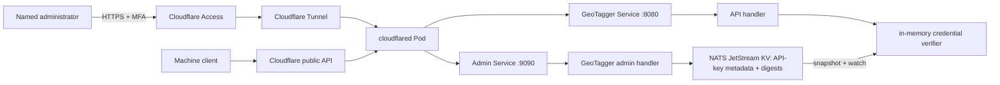

# GeoTagger Admin Control Plane

## Status

This document defines the security and operational contract for the GeoTagger human-administration surface **before implementation**. The public machine API remains the production interface until the implementation described here is merged, deployed, and validated.

Planned hostname:

```text
https://admin.geo.itsjosiahdavis.dev
```

The admin hostname is separate from the machine API at `https://geo.itsjosiahdavis.dev`.

## Goals

The control plane will replace manual day-to-day API-key lifecycle work with a small authenticated operator interface while preserving the current machine API contract.

Required first release:

- list managed API credentials without exposing plaintext secrets;
- create a credential and reveal the client token exactly once;
- revoke a credential;
- rotate a credential and reveal the replacement token exactly once;
- record key metadata: ID, display name, owner/service, environment, created time, expiry and revocation state;
- keep authentication verification in memory on the API hot path;
- propagate managed-key changes to all API replicas without a Pod restart;
- show service/MMDB health and the active City/ASN generation;
- remain inaccessible unless the request passed the dedicated Cloudflare Access policy; and
- keep health/readiness/metrics usable internally even when the human admin UI is disabled.

The first release does not attempt to become a general Kubernetes or Proxmox administration console.

## Trust boundaries



The public API and admin hostname are intentionally separate. Cloudflare Access must apply to the admin hostname only; putting browser-oriented Access in front of the machine API would break service-to-service callers.

## Human authentication

Cloudflare Access is the primary interactive identity boundary for the admin hostname.

Required Cloudflare-side controls:

- a dedicated self-hosted Access application for `admin.geo.itsjosiahdavis.dev`;
- an allow policy limited to named administrators or an approved identity-provider group;
- MFA required by the identity provider / Access policy, with phishing-resistant WebAuthn/passkeys/security keys preferred where available;
- no broad `Everyone` allow rule; and
- a short, documented session lifetime appropriate for privileged administration.

The origin must not trust an arbitrary email header by itself. The implementation should validate the Cloudflare Access JWT (`Cf-Access-Jwt-Assertion`) against the configured Access issuer and application audience before serving privileged routes.

Planned runtime configuration:

```text
CF_ACCESS_TEAM_DOMAIN=<team>.cloudflareaccess.com
CF_ACCESS_AUD=<Access application audience tag>
```

If those values are absent or invalid, privileged admin routes fail closed. Internal `/healthz`, `/readyz`, and `/metrics` remain separate from the human UI authorization path.

## Credential model

Client token format remains compatible with the current API:

```text
<key-id>.<secret>
```

Creation/rotation uses 32 cryptographically random bytes encoded with unpadded Base64URL. Only a SHA-256 digest of the secret is stored server-side.

Managed record shape:

```json
{
  "id": "ndhis-prod",
  "secret_sha256": "<64 hex chars>",
  "display_name": "NDHIS production",
  "owner": "NDHIS",
  "environment": "production",
  "created_at": "2026-09-14T17:00:00Z",
  "expires_at": null,
  "revoked_at": null,
  "revocation_reason": ""
}
```

Plaintext secrets are never written to NATS, ClickHouse, logs, metrics, Kubernetes Secrets, or browser storage by GeoTagger. A newly generated token is returned only in the create/rotate response and the UI treats it as one-time material.

## Managed-key storage

Managed credentials will use a dedicated NATS JetStream Key/Value bucket backed by file storage. This reuses the already-required persistent NATS failure domain instead of adding Redis or a new relational database solely for credential metadata.

Target bucket:

```text
GEOTAGGER_API_KEYS
```

The API does **not** query NATS on every lookup. Each API process:

1. loads a snapshot of managed key records at startup;
2. builds an in-memory verifier keyed by key ID;
3. watches the KV bucket for updates/deletes; and
4. atomically refreshes its in-memory credential map when a valid update arrives.

Authentication therefore remains an in-process hash/constant-time comparison on the request hot path.

## Bootstrap / break-glass credentials

The existing `API_KEYS` Kubernetes Secret remains supported initially as a compatibility and break-glass source.

Rules:

- static bootstrap keys are not displayed by the dashboard;
- managed keys live in JetStream KV and can be created/revoked/rotated through the admin UI;
- key IDs must be unique across static and managed sources;
- a collision is a startup/readiness error rather than an ambiguous override;
- removing the last static break-glass key is a later migration decision, not part of the first release.

This allows the existing deployed token to continue working during rollout while new integrations can move to managed credentials.

## Key lifecycle

### Create

The operator provides metadata and a unique key ID. GeoTagger generates the secret server-side, stores only its digest, then returns:

```json
{
  "id": "ndhis-prod",
  "token": "ndhis-prod.<one-time-secret>"
}
```

The token is not retrievable later.

### Revoke

Revocation sets `revoked_at` and an optional reason. API replicas remove the credential from their active verifier after the KV update is observed. A revoked token must return `401`.

### Rotate

Rotation generates a fresh secret for the same key ID and replaces the stored digest while retaining identity/ownership metadata. The old secret becomes invalid after the update reaches API replicas. The replacement token is shown once.

For callers that require overlap during migration, create a second key ID, deploy it to the client, verify traffic, then revoke the old key.

### Expiry

If `expires_at` is set, authentication rejects the credential at or after that time even if the KV record remains present. Expired credentials remain visible to administrators until explicitly removed or archived.

## Admin API surface

Planned privileged endpoints on port 9090:

```text
GET    /admin/
GET    /admin/api/session
GET    /admin/api/status
GET    /admin/api/keys
POST   /admin/api/keys
POST   /admin/api/keys/{id}/rotate
POST   /admin/api/keys/{id}/revoke
```

Mutating endpoints accept JSON only, enforce strict body limits/unknown-field rejection, and require the validated Access session.

Browser security requirements:

- no credential token in a URL;
- `Cache-Control: no-store` on admin HTML/API responses that can contain sensitive material;
- restrictive CSP and frame protections;
- same-origin requests only;
- no third-party analytics/scripts; and
- one-time token values cleared from UI state when dismissed/reloaded.

## Admin status view

The first dashboard status page should show operational facts already available to the API process, for example:

```text
API process readiness
NATS connectivity
active City database version
active ASN database version
managed credential count
active / revoked / expired counts
current server time
```

Historical traffic analytics remain a separate concern. The first release should not grant the web process broader ClickHouse privileges merely to make a prettier dashboard. Caller activity can continue to be investigated through the existing audit store until a dedicated read-only analytics identity is defined.

## Kubernetes exposure

The public `geotagger` Service continues to expose only port 8080.

A dedicated ClusterIP service will expose the admin listener:

```text
geotagger-admin.geotagger.svc.cluster.local:9090
```

NetworkPolicy should permit:

```text
cloudflared -> API Pods TCP 8080   # public machine API
cloudflared -> API Pods TCP 9090   # admin hostname only
```

NATS and ClickHouse remain ClusterIP-only and are never routed through the admin hostname.

The Cloudflare Tunnel then receives two hostname mappings:

```text
geo.itsjosiahdavis.dev       -> http://geotagger.geotagger.svc.cluster.local:8080
admin.geo.itsjosiahdavis.dev -> http://geotagger-admin.geotagger.svc.cluster.local:9090
```

The second mapping must not be considered secure until the Access application/policy is active and origin JWT validation is configured.

## Audit behavior

Machine lookup auditing remains unchanged.

Administrative credential mutations should emit structured application logs containing non-secret metadata such as:

```text
admin identity
operation
key ID
timestamp
outcome
```

Never log the generated plaintext token or stored digest. A later iteration can add a dedicated immutable admin-audit stream if the organizational requirement justifies it.

## Failure behavior

| Failure | Required behavior |
|---|---|
| Access JWT missing/invalid | privileged route returns `401`/`403` |
| Access configuration absent | privileged routes fail closed |
| NATS/KV unavailable at API startup | managed-key subsystem not considered ready; static break-glass behavior follows explicit implementation policy |
| NATS/KV unavailable during create/revoke/rotate | mutation fails; UI reports no change |
| malformed KV record | reject record, surface readiness/health error rather than accepting ambiguous auth state |
| revoked/expired key | machine API returns `401` |
| dashboard reload after creation | plaintext token cannot be recovered |

## Deployment acceptance

The admin control plane is not considered deployed until all of the following are proven:

```text
[ ] admin hostname routes only through Cloudflare Tunnel
[ ] Cloudflare Access blocks an unauthenticated browser
[ ] authorized administrator reaches dashboard
[ ] origin rejects a request without a valid Access JWT
[ ] create shows token once
[ ] created token authenticates machine API
[ ] rotate invalidates previous secret and new token works
[ ] revoke causes token to return 401
[ ] API Pods receive key changes without restart
[ ] static existing production token still works during migration
[ ] admin responses use no-store and restrictive browser headers
[ ] plaintext generated tokens are absent from logs and persistent stores
[ ] public geo hostname remains usable by machine clients without interactive Access
```

## Compliance boundary

The dashboard improves technical access control and credential lifecycle evidence; it does not by itself establish HIPAA compliance. Privileged-user enrollment, MFA policy, periodic access review, termination procedures, incident response, backup/recovery, vendor/BAA obligations and risk analysis remain organizational controls.