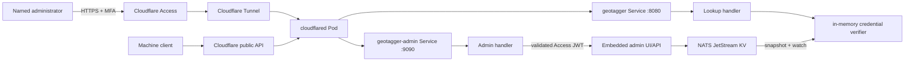

# GeoTagger Admin Control Plane

## Status

The admin control plane is implemented in the application and Kubernetes manifests. It remains **disabled at the origin until Cloudflare Access configuration is supplied** and is not considered production-enabled until the Cloudflare setup and acceptance checks in this document are completed.

Target hostname:

```text
https://admin.geo.itsjosiahdavis.dev
```

The machine API remains separate at:

```text
https://geo.itsjosiahdavis.dev
```

Do not put browser-oriented Cloudflare Access in front of the machine API hostname.

## What is implemented

The first control-plane release provides:

- an embedded, dependency-free admin web UI on the existing internal admin listener (`:9090`);
- origin validation of Cloudflare Access JWTs (`Cf-Access-Jwt-Assertion`);
- managed API-key create, rotate, revoke and expiry state;
- one-time plaintext token display for create/rotate operations;
- metadata for key ID, display name, owner/service, environment, timestamps and revocation reason;
- NATS JetStream Key/Value persistence for managed credentials;
- in-memory API verification, so normal lookups do not query NATS;
- cross-replica credential propagation through a KV watcher;
- compatibility with the existing static `API_KEYS` break-glass credentials;
- key/store/audit/MMDB status in the dashboard;
- a dedicated `geotagger-admin` ClusterIP service on port 9090; and
- NetworkPolicy ingress from the `cloudflared` Pod to ports 8080 and 9090 only.

The first release deliberately does **not** expose Kubernetes, Proxmox, ClickHouse or NATS administration in the browser.

## Trust boundaries



The control plane has two independent authorization layers:

1. Cloudflare Access decides whether a browser/user may reach the protected hostname.
2. GeoTagger validates the Access JWT at the origin, including signature, issuer, audience and expiry.

A spoofed email header alone is not accepted.

## Human authentication

Cloudflare Access is the interactive identity boundary for the admin hostname. GeoTagger expects Cloudflare to send the signed Access assertion in:

```text
Cf-Access-Jwt-Assertion
```

Origin validation requires both runtime values:

```text
CF_ACCESS_TEAM_DOMAIN=<team>.cloudflareaccess.com
CF_ACCESS_AUD=<Access application audience tag>
```

The application fetches the team's Access signing keys from:

```text
https://<team>.cloudflareaccess.com/cdn-cgi/access/certs
```

and validates RS256 signatures, issuer, audience, expiry and not-before claims. Signing keys are cached and refreshed when needed.

If either Access setting is absent, both must be absent; the application still serves internal health/readiness/metrics, but `/admin/...` returns a fail-closed configuration error. If a request reaches the admin origin without a valid Access assertion, privileged routes return `401`.

Recommended Cloudflare/IdP policy:

- dedicated self-hosted Access application for `admin.geo.itsjosiahdavis.dev`;
- named administrator(s) or an approved IdP group only;
- MFA required by the IdP/policy;
- phishing-resistant WebAuthn/passkeys/security keys preferred where available;
- no `Everyone` allow policy; and
- a short privileged-session lifetime appropriate to the organization.

## Credential model

Machine tokens retain the existing format:

```text
<key-id>.<secret>
```

For managed credentials, GeoTagger generates 32 cryptographically random bytes and encodes them as unpadded Base64URL. Only this value is returned to the administrator:

```text
ndhis-prod.<one-time-secret>
```

The persistent record contains only the SHA-256 digest of the secret plus lifecycle metadata:

```json
{
  "id": "ndhis-prod",
  "secret_sha256": "<64 hex characters>",
  "display_name": "NDHIS production",
  "owner": "NDHIS",
  "environment": "production",
  "created_at": "2026-09-14T17:00:00Z",
  "rotated_at": null,
  "expires_at": null,
  "revoked_at": null,
  "revocation_reason": ""
}
```

Plaintext secrets are not written by GeoTagger to NATS, ClickHouse, application logs, metrics or Kubernetes Secrets. Create/rotate responses deliberately use `Cache-Control: no-store`, and the UI removes the displayed token from page state when dismissed or the page is left.

A browser/network inspector may still observe a token at the moment it is intentionally returned to the authorized administrator. Treat the admin workstation and browser session as privileged.

## Managed-key storage

Managed credentials use a dedicated NATS JetStream Key/Value bucket:

```text
GEOTAGGER_API_KEYS
```

Properties created by GeoTagger:

```text
storage: FileStorage
history: 5 revisions per key
replicas: 1
max bytes: 64 MiB
```

The bucket uses the existing NATS persistent volume/failure domain. This avoids introducing Redis or another database just for credential metadata.

Two API Pods may race to provision the bucket during the first rollout. Provisioning is race-tolerant: a losing Pod binds to the bucket created by the other Pod rather than failing solely because it lost the creation race.

## Hot-path behavior

The machine API does **not** query NATS for every request.

Each API process:

1. opens the managed-key KV bucket;
2. starts a `WatchAll` snapshot/watch;
3. builds an in-memory managed-key map after the initial snapshot;
4. merges that map logically with static break-glass keys; and
5. atomically replaces the managed verifier map when KV updates arrive.

Bearer verification remains an in-process SHA-256 + constant-time comparison.

The API readiness path treats managed-key synchronization as a required runtime dependency after synchronization starts. If the watcher becomes unhealthy, readiness degrades rather than silently claiming the authorization state is current.

## Static break-glass credentials

The existing `API_KEYS` Kubernetes Secret remains required for the first release and acts as compatibility/break-glass authentication.

Rules:

- static credentials are not listed in the dashboard;
- they continue to authenticate the public API unchanged;
- dashboard-created IDs cannot collide with a static ID;
- managed/static collisions discovered while loading persistent state fail verification/synchronization rather than choosing an ambiguous winner; and
- removing the last static break-glass credential is a later migration decision.

This allows the existing production token to keep working while new integrations move to managed credentials.

## Key lifecycle

### Create

The operator supplies a unique ID and optional metadata. GeoTagger generates the secret at the origin and returns it once.

Example response shape:

```json
{
  "key": {
    "id": "ndhis-prod",
    "owner": "NDHIS",
    "environment": "production",
    "status": "active"
  },
  "token": "ndhis-prod.<one-time-secret>"
}
```

A static-ID collision is rejected before a persistent managed record is created.

### Rotate

Rotation replaces the stored digest for the same managed key ID and records `rotated_at`. The old secret becomes invalid after the KV update reaches each API replica. The replacement plaintext token is returned once.

If a caller requires an overlap window, create a second ID, deploy it to the caller, verify traffic, then revoke the old ID instead of rotating in place.

### Revoke

Revocation records `revoked_at` plus an optional reason. A revoked managed token returns `401` once the update has propagated. A repeated revoke is idempotent.

### Expiry

If `expires_at` is set, the in-memory verifier rejects the credential at or after that UTC time even though its metadata remains in the KV bucket and dashboard.

### Propagation warnings

Create/rotate/revoke are persisted in JetStream KV first. The serving Pod then refreshes its local verifier immediately while all Pods also receive the watch event.

If the durable mutation succeeds but that immediate local refresh fails, the admin API does **not** discard a newly generated plaintext token behind an error response. Instead it returns the successful mutation with an explicit warning. The administrator should treat dashboard/readiness as degraded until synchronization recovers.

## Admin routes

Privileged routes on the internal `:9090` listener:

```text
GET    /admin/
GET    /admin/assets/app.js
GET    /admin/assets/style.css
GET    /admin/api/session
GET    /admin/api/status
GET    /admin/api/keys
POST   /admin/api/keys
POST   /admin/api/keys/{id}/rotate
POST   /admin/api/keys/{id}/revoke
```

Operational routes remain internal on the same listener and are not themselves part of the web UI:

```text
GET /healthz
GET /readyz
GET /metrics
```

The dedicated tunnel hostname should route to `/admin/...` through the admin service; do not publish NATS or ClickHouse.

## Browser protections

Admin responses set:

```text
Cache-Control: no-store
Pragma: no-cache
X-Content-Type-Options: nosniff
X-Frame-Options: DENY
Referrer-Policy: no-referrer
restrictive Content-Security-Policy
restrictive Permissions-Policy
```

The UI has no third-party scripts, fonts, analytics or API dependencies.

Mutating requests additionally require:

```text
X-GeoTagger-Admin-CSRF: 1
```

and cross-site `Sec-Fetch-Site` values are rejected. Mutation bodies must be `application/json`, are size-limited, reject unknown JSON fields and allow only a single JSON object.

## Kubernetes exposure

Public machine API:

```text
geotagger.geotagger.svc.cluster.local:8080
```

Human admin surface:

```text
geotagger-admin.geotagger.svc.cluster.local:9090
```

Both Services select the same API Pods, but the public service does not expose port 9090. The namespace default-deny ingress policy remains in place, with explicit ingress from the `cloudflared` Pod to API ports 8080 and 9090.

NATS and ClickHouse remain ClusterIP-only and are not routed through either public hostname directly.

Expected tunnel mappings:

```text
geo.itsjosiahdavis.dev       -> http://geotagger.geotagger.svc.cluster.local:8080
admin.geo.itsjosiahdavis.dev -> http://geotagger-admin.geotagger.svc.cluster.local:9090
```

The admin hostname is not considered secure merely because it is a Tunnel route. The Access application/policy and origin JWT configuration are required.

## Administrative logs

Credential mutations emit structured application log metadata containing:

```text
admin_email
operation
key_id
outcome
```

The generated token and stored secret digest are intentionally omitted.

Machine lookup auditing in NATS -> ClickHouse is unchanged. The first admin release does not yet add a separate immutable admin-event stream; structured application logs are therefore an explicitly documented residual control gap if long-term immutable admin-action evidence is required.

## Failure behavior

| Failure | Behavior |
|---|---|
| Access settings absent | `/admin/...` fails closed; health/readiness/metrics remain available internally |
| Access assertion missing/invalid | privileged route returns `401` |
| Access signing-key fetch fails | JWT validation fails closed |
| NATS unavailable at API startup | API startup fails because audit/key-store dependencies cannot initialize |
| managed-key initial snapshot fails/times out | API startup fails |
| managed-key watcher becomes unhealthy | key-store health/readiness degrades |
| mutation cannot be persisted | mutation fails and no success is reported |
| mutation persists but immediate local refresh fails | mutation response includes a warning; one-time token is still returned if generated |
| malformed KV record | verifier synchronization reports/fails rather than accepting ambiguous auth state |
| revoked/expired managed key | public API returns `401` |
| dashboard is reloaded after token creation | plaintext token cannot be recovered from GeoTagger |

## Deployment acceptance

The admin control plane is not production-enabled until all of the following are demonstrated:

```text
[ ] admin hostname routes only through the Cloudflare Tunnel
[ ] dedicated Cloudflare Access application protects admin.geo.itsjosiahdavis.dev
[ ] no broad Everyone allow policy exists
[ ] privileged identity uses MFA
[ ] CF_ACCESS_TEAM_DOMAIN and CF_ACCESS_AUD are present in geotagger-secrets
[ ] unauthenticated browser is stopped by Cloudflare Access
[ ] authorized administrator reaches /admin/
[ ] origin rejects a request without a valid Access JWT
[ ] create shows a token once
[ ] created token authenticates the public machine API
[ ] rotate invalidates the old secret and the replacement works
[ ] revoke makes the managed token return 401
[ ] managed changes propagate across both API Pods without Pod restart
[ ] existing static production token still works
[ ] admin responses include no-store/CSP/frame protections
[ ] plaintext generated tokens are absent from persistent stores and logs
[ ] geo.itsjosiahdavis.dev remains usable by machine clients without interactive Access
```

See `CLOUDFLARE_ADMIN_SETUP.md` for the Cloudflare-side rollout sequence.

## Compliance boundary

The dashboard improves technical access control and credential-lifecycle evidence; it does not by itself establish HIPAA compliance. Privileged-user enrollment, MFA policy, access review, workforce termination procedures, incident response, backup/recovery, vendor/BAA obligations, risk analysis and periodic evaluation remain organizational responsibilities.
