# GeoTagger Production Architecture

## Purpose of this document

This document describes the deployed GeoTagger system at the component, network, data-flow, Kubernetes, storage, scaling, and failure-recovery levels.

For a product-oriented introduction, see `PROJECT_OVERVIEW.md`.
For a Kubernetes-specific explanation, see `KUBERNETES.md`.

Public endpoint:

```text
https://geo.itsjosiahdavis.dev
```

---

# 1. System context

GeoTagger is an authenticated machine API that receives an IP address, resolves its country from a local MaxMind GeoLite2 Country database, durably records an audit event, and returns the country.

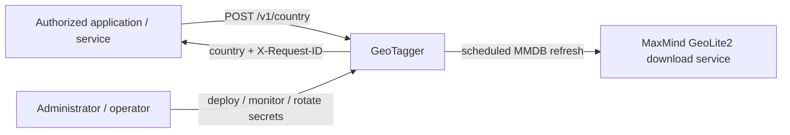

There is no request-time call from the lookup API to MaxMind.

---

# 2. Physical deployment

The entire current GeoTagger runtime is inside one dedicated Linux VM on an on-premises Proxmox server.

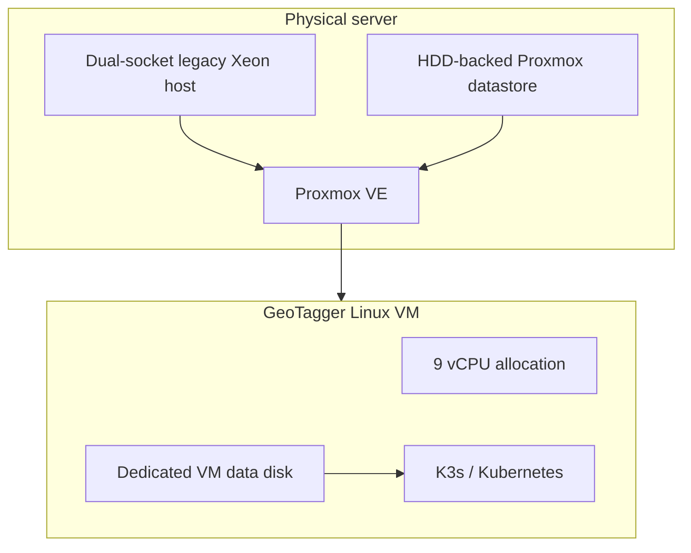

The current cluster has one Kubernetes node because K3s runs inside this single VM.

Consequences:

- Pod/process failures can be healed automatically;
- API replicas can scale within available VM CPU/RAM;
- the VM remains a single failure domain;
- the Proxmox host remains a single failure domain;
- HPA is not the same as hardware HA or node autoscaling.

---

# 3. Complete logical architecture

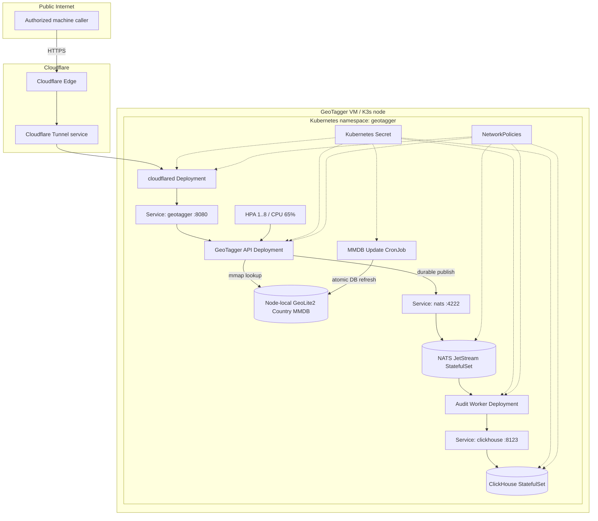

---

# 4. Public ingress path

The origin is not exposed using a public IP/port-forward rule.

Cloudflare Tunnel works by having `cloudflared` establish outbound connections to Cloudflare.

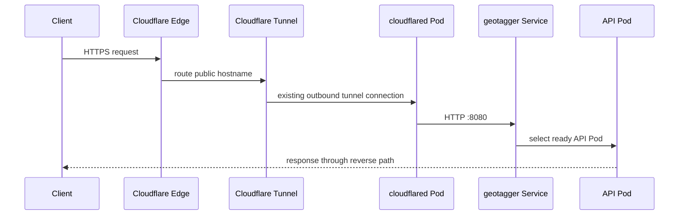

Origin target:

```text
http://geotagger.geotagger.svc.cluster.local:8080
```

This stable Service name means Cloudflare does not care which individual API Pods currently exist.

---

# 5. Synchronous lookup path

A lookup performs these steps:

```text
1. receive request
2. generate request ID
3. authenticate bearer token
4. enforce body size / JSON shape
5. parse IP
6. reject non-permitted local/private target
7. lookup country in memory-mapped MMDB
8. create privacy-preserving audit event
9. publish event to JetStream durably
10. wait for JetStream publish ACK
11. return HTTP result
```

Detailed sequence:

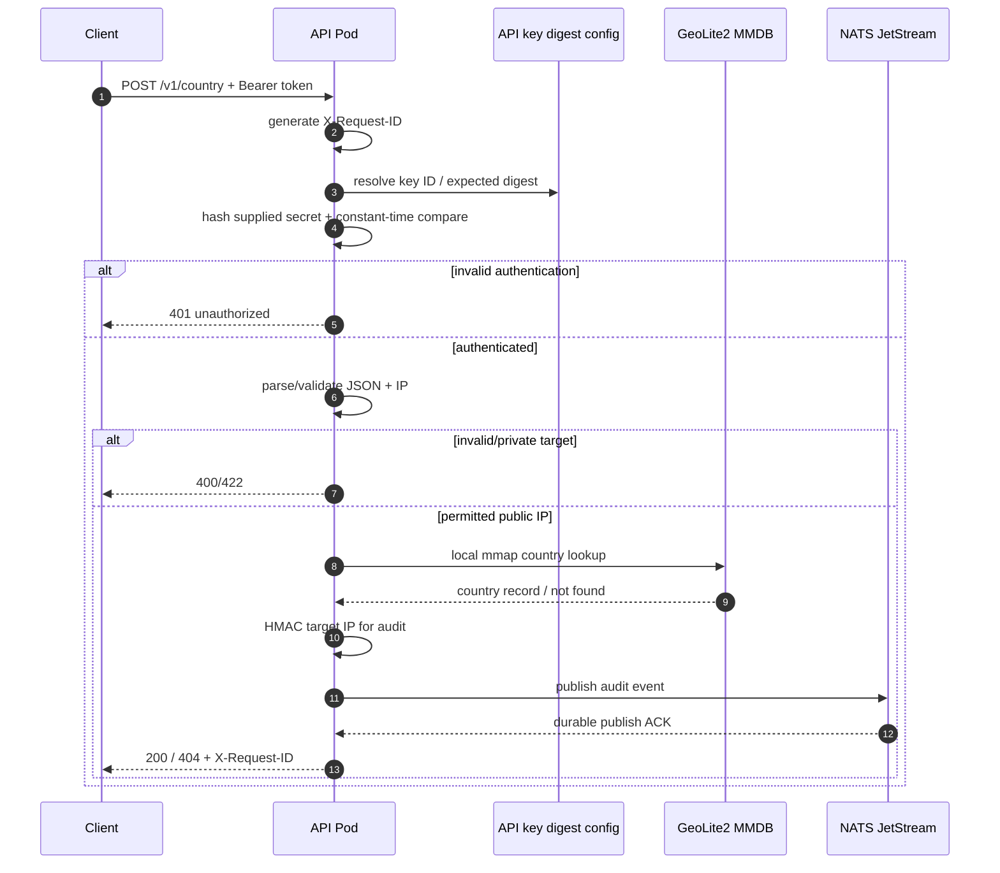

The important guarantee is that the normal lookup response does not need to wait for ClickHouse, but it does require the audit event to be accepted by the durable queue.

---

# 6. Asynchronous audit persistence path

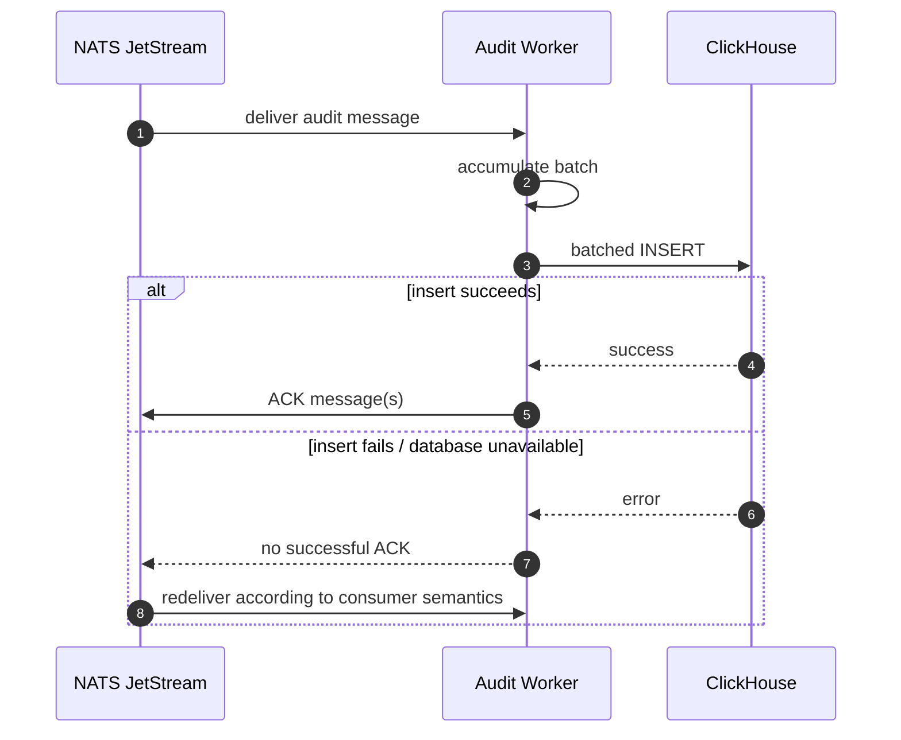

This separates fast request handling from database insertion work.

## Delivery semantics

The worker is intentionally at-least-once.

Possible crash window:

```text
ClickHouse insert succeeds
→ worker crashes before JetStream ACK
→ NATS redelivers
→ row may be inserted again
```

Therefore `request_id` is the natural deduplication/correlation key when exact uniqueness matters in analysis.

The system chooses potential duplication over silent loss.

---

# 7. Audit durability configuration

The production stream safety configuration is:

```text
Retention: WorkQueue
MaxAge:    0
MaxBytes:  8 GiB
Discard:   DiscardNew
```

Interpretation:

## WorkQueue retention

Messages represent work to be consumed/persisted. Once successfully processed and acknowledged, they can leave the queue.

## `MaxAge=0`

No age-based expiration of required unpersisted audit events.

An old event is not silently deleted merely because an outage lasted too long.

## `MaxBytes=8 GiB`

The queue remains bounded and cannot grow without limit.

## `DiscardNew`

When the configured capacity ceiling is reached, new events are rejected rather than destroying older queued work.

Because the API requires the publish ACK, this becomes fail-closed behavior:

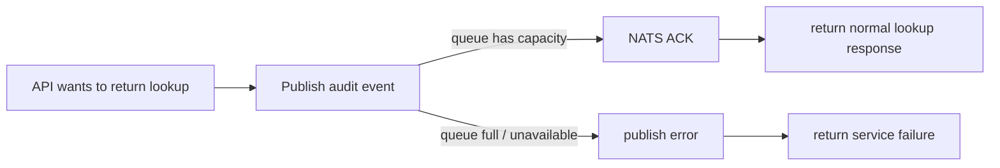

---

# 8. MMDB data path

GeoTagger uses MaxMind GeoLite2 Country as a local database file.

The update path is separate from normal lookup traffic.

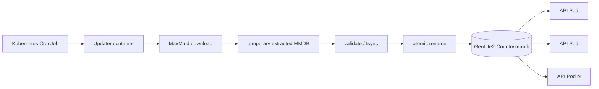

Current schedule:

```text
17 3 * * *
```

which means daily at 03:17.

The CronJob uses:

```text
concurrencyPolicy: Forbid
```

so a second update job is not started while the previous one is still running.

The API periodically detects/reopens a changed database safely.

---

# 9. Kubernetes resource topology

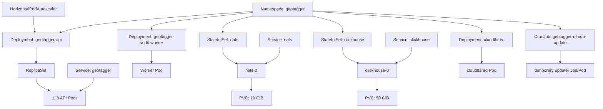

See `KUBERNETES.md` for a detailed explanation of Pods, containers, Services, Deployments, StatefulSets, PVCs, HPA, probes, Secrets, and NetworkPolicy.

---

# 10. Pod and container model

A Pod is not a synonym for a Docker container.

K3s uses containerd to run OCI containers.

```text
Pod
└── one or more OCI containers
```

Most GeoTagger Pods have one long-running container.

API Pods additionally contain the `wait-for-mmdb` init container, which runs before the API container.

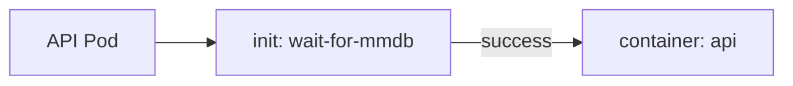

The Pod is the Kubernetes scheduling/network/lifecycle unit; the container is the actual isolated process runtime.

---

# 11. Service discovery and load balancing

API Pod IPs can change.

Kubernetes Service discovery hides that volatility.

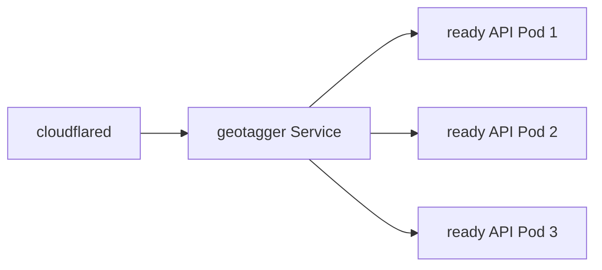

A Pod that is not ready is removed from Service endpoints.

The same principle applies to:

```text
nats:4222
clickhouse:8123
```

Internal clients depend on service names rather than Pod IPs.

---

# 12. Health, readiness, and self-healing

The API administrative listener is on port 9090.

```text
/healthz
/readyz
/metrics
```

Port 9090 is not exposed by the public Kubernetes Service.

## Liveness

Repeated liveness failure means the process is considered unhealthy enough to restart.

## Readiness

Readiness controls whether new Service traffic can be sent to the Pod.

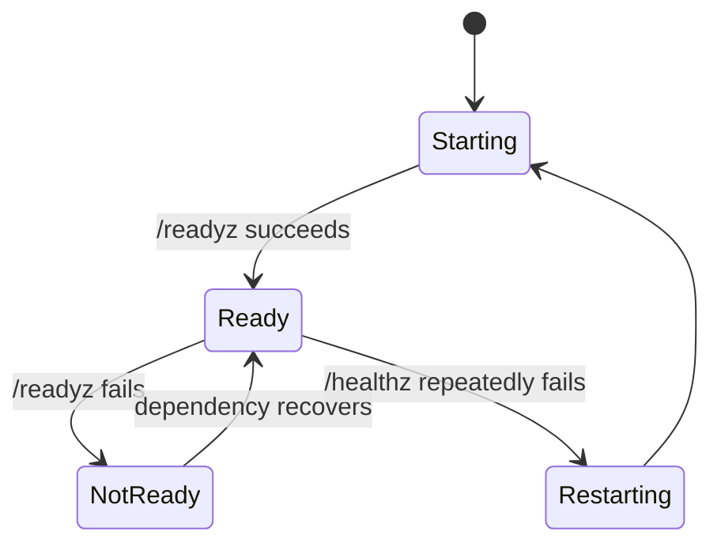

This allows Kubernetes to remove a temporarily unhealthy Pod from traffic without necessarily destroying it immediately.

---

# 13. Horizontal scaling

API autoscaling:

```text
min replicas: 1
max replicas: 8
CPU target:   65%
```

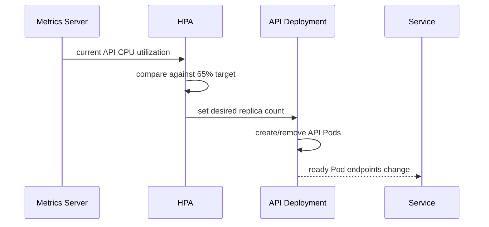

Scale-down has a five-minute stabilization window to avoid oscillating aggressively when load briefly falls.

## Capacity boundary

All API Pods currently run on one 9-vCPU VM.

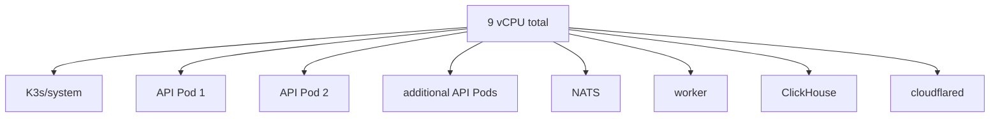

HPA can use spare cores more effectively, but once total VM CPU saturates, creating more Pods cannot increase the amount of CPU available.

---

# 14. Storage architecture

Stateful application data lives on the VM data disk backed by the existing Proxmox HDD datastore.

```mermaid
flowchart TB
    PVE[(Proxmox HDD datastore)] --> VDISK[VM virtual data disk]

    subgraph VM[GeoTagger VM]
        ROOT[Guest root filesystem]
        DATA[/srv/geotagger-data]
        K3SD[K3s data]
        LOCAL[K3s local-path PVC data]
        MMDB[/var/lib/geotagger/mmdb]
    end

    VDISK --> DATA
    DATA --> K3SD
    DATA --> LOCAL
    VDISK --> MMDB
    LOCAL --> NPVC[NATS PVC]
    LOCAL --> CPVC[ClickHouse PVC]
```

The intended deployment keeps large K3s/PVC state off the small guest root disk.

Current PVC requests:

```text
NATS:       10 GiB
ClickHouse: 50 GiB
```

These are initial sizes, not measured long-term production sizing claims.

---

# 15. ClickHouse architecture

ClickHouse stores audit events in:

```text
geotagger.audit_events
```

Schema characteristics:

```text
engine:      MergeTree
partition:   toDate(timestamp)
order key:   (timestamp, caller_id, request_id)
TTL:         timestamp + 30 days
```

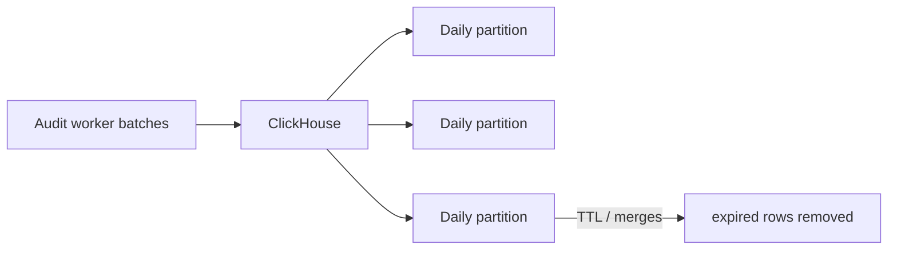

TTL is merge-driven. A row is eligible for deletion at 30 days but deletion is not guaranteed at the exact expiration second.

The deployed image is intentionally pinned to ClickHouse 26.3 LTS because the older Westmere host lacks AVX2 required by newer default x86-64-v3 images.

---

# 16. Network isolation

The namespace begins with default-deny ingress.

Explicit allowed flows:

```text
cloudflared  → API        TCP 8080
API          → NATS       TCP 4222
worker       → NATS       TCP 4222
worker       → ClickHouse TCP 8123
```

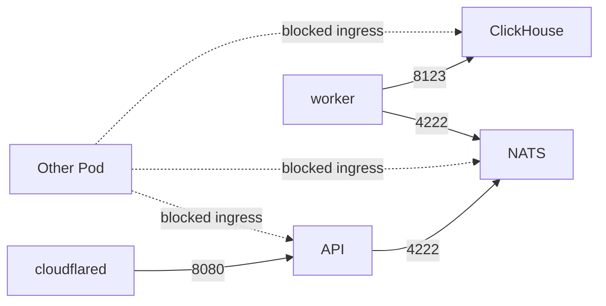

NATS and ClickHouse are ClusterIP-only internal services and are not intended to be Internet-accessible.

The current policy set controls ingress. Strict egress policy is a future hardening item because legitimate egress includes DNS, Cloudflare Tunnel connectivity, and MaxMind database downloads.

---

# 17. Secrets architecture

Runtime-sensitive data is supplied through the Kubernetes Secret `geotagger-secrets`.

Values include:

```text
API_KEYS
AUDIT_HMAC_KEY
CLICKHOUSE_PASSWORD
MAXMIND_LICENSE_KEY
CLOUDFLARE_TUNNEL_TOKEN
```

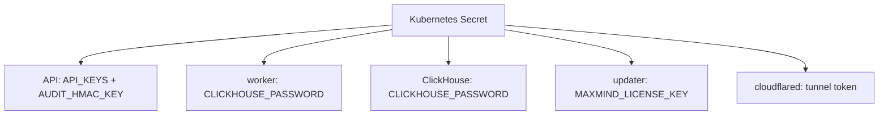

K3s is intended to run with secrets encryption at rest enabled.

Client bearer secrets are not stored by the API in plaintext; server configuration contains SHA-256 digests.

---

# 18. Container hardening

The Go API and worker run as:

```text
UID: 65532
GID: 65532
```

NATS runs as:

```text
UID: 1000
GID: 1000
```

The explicit numeric IDs were added because `runAsNonRoot: true` alone can be rejected when Kubernetes cannot verify an image's default named user is non-root.

API/worker controls include:

```text
runAsNonRoot: true
allowPrivilegeEscalation: false
readOnlyRootFilesystem: true
capabilities: drop ALL
```

---

# 19. Failure and recovery architecture

## API Pod failure

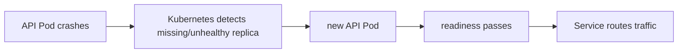

With multiple replicas, healthy Pods may continue serving while one is replaced.

## Worker failure

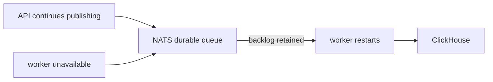

## ClickHouse failure

```mermaid
flowchart LR
    API --> N[NATS]
    N --> W[worker]
    W -->|insert fails| CHFAIL[ClickHouse unavailable]
    N -->|unACKed work retained| BACKLOG[backlog]
    CHREC[ClickHouse recovers] --> W
    W -->|retry / redelivery| CHREC
```

## NATS failure

NATS is on the synchronous durability boundary.

```text
NATS unavailable
→ durable publish cannot be acknowledged
→ API cannot complete normal audited success
```

## Complete VM/host failure

```text
single K3s node disappears
→ all Pods/Services disappear with it
→ Kubernetes inside that VM cannot self-heal onto another node
```

This is the main availability boundary of the current architecture.

---

# 20. Rolling updates

Stateless Deployments can be replaced gradually.

```mermaid
sequenceDiagram
    participant D as Deployment controller
    participant O as Old API Pod
    participant N as New API Pod
    participant S as Service

    D->>N: create new replica
    N->>N: init + start
    N-->>D: readiness succeeds
    S->>N: include endpoint
    D->>O: terminate old replica
    S-->>O: remove endpoint
```

StatefulSet upgrades deserve more caution because there is only one NATS and one ClickHouse replica and persistent storage must remain valid/compatible.

---

# 21. Performance architecture

The synchronous request contains several latency components:

```mermaid
flowchart LR
    A[Cloudflare / network RTT]
    B[Auth + JSON/IP validation]
    C[MMDB lookup]
    D[NATS durable publish ACK]
    E[Response encoding]

    A --> B --> C --> D --> E
```

Observed local MMDB lookup for the verified 8.8.8.8 request:

```text
56 microseconds
```

That is not the dominant end-to-end cost.

The first public load test showed CPU saturation before HDD saturation. Disk utilization stayed below roughly 3% even at the highest offered tiers.

The test was intentionally harsh because k6 ran on the same 9-vCPU VM and public traffic traversed Cloudflare.

See `PERFORMANCE.md` for the measurements and limitations.

---

# 22. Security trust diagram

```mermaid
flowchart TB
    subgraph U[Untrusted]
        CLIENT[Client request]
    end

    subgraph E[External trusted provider boundary]
        CF[Cloudflare]
    end

    subgraph APP[Application trust zone]
        CFD[cloudflared]
        API[API Pods]
        NATS[NATS]
        W[worker]
        CH[ClickHouse]
    end

    subgraph ADMIN[Highly privileged management plane]
        KAPI[Kubernetes API / node root]
        PVE[Proxmox administration]
    end

    CLIENT --> CF
    CF --> CFD
    CFD --> API
    API --> NATS
    NATS --> W
    W --> CH
    ADMIN --> APP
```

Application-level authentication is required even though Cloudflare is in front of the service.

Access to the Kubernetes/Proxmox administrative plane is significantly more privileged than ordinary application access.

---

# 23. End-to-end validation performed

The deployed system has been validated through the real public path.

Verified request:

```text
POST https://geo.itsjosiahdavis.dev/v1/country
IP: 8.8.8.8
HTTP: 200
country: United States
request ID: c75bb0a033c44dd87a9969df059dd6b4
```

The same request ID was located in ClickHouse with:

```text
caller_id:         azure-prod
ip_mode:           hmac
country_code:      US
country:           United States
outcome:           ok
status_code:       200
lookup_latency_us: 56
```

This confirms:

```text
Internet
→ Cloudflare
→ tunnel
→ Kubernetes Service
→ API
→ MMDB
→ JetStream durable publish
→ worker
→ ClickHouse
```

Private-address rejection was separately validated using `10.0.0.1`, returning HTTP 422 with:

```json
{"error":"IP address is not a permitted public address"}
```

---

# 24. Current scalability boundary

Current deployment:

```text
1 physical server
1 GeoTagger VM
1 K3s node
1..8 API Pods
1 NATS StatefulSet replica
1 audit worker replica
1 ClickHouse StatefulSet replica
```

This gives **application-level elasticity and healing**, not full infrastructure HA.

A future distributed deployment could schedule API Pods across several nodes, but stateful HA would also require a deliberate NATS/ClickHouse/storage architecture.

```mermaid
flowchart TB
    SVC[API Service]
    subgraph FUTURE[Future multi-node cluster]
        N1[Node A / API]
        N2[Node B / API]
        N3[Node C / API]
    end
    SVC --> N1
    SVC --> N2
    SVC --> N3
```

---

# 25. Operational architecture checklist

A healthy deployment should satisfy all of the following:

```text
[ ] Cloudflare Tunnel connector is connected
[ ] public DNS resolves
[ ] API Deployment has at least one ready replica
[ ] HPA has valid CPU metrics
[ ] MMDB file exists and API readiness succeeds
[ ] NATS StatefulSet is ready
[ ] audit worker is running
[ ] ClickHouse StatefulSet is ready
[ ] NATS/ClickHouse PVCs are bound
[ ] NetworkPolicies are present
[ ] Kubernetes Secrets are present without being committed to Git
[ ] public authenticated lookup succeeds
[ ] X-Request-ID is returned
[ ] matching audit row lands in ClickHouse
[ ] private IP target is rejected
[ ] invalid bearer token is rejected
[ ] raw IP is absent from audit row when HMAC mode is configured
```

---

# 26. Architectural trade-offs

## Why Kubernetes instead of only Docker Compose?

Kubernetes adds operational complexity, but in return provides:

- HPA;
- readiness-aware Services;
- declarative reconciliation;
- StatefulSet/PVC lifecycle;
- CronJobs;
- NetworkPolicy;
- rolling Deployments;
- Secret references; and
- an easier path to multi-node scheduling later.

## Why NATS before ClickHouse?

To keep ClickHouse off the synchronous lookup path while still requiring a durable audit acceptance before success.

## Why HMAC instead of storing raw IP?

To support stable correlation without retaining the original target IP by default.

## Why fail closed when the queue is full?

Because silently returning successful results while dropping required audit events would violate the intended audit guarantee.

## Why a single-node architecture today?

Because it is simpler, fits the available on-prem hardware, and is sufficient to validate the service architecture. Multi-node HA should be added only when availability requirements justify the stateful-storage and operational complexity.

---

# Related documentation

- `PROJECT_OVERVIEW.md` — detailed project purpose and component responsibilities
- `KUBERNETES.md` — Kubernetes/K3s runtime guide
- `API.md` — client integration/API contract
- `PERFORMANCE.md` — measured throughput/latency and bottleneck analysis
- `SECURITY_AUDIT.md` — security findings and hardening roadmap
