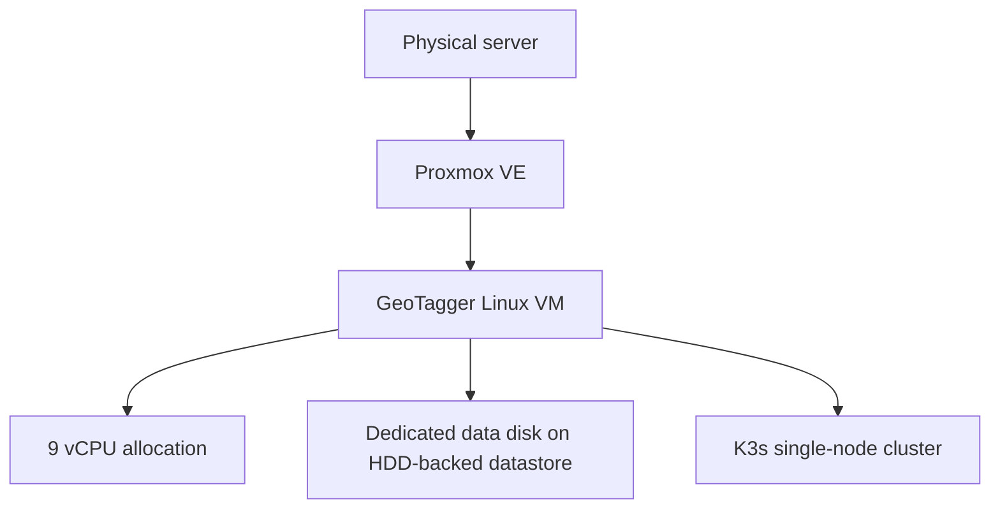
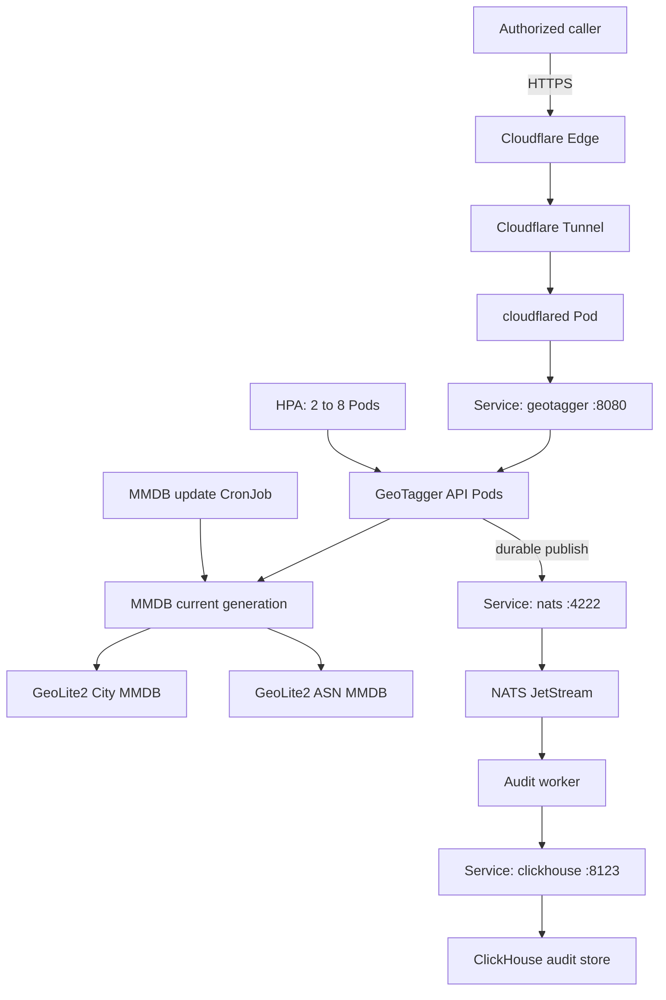
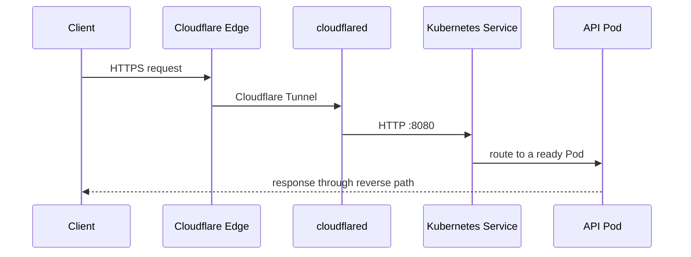
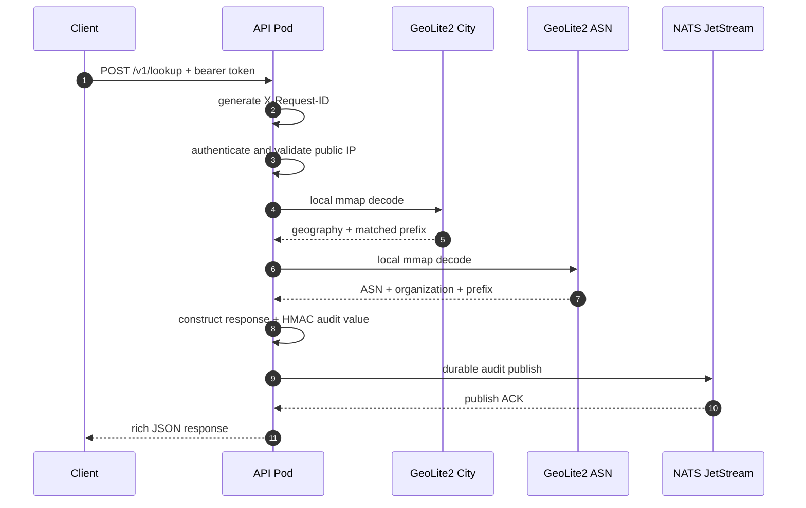
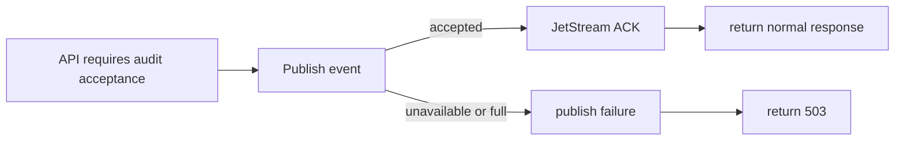
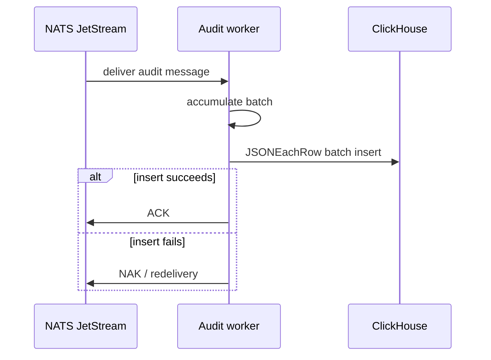
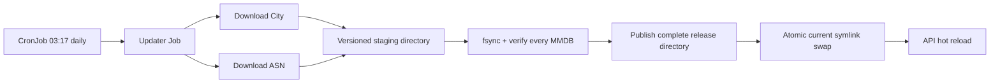
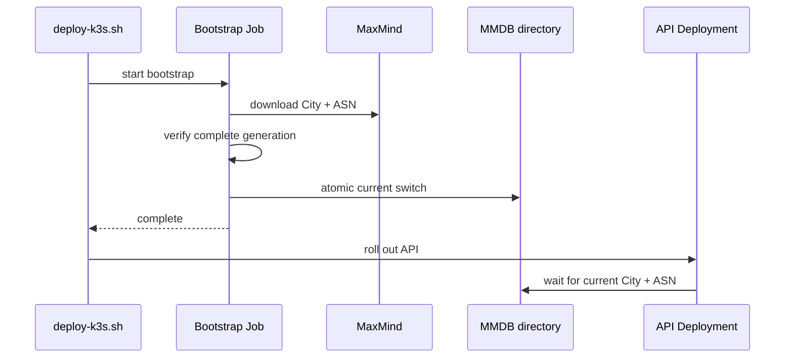
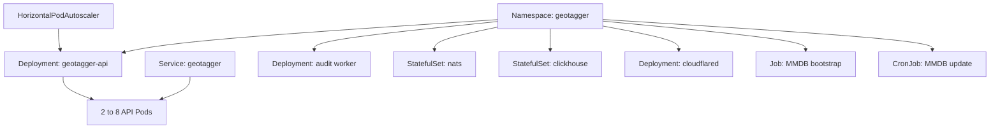
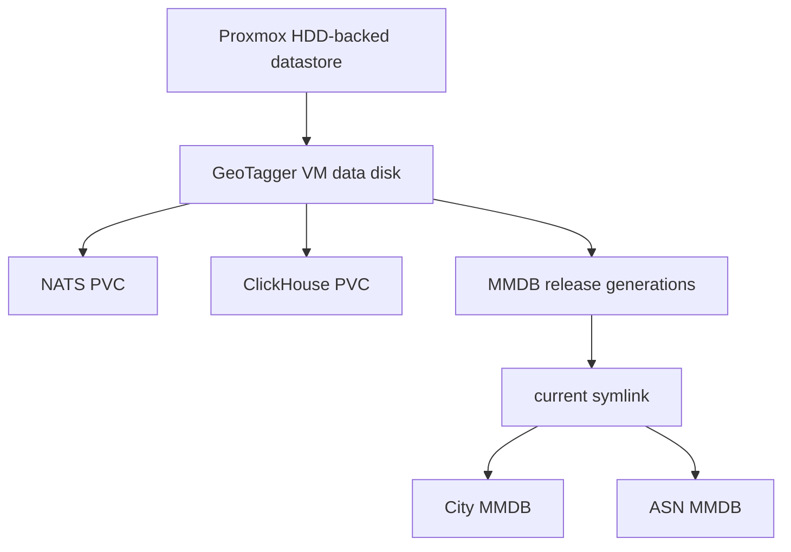

# GeoTagger Production Architecture

## Scope

GeoTagger is a self-hosted IP intelligence service deployed on a single K3s node inside a dedicated Proxmox VM. It performs local GeoLite2 City and ASN lookups, requires durable audit acceptance before returning normal success, and persists audit events asynchronously to ClickHouse.

Public endpoint:

```text
https://geo.itsjosiahdavis.dev
```

Normal lookups do not call MaxMind, IPinfo, or another third-party geolocation API.

## 1. System context


API surface:

```text
POST /v1/lookup
GET  /v1/lookup?ip=...
GET  /v1/me
POST /v1/country
```

`/v1/country` is retained for compatibility. New integrations should use `/v1/lookup` when they need network or approximate location metadata.

## 2. Physical placement



Kubernetes can recover application processes inside the VM. It cannot recover from loss of the one VM, Proxmox host, storage, local network or power source.

## 3. Logical service topology



ClickHouse is outside the synchronous request path. NATS JetStream is inside it because the API waits for durable audit acceptance.

## 4. Public ingress

`cloudflared` establishes outbound tunnel connections to Cloudflare. The VM does not require an inbound WAN port-forward or a public origin address.



Tunnel origin:

```text
http://geotagger.geotagger.svc.cluster.local:8080
```

## 5. Authentication boundary

Clients authenticate with:

```text
Authorization: Bearer <key-id>.<secret>
```

The server stores only SHA-256 digests of client secrets and performs constant-time comparison. Authentication occurs before target-IP parsing, so failed authentication does not cause the requested target IP to be retained in the audit event.

## 6. Full lookup request path



Both MMDB readers are local memory-mapped files. No HTTP call is made during the lookup.

## 7. `/v1/me` trust boundary

`GET /v1/me` resolves the caller address observed at ingress. Current precedence is:

```text
CF-Connecting-IP
first X-Forwarded-For entry
RemoteAddr for trusted internal/direct testing
```

The API origin must therefore remain restricted to the intended Cloudflare Tunnel/internal path. If direct untrusted origin access is introduced later, forwarded headers must be accepted only from explicitly trusted proxy peers.

## 8. Rich response model

The response can include:

```text
normalized IP
matched network/CIDR
continent
country
region/subdivision
city
postal code
estimated latitude/longitude
accuracy radius
timezone
ASN
ASN organization
public/private/loopback/link-local classification
IPv4/IPv6 classification
City database build/version
ASN database build/version
local lookup latency
request ID
```

City, region and coordinates are IP-geolocation estimates, not GPS. Missing data is not fabricated. Consumers should use `accuracy_radius_km` when precision matters.

## 9. Data minimization

Rich response fields are returned to the authenticated caller but are not copied wholesale into ClickHouse.

The durable audit record remains:

```text
timestamp
request ID
caller ID
HMAC/raw/omitted IP representation
country code/name
outcome
HTTP status
lookup latency
combined City/ASN source version metadata
```

This keeps city, postal code, coordinates, timezone and ASN out of durable audit storage unless a future requirement explicitly justifies them.

## 10. Audit durability

Production JetStream policy:

```text
Retention: WorkQueue
MaxAge:    0
MaxBytes:  8 GiB
Discard:   DiscardNew
```



The service fails closed when the required durable audit event cannot be accepted.

## 11. Audit persistence



Delivery is at least once. A crash after ClickHouse accepts an insert but before NATS receives the ACK can produce a duplicate; `request_id` is the correlation/deduplication key.

## 12. Atomic MMDB generation model

Production no longer replaces City and ASN independently. The updater publishes a **bundle generation** and atomically switches one `current` symlink.

Filesystem layout:

```text
/var/lib/geotagger/mmdb/
├── current -> releases/release-20260914T.../
└── releases/
    ├── release-.../
    ├── release-.../
    └── release-.../
        ├── GeoLite2-City.mmdb
        └── GeoLite2-ASN.mmdb
```

Updater flow:



Guarantee:

```text
readers see old complete generation
OR
readers see new complete generation
```

They do not see a City database from one update paired with an ASN database from another because activation occurs through one atomic symlink rename.

The updater keeps the three newest complete releases so an operator has short rollback/forensics headroom without unbounded disk growth.

Default updater configuration:

```text
MAXMIND_EDITIONS=GeoLite2-City,GeoLite2-ASN
MMDB_DIR=/data
```

The same `MAXMIND_LICENSE_KEY` downloads both editions.

## 13. Bootstrap and hot reload

Deployment creates a bootstrap Job before rolling out API Pods.



API paths:

```text
/data/current/GeoLite2-City.mmdb
/data/current/GeoLite2-ASN.mmdb
```

The API checks file modification times periodically. When `current` switches to a new generation, the new files are opened and verified before the in-process readers are swapped. No Pod restart is required.

## 14. Kubernetes resources



## 15. Health and autoscaling

Internal admin listener on port 9090:

```text
/healthz
/readyz
/metrics
```

Current API scaling:

```text
minimum replicas: 2
maximum replicas: 8
CPU request:       750m per Pod
CPU limit:         2 cores per Pod
CPU target:        65% of request
scale-down window: 5 minutes
```

All API Pods still share one 9-vCPU VM. HPA can consume spare capacity but cannot create new hardware.

## 16. Storage



NATS and ClickHouse require persistent state. MMDB generations are reproducible from MaxMind but are kept locally for runtime availability and rollback.

## 17. Network isolation

Allowed ingress relationships:

```text
cloudflared -> API        TCP 8080
API         -> NATS       TCP 4222
worker      -> NATS       TCP 4222
worker      -> ClickHouse TCP 8123
```

NATS and ClickHouse are ClusterIP-only. The current policy is ingress-focused; a future egress-deny policy must preserve DNS, Cloudflare and MaxMind download requirements.

## 18. Secrets and runtime hardening

Kubernetes Secret values include:

```text
API_KEYS
AUDIT_HMAC_KEY
CLICKHOUSE_PASSWORD
MAXMIND_LICENSE_KEY
CLOUDFLARE_TUNNEL_TOKEN
```

API/worker run as `65532:65532`; NATS runs as `1000:1000`. Application containers use non-root execution, disabled privilege escalation, dropped capabilities and read-only root filesystems where designed.

## 19. Failure behavior

| Failure | Effect | Recovery |
|---|---|---|
| API Pod crash | affected connection may fail | Deployment recreates Pod |
| API unready | removed from Service | returns after dependency recovery |
| one MMDB download/verification fails | new generation is never activated | existing `current` generation stays active |
| process dies before `current` swap | existing generation remains active | next Job retries |
| process dies after atomic `current` swap | new complete generation is active | API reloads it |
| NATS unavailable/full | durable audit ACK unavailable | normal lookup fails closed |
| worker unavailable | JetStream backlog grows | worker restarts and drains |
| ClickHouse unavailable | audit inserts/ACKs stop | JetStream retains work |
| cloudflared unavailable | public endpoint unavailable | Deployment restarts connector |
| VM/host unavailable | entire cluster unavailable | infrastructure recovery required |

## 20. Performance boundary

The historical benchmark measured the old country-only path. The rich endpoint adds a second MMDB decode and larger JSON response.

```text
rich public latency
= Cloudflare/network RTT
+ auth/validation
+ City MMDB decode
+ ASN MMDB decode
+ durable JetStream ACK
+ JSON serialization
```

Use `test/load/k6-rich.js` from an external load generator before publishing capacity claims for `/v1/lookup`. Redis remains intentionally absent until measurements show local MMDB decode work is a material bottleneck.

## 21. Availability boundary

The current deployment still contains one physical host, one VM, one K3s node, one NATS instance and one ClickHouse instance. Multiple API Pods improve process resilience and CPU utilization; they do not provide full infrastructure HA.
