# GeoTagger Production Architecture

## Scope

This document describes the deployed GeoTagger system: physical placement, request flow, Kubernetes resources, data persistence, trust boundaries, scaling, and failure behavior.

Related documents:

- `PROJECT_OVERVIEW.md` — service purpose and component responsibilities
- `KUBERNETES.md` — Kubernetes resource model and operating commands
- `API.md` — client-facing API contract
- `PERFORMANCE.md` — measured load-test results
- `SECURITY_AUDIT.md` — security findings and remediation plan
- `HIPAA_READINESS.md` — controls required before ePHI use
- `BACKUP_RECOVERY.md` — backup and restore requirements
- `INCIDENT_RESPONSE.md` — incident-response runbook

Public endpoint:

```text
https://geo.itsjosiahdavis.dev
```

## 1. System context

GeoTagger accepts a public IPv4 or IPv6 address, authenticates the caller, resolves the address to a country using a local GeoLite2 Country database, durably accepts an audit event, and returns the result.

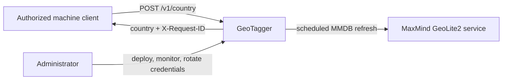

MaxMind is not called during normal request processing.

## 2. Physical deployment

The current runtime is a single K3s node inside a dedicated Linux VM on an on-premises Proxmox host.

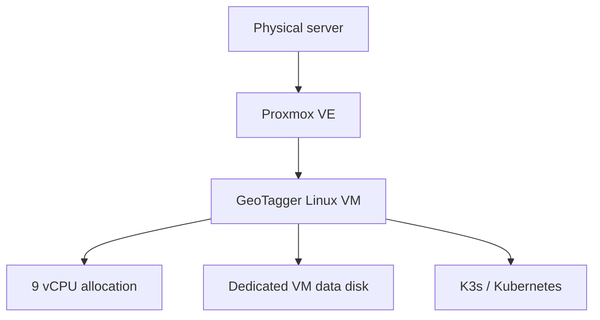

This design provides workload-level recovery inside the VM. It does not provide host-level or VM-level high availability.

## 3. Logical architecture

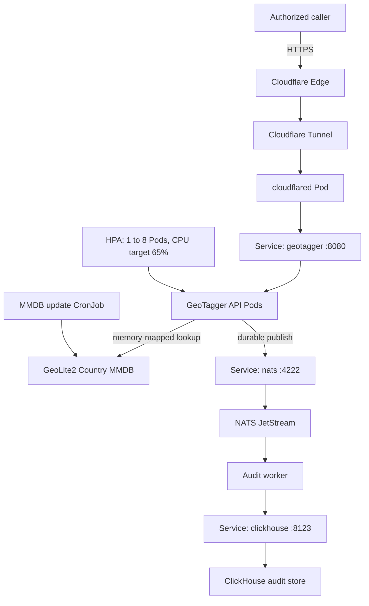

The request path and audit-persistence path are separated. ClickHouse is not in the synchronous response path.

## 4. Public ingress

The origin does not require a public IP or inbound port-forward rule. `cloudflared` establishes outbound tunnel connections to Cloudflare.

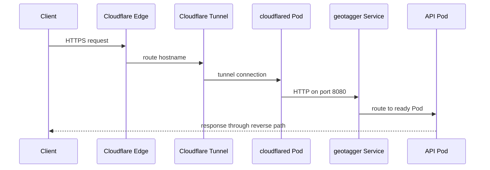

Tunnel origin target:

```text
http://geotagger.geotagger.svc.cluster.local:8080
```

The stable Service name decouples Cloudflare configuration from Pod IP addresses and replica count.

## 5. Synchronous lookup path

Request processing is intentionally short:

```text
authenticate
-> validate body and IP
-> local MMDB lookup
-> construct privacy-preserving audit event
-> durable JetStream publish and ACK
-> return HTTP response
```

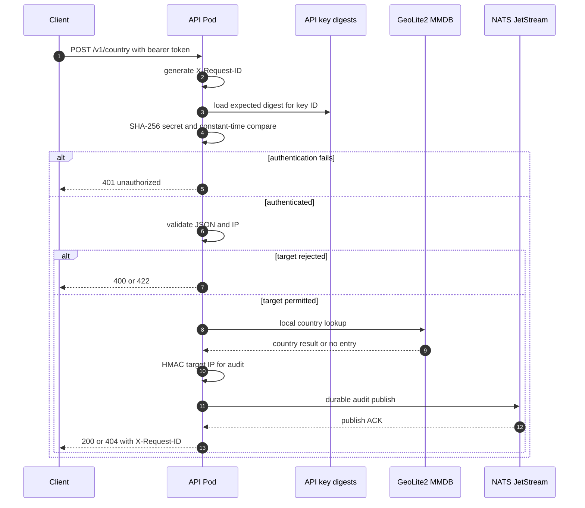

The API waits for JetStream acceptance, not for a ClickHouse insert.

## 6. Audit persistence

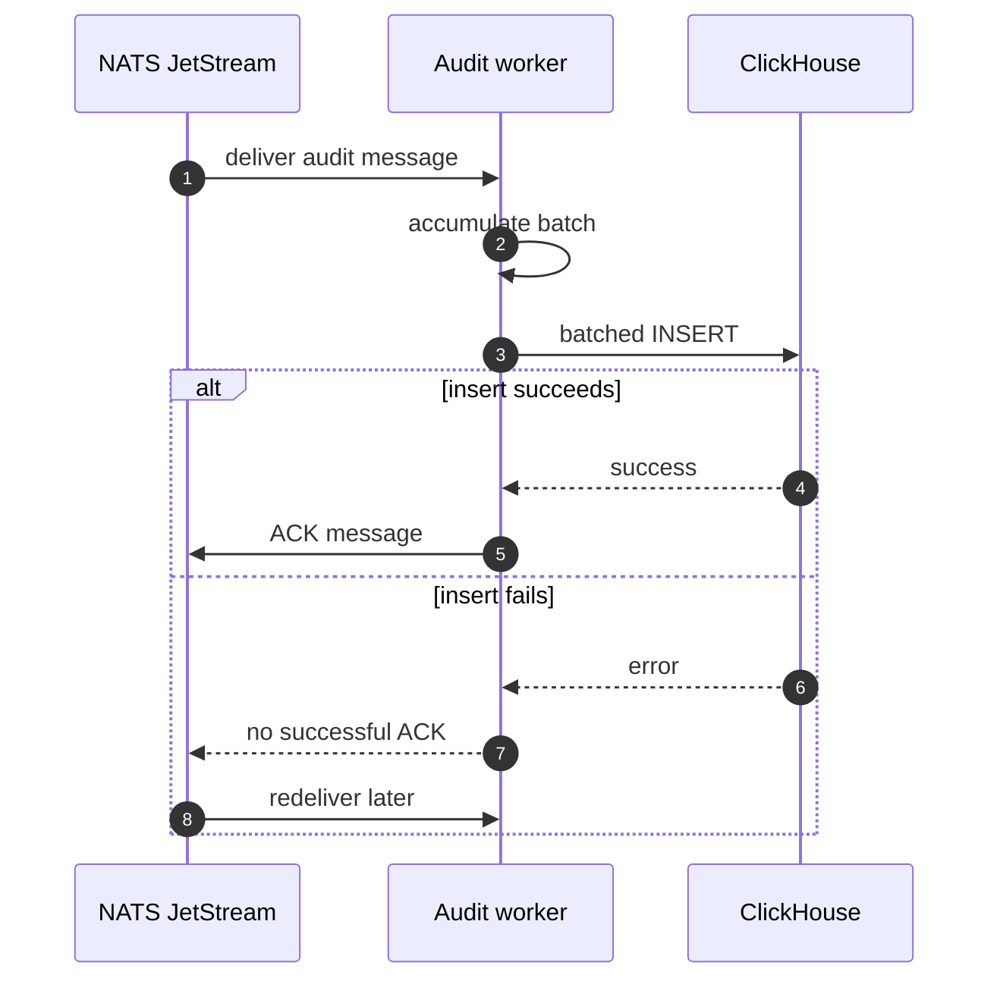

The worker uses at-least-once delivery. A crash after ClickHouse accepts an insert but before NATS receives the ACK can produce a duplicate row. `request_id` is the correlation and deduplication key when analysis requires uniqueness.

## 7. JetStream durability policy

Production stream safety settings:

```text
Retention: WorkQueue
MaxAge:    0
MaxBytes:  8 GiB
Discard:   DiscardNew
```

Behavior:

- `WorkQueue` retains work until the consumer completes it.
- `MaxAge=0` disables age-based expiry for required unpersisted events.
- `MaxBytes=8 GiB` bounds queue storage.
- `DiscardNew` rejects new events at the capacity limit instead of deleting older queued events.

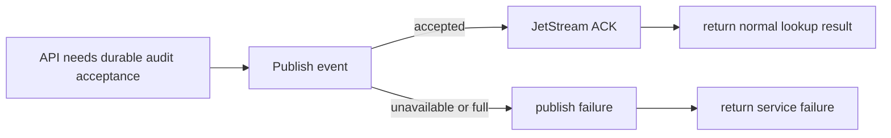

This is fail-closed behavior for required audit acceptance.

## 8. MMDB update path

The database is refreshed independently from request processing.

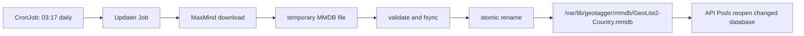

The CronJob uses `concurrencyPolicy: Forbid`, which prevents overlapping scheduled updates.

## 9. Kubernetes resources

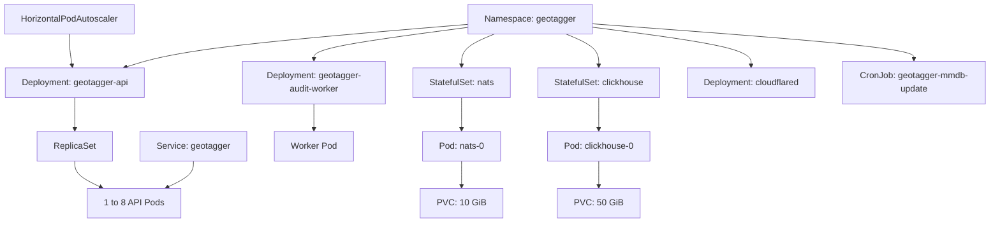

See `KUBERNETES.md` for the resource lifecycle and operating commands.

## 10. Pod/container boundary

K3s uses containerd to run OCI images.

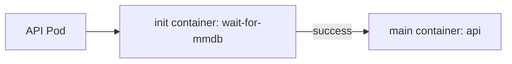

A Pod owns lifecycle/networking. The container runs the application process.

## 11. Service discovery and readiness

API Pod addresses can change at any time. The Service gives callers a stable endpoint and routes only to ready endpoints.

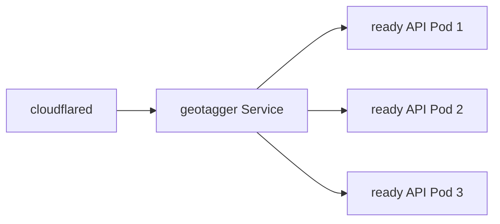

Internal consumers use:

```text
nats:4222
clickhouse:8123
```

rather than stateful Pod IPs.

## 12. Health model

API administrative endpoints are internal on port 9090:

```text
/healthz
/readyz
/metrics
```

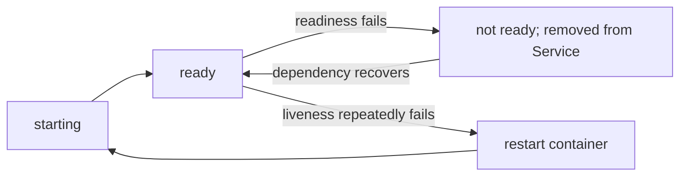

Liveness controls restart behavior. Readiness controls traffic eligibility.

## 13. Horizontal scaling

The API HPA is configured with one minimum replica, eight maximum replicas and a 65% CPU target.

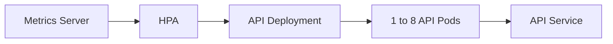

All replicas currently share the same 9-vCPU VM. HPA can use spare cores; it cannot create additional physical CPU. Once the VM saturates, more Pods can increase contention.

## 14. Storage architecture

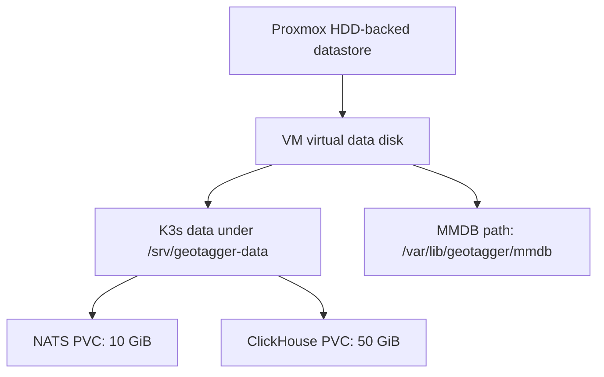

The current layout keeps large K3s/PVC state off the small guest root filesystem. PVC requests are initial allocations, not measured long-term capacity guarantees.

## 15. ClickHouse data model

Audit table:

```text
geotagger.audit_events
```

Key schema properties:

```text
engine:    MergeTree
partition: toDate(timestamp)
order key: (timestamp, caller_id, request_id)
TTL:       timestamp + 30 days
```

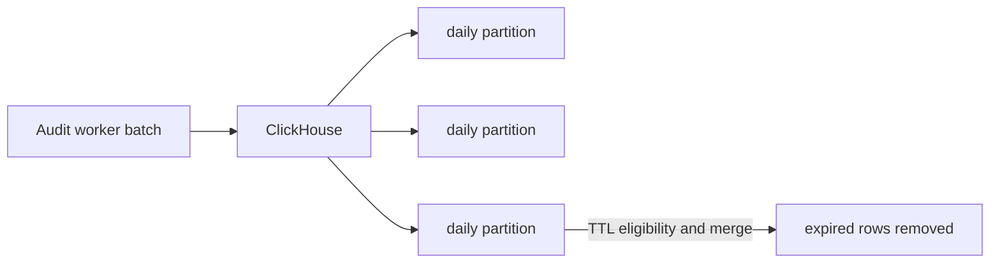

TTL deletion is merge-driven, so expiration is not guaranteed at an exact second.

The deployed ClickHouse image remains pinned to a Westmere-compatible 26.3 LTS build because the host lacks AVX2 required by newer default x86-64-v3 images.

## 16. Network isolation

Base ingress rules:

```text
cloudflared  -> API        TCP 8080
API          -> NATS       TCP 4222
worker       -> NATS       TCP 4222
worker       -> ClickHouse TCP 8123
```

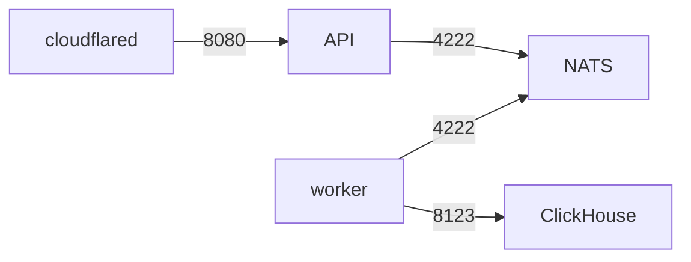

NATS and ClickHouse are ClusterIP-only services. The current base policy is ingress-focused. A stricter egress policy must preserve DNS, Cloudflare and MaxMind access and should be staged before production enforcement.

## 17. Secrets

`geotagger-secrets` supplies:

```text
API_KEYS
AUDIT_HMAC_KEY
CLICKHOUSE_PASSWORD
MAXMIND_LICENSE_KEY
CLOUDFLARE_TUNNEL_TOKEN
```

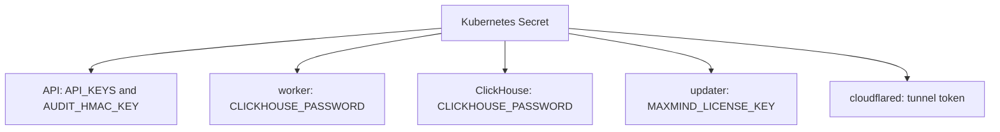

Production operation must verify K3s secrets encryption, restrict administrative access, keep protected recovery copies, and rotate credentials after suspected disclosure.

## 18. Container hardening

API and worker run as numeric UID/GID `65532:65532`; NATS runs as `1000:1000`.

Application controls include:

```text
runAsNonRoot: true
allowPrivilegeEscalation: false
readOnlyRootFilesystem: true
capabilities: drop ALL
```

Numeric identities avoid ambiguity in Kubernetes `runAsNonRoot` admission checks.

## 19. Failure and recovery

| Failure | Effect | Recovery path |
|---|---|---|
| API Pod crash | affected connection may fail | Deployment/ReplicaSet restores desired replicas |
| API readiness failure | Pod stops receiving new traffic | Service re-adds it after readiness succeeds |
| worker unavailable | JetStream backlog grows | Deployment restarts worker; backlog drains |
| ClickHouse unavailable | worker cannot persist/ACK | backlog remains in JetStream until recovery |
| NATS unavailable | API cannot obtain durable audit ACK | normal audited success fails closed |
| JetStream full | new audit publish rejected | restore consumer/database capacity; do not weaken durability settings |
| cloudflared unavailable | public endpoint unavailable | Deployment restarts connector |
| VM or host unavailable | entire cluster unavailable | infrastructure/VM recovery required |

Full restoration is documented in `BACKUP_RECOVERY.md`.

## 20. Rolling updates

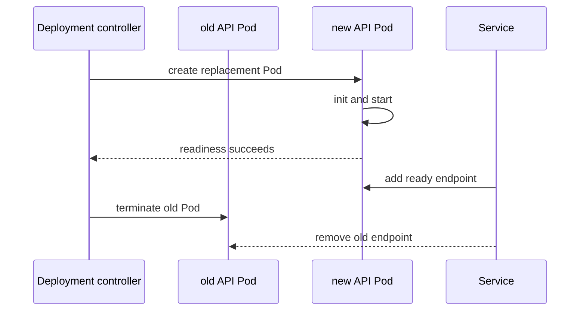

StatefulSet upgrades need a separate backup/compatibility plan because NATS and ClickHouse each have one replica.

## 21. Performance path

End-to-end latency includes more than the MMDB lookup:

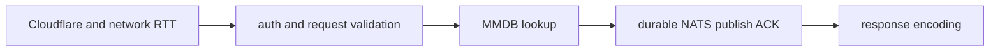

The validated `8.8.8.8` request recorded a 56-microsecond MMDB lookup. The first public load test reached CPU saturation before HDD saturation; disk utilization stayed below roughly 3%. See `PERFORMANCE.md` for the complete test conditions and interpretation.

## 22. Trust boundaries

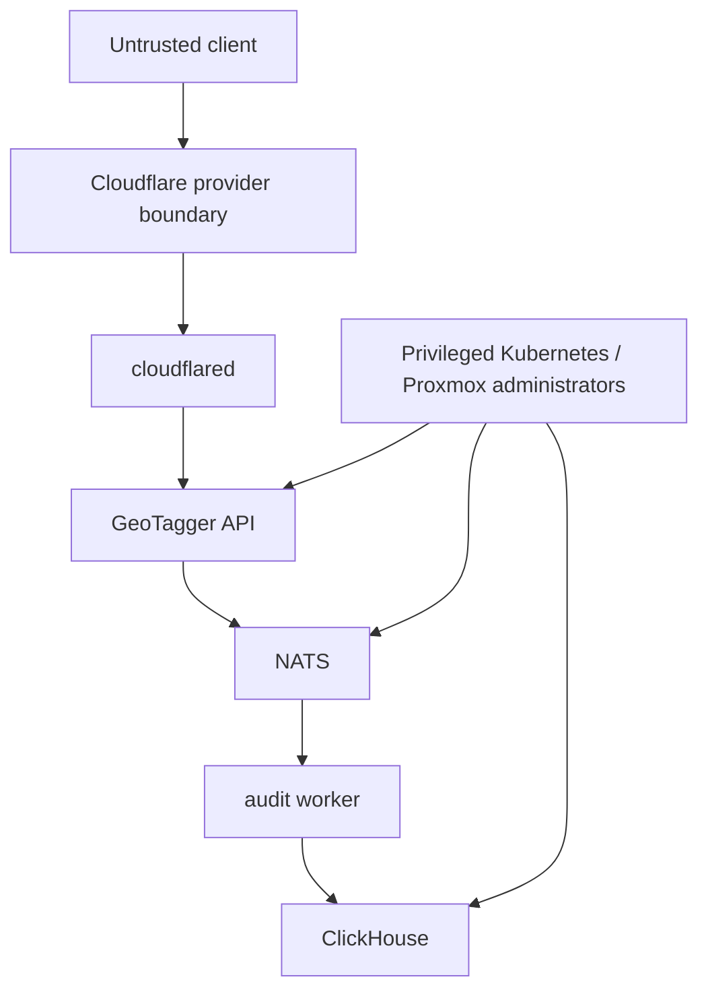

Cloudflare does not replace application authentication. Kubernetes/Proxmox administrative access is materially more privileged than ordinary API access and must be governed separately.

## 23. Verified end-to-end path

Production-path validation completed successfully for request ID:

```text
c75bb0a033c44dd87a9969df059dd6b4
```

Observed result:

```text
POST https://geo.itsjosiahdavis.dev/v1/country
input:             8.8.8.8
HTTP:              200
country:           United States
caller_id:         azure-prod
ip_mode:           hmac
lookup_latency_us: 56
```

The same request ID was found in ClickHouse, confirming:

```text
Internet
-> Cloudflare
-> tunnel
-> Kubernetes Service
-> API
-> local MMDB
-> JetStream durable publish
-> audit worker
-> ClickHouse
```

Private-target handling was separately verified with `10.0.0.1`, which returned HTTP 422.

## 24. Availability boundary and future HA

Current deployment:

```text
1 physical host
1 GeoTagger VM
1 K3s node
1 to 8 API Pods
1 NATS replica
1 audit worker replica
1 ClickHouse replica
```

A future multi-node cluster could distribute stateless API replicas:

```mermaid
flowchart TB
    SVC["GeoTagger API Service"] --> N1["Node A: API"]
    SVC --> N2["Node B: API"]
    SVC --> N3["Node C: API"]
```

That alone would not make NATS, ClickHouse or storage highly available. Stateful HA needs replicated state, independent failure domains, tested backups, and a deliberate storage/network design.

## 25. Operational acceptance checklist

```text
[ ] Cloudflare Tunnel connected
[ ] public DNS resolves
[ ] API has at least one ready replica
[ ] HPA receives valid CPU metrics
[ ] MMDB exists and API readiness succeeds
[ ] NATS StatefulSet ready
[ ] audit worker running
[ ] ClickHouse StatefulSet ready
[ ] NATS and ClickHouse PVCs bound
[ ] NetworkPolicies present
[ ] Kubernetes Secrets present and absent from Git
[ ] authenticated public lookup succeeds
[ ] X-Request-ID returned
[ ] matching audit row reaches ClickHouse
[ ] private IP rejected
[ ] invalid bearer token rejected
[ ] raw IP absent when HMAC mode is configured
[ ] backup/restore status is current
[ ] security and compliance gates are current for the data classification
```

## 26. Architecture decisions

**Kubernetes instead of only Docker Compose:** required for HPA, readiness-aware Services, reconciliation, StatefulSet/PVC lifecycle, CronJobs, NetworkPolicy and rolling Deployments.

**NATS before ClickHouse:** keeps analytical inserts off the synchronous path while requiring durable audit acceptance before normal success.

**HMAC instead of raw IP:** supports correlation without retaining the raw target address by default.

**Fail closed at audit-capacity failure:** prevents successful responses from silently bypassing the required audit guarantee.

**Single node today:** matches available hardware and keeps operations manageable. Multi-node stateful HA should be added only against a defined availability requirement and tested recovery design.
