# GeoTagger Production Architecture

## Scope

GeoTagger is a self-hosted IP intelligence service deployed on a single K3s node inside a dedicated Proxmox VM. It performs local GeoLite2 City and ASN lookups, requires durable audit acceptance before returning normal success, and persists audit events asynchronously to ClickHouse.

Public endpoint:

```text
https://geo.itsjosiahdavis.dev
```

The architecture is intentionally split into three concerns:

```text
request serving
local IP intelligence data
asynchronous audit persistence
```

Normal requests do not call MaxMind, IPinfo, or another third-party geolocation API.

## 1. System context

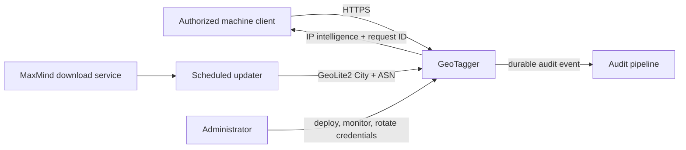

The client-facing API supports:

```text
POST /v1/lookup
GET  /v1/lookup?ip=...
GET  /v1/me
POST /v1/country
```

`/v1/country` remains as a compatibility endpoint. New integrations should use `/v1/lookup` unless they need only the country name.

## 2. Physical placement

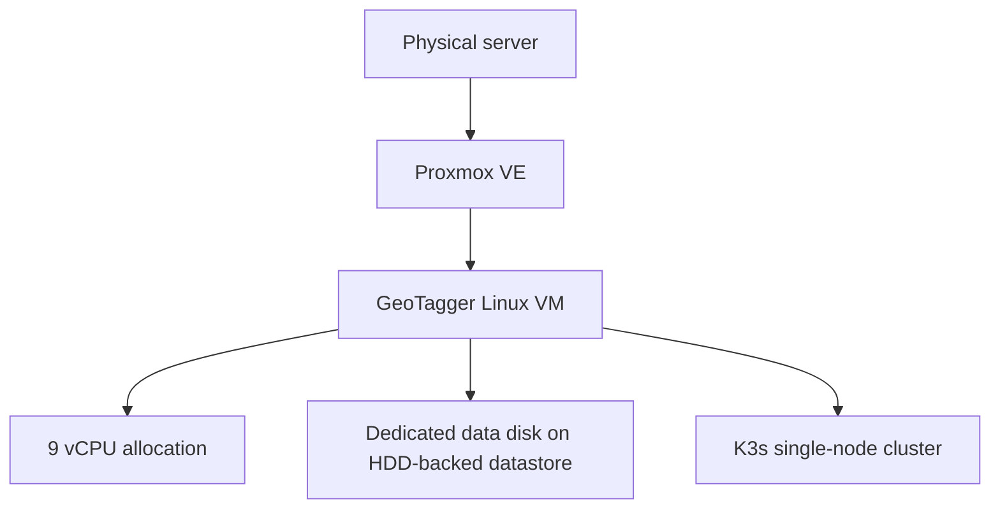

This provides application-process recovery and orchestration inside the VM. It does not provide hardware high availability. A Proxmox host, VM, local network, or power failure can still make the entire service unavailable.

## 3. Logical service topology

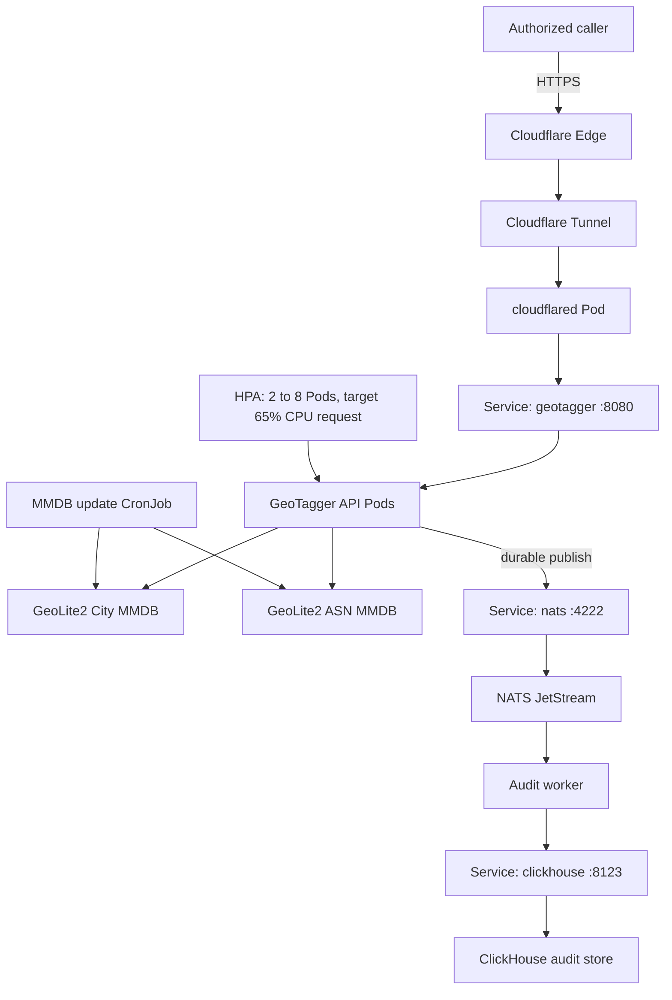

ClickHouse is not in the synchronous response path. NATS JetStream is.

## 4. Public ingress

`cloudflared` establishes outbound connections to Cloudflare. The VM does not require a public origin IP or inbound NAT rule.

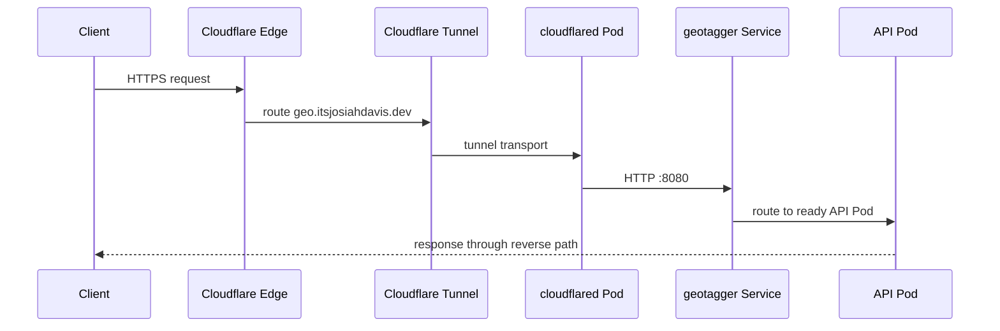

Tunnel origin:

```text
http://geotagger.geotagger.svc.cluster.local:8080
```

The Kubernetes Service name is stable even when Pod IPs or replica counts change.

## 5. Authentication boundary

Clients authenticate with:

```text
Authorization: Bearer <key-id>.<secret>
```

The server stores only SHA-256 digests of client secrets. Secret comparison is constant-time.

Authentication happens before target-IP parsing. An unauthenticated request is audited as `unauthenticated`, but GeoTagger does not parse/store the requested target IP before authentication succeeds.

## 6. Full lookup request path

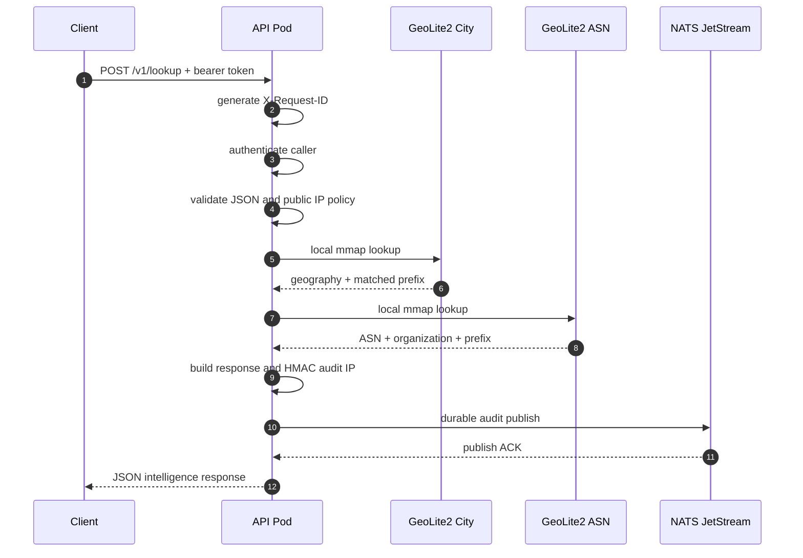

The City and ASN readers are local memory-mapped files. There is no network lookup between the API and either database.

## 7. `/v1/me` path

`GET /v1/me` uses the observed caller IP rather than an explicit request body.

Preference order:

```text
CF-Connecting-IP
first X-Forwarded-For entry
RemoteAddr for trusted internal/direct testing
```

This is safe only while the origin remains restricted to the intended Cloudflare Tunnel/internal trust boundary. If an untrusted client can connect directly to the origin, forwarded headers must not be trusted without a stronger trusted-proxy check.

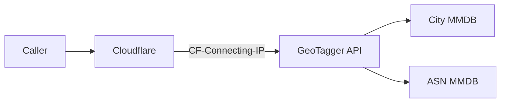

## 8. Rich response data model

The rich lookup response can include:

```text
normalized IP
matched network/CIDR
continent code/name
country code/name
region/subdivision code/name
city
postal code
estimated latitude/longitude
accuracy radius
timezone
ASN
ASN organization
public/private/loopback/link-local classification
IPv4/IPv6 classification
City database build/version
ASN database build/version
local lookup latency
request ID
```

Missing data is not fabricated.

City/region/coordinate values are IP-geolocation estimates. They are not GPS location. `accuracy_radius_km` is returned specifically so downstream systems can represent uncertainty.

## 9. Data-minimization boundary

The rich response is not copied wholesale into ClickHouse.

The durable audit event remains intentionally smaller:

```text
timestamp
request ID
caller ID
HMAC/raw/omitted IP representation according to policy
country code/name
outcome
HTTP status
lookup latency
combined City/ASN database version metadata
```

This keeps city, coordinates, postal code, timezone and ASN out of the retained audit schema unless a future requirement explicitly justifies storing them.

## 10. Audit durability

JetStream configuration:

```text
Retention: WorkQueue
MaxAge:    0
MaxBytes:  8 GiB
Discard:   DiscardNew
```

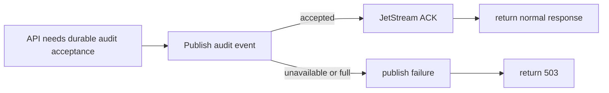

The service deliberately fails closed when required durable audit acceptance is unavailable.

## 11. Audit persistence

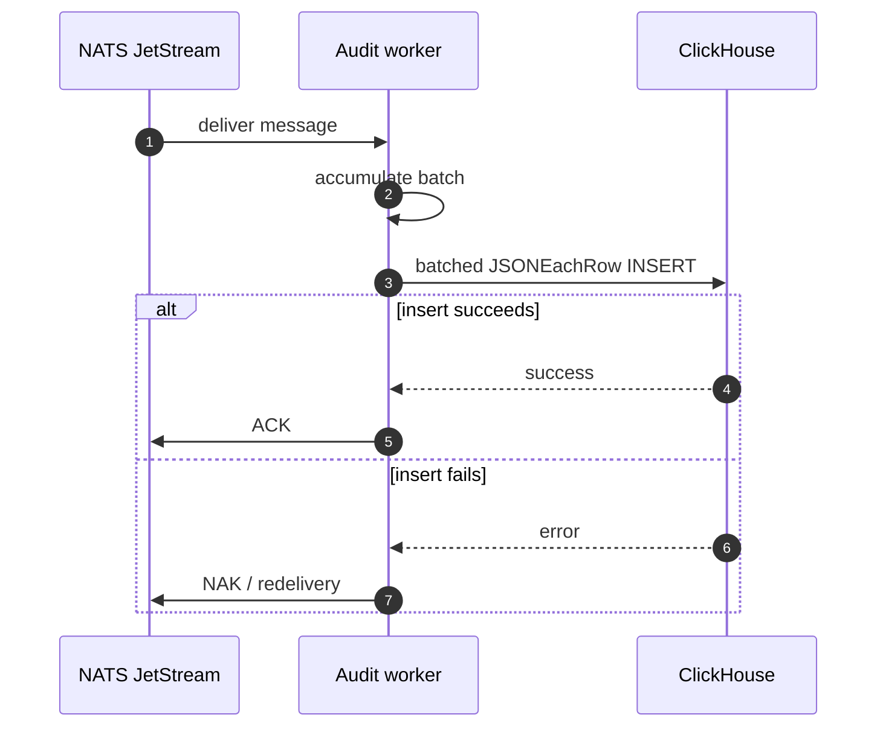

Delivery is at least once. A worker crash after ClickHouse accepts a row but before the NATS ACK can produce a duplicate. `request_id` is the correlation/deduplication key when uniqueness matters.

## 12. MMDB update architecture

The updater now manages City and ASN together using the same MaxMind license key.

Default updater configuration:

```text
MAXMIND_EDITIONS=GeoLite2-City,GeoLite2-ASN
MMDB_DIR=/data
```

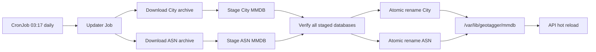

Important update semantics:

- every configured database must download successfully before live replacement begins;
- every staged MMDB is opened and verified before replacement;
- each file replacement uses an atomic rename;
- a process/host crash between the two final renames can briefly leave different City/ASN build timestamps;
- the API tolerates this and reports each database's source version independently;
- API Pods periodically check both files and reopen changed readers without restart.

The CronJob uses:

```text
concurrencyPolicy: Forbid
```

so two scheduled update Jobs do not overlap.

## 13. Bootstrap path

Deployment runs a one-time bootstrap Job before rolling out the API.

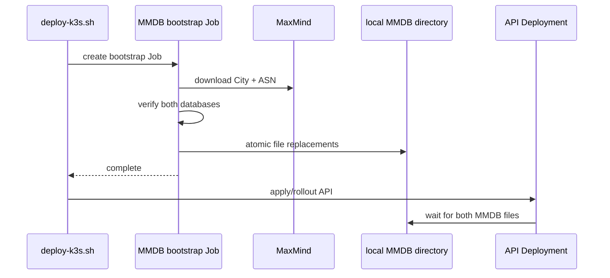

The API init container waits until both files are present and non-empty:

```text
/data/GeoLite2-City.mmdb
/data/GeoLite2-ASN.mmdb
```

## 14. Kubernetes resource map

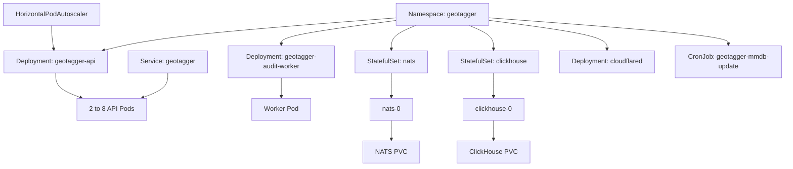

## 15. Health model

API admin listener on port 9090:

```text
/healthz
/readyz
/metrics
```

The public Kubernetes Service exposes only port 8080.

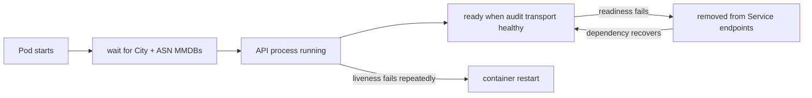

## 16. Autoscaling

Current API HPA:

```text
minimum replicas: 2
maximum replicas: 8
CPU request:       750m per Pod
CPU limit:         2 cores per Pod
CPU target:        65% of request
scale-down window: 5 minutes
```

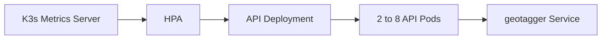

All replicas share the same 9-vCPU VM. HPA can consume unused node capacity; it cannot create more physical CPU.

## 17. Storage

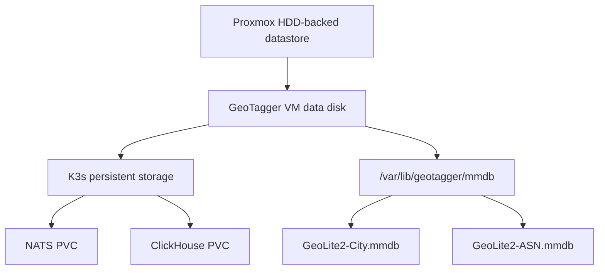

MMDB files are node-local read-only mounts inside API Pods. NATS and ClickHouse use persistent volumes.

## 18. Network policy

Required ingress relationships:

```text
cloudflared -> API        TCP 8080
API         -> NATS       TCP 4222
worker      -> NATS       TCP 4222
worker      -> ClickHouse TCP 8123
```

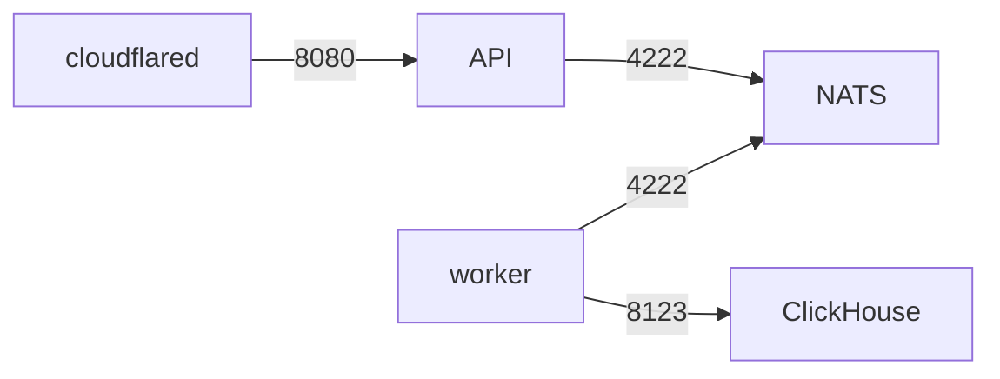

NATS and ClickHouse are ClusterIP-only and are not intended to be reachable from the Internet or ordinary LAN clients.

## 19. Secrets

Kubernetes Secret data includes:

```text
API_KEYS
AUDIT_HMAC_KEY
CLICKHOUSE_PASSWORD
MAXMIND_LICENSE_KEY
CLOUDFLARE_TUNNEL_TOKEN
```

One MaxMind license key downloads both City and ASN editions.

The K3s deployment should use secrets encryption at rest, controlled administrator access, protected recovery copies and documented rotation/revocation procedures.

## 20. Container hardening

API/worker runtime identity:

```text
UID:GID 65532:65532
```

NATS runtime identity:

```text
UID:GID 1000:1000
```

Application hardening includes:

```text
runAsNonRoot: true
allowPrivilegeEscalation: false
readOnlyRootFilesystem: true where supported
capabilities: drop ALL
```

## 21. Failure behavior

| Failure | Effect | Recovery |
|---|---|---|
| API Pod crash | connection may fail | Deployment recreates Pod |
| one API Pod unready | removed from Service | returns after readiness recovers |
| City/ASN update download failure | current live files remain | next Job retries later |
| one staged MMDB invalid | no live replacement begins | updater fails Job |
| NATS unavailable | no durable audit ACK | API returns service failure |
| worker unavailable | JetStream backlog grows | worker restarts and drains backlog |
| ClickHouse unavailable | worker cannot persist/ACK | messages remain queued |
| JetStream full | new audit event rejected | restore consumer/storage capacity |
| cloudflared unavailable | public endpoint unavailable | Deployment restarts connector |
| VM/host unavailable | entire service unavailable | infrastructure recovery required |

## 22. Performance boundary

The original benchmark measured the country-only path. The rich endpoint now performs two MMDB decodes and serializes a larger response.

Expected cost model:

```text
public request latency
= Cloudflare/network RTT
+ authentication/validation
+ City MMDB decode
+ ASN MMDB decode
+ durable JetStream publish ACK
+ JSON serialization
```

The old 56-microsecond observation was a single country lookup and should not be presented as the measured rich-lookup latency.

A new external-generator test should measure:

```text
POST /v1/country
POST /v1/lookup
GET  /v1/lookup?ip=...
GET  /v1/me
```

and compare origin-side metrics with public-path latency.

Redis is not part of the architecture because both lookup datasets are already local memory-mapped files. Add caching only if the new benchmark shows City/ASN decode work is a material bottleneck.

## 23. Availability boundary

Kubernetes improves process recovery, deployment behavior and horizontal use of spare CPU, but the current design still has one:

```text
physical host
VM
K3s node
NATS instance
ClickHouse instance
```

True high availability would require multiple failure domains and replicated state, not merely more API Pods.
