# GeoTagger on Kubernetes / K3s

## Short answer: are Pods Docker containers?

Not exactly.

A **container** is the isolated process/runtime unit. A **Pod** is a Kubernetes object that owns one or more containers that are scheduled together and share a network namespace, IP address, localhost interface, and some lifecycle/storage configuration.

On this deployment, K3s uses **containerd** as its container runtime. It does not need the Docker daemon to run the workloads.

The relationship is:

```text
Kubernetes Pod
└── OCI container(s)
    └── Linux process(es)
```

The images can still be built with Docker and stored in GHCR because Docker images follow the OCI/container-image format understood by containerd.

For most GeoTagger workloads, one Pod contains one long-running application container:

```text
Pod: geotagger-api-xxxxx
└── container: api

Pod: geotagger-audit-worker-xxxxx
└── container: worker

Pod: nats-0
└── container: nats

Pod: clickhouse-0
└── container: clickhouse
```

The API Pod also has an **init container** called `wait-for-mmdb`. That container runs before the main API container, verifies that the GeoLite2 database exists, exits, and then the API container starts.

```text
API Pod lifecycle

1. init container: wait-for-mmdb
   └── waits until /data/GeoLite2-Country.mmdb exists

2. init container exits successfully

3. main container: api
   └── starts the Go service
```

The init container and API container are part of the same Pod, but they are not running at the same time in normal operation.

---

# Why K3s

K3s is a lightweight Kubernetes distribution. GeoTagger uses it because the project needs more than simply "start five containers":

- automatic restart/reconciliation;
- stable internal service discovery;
- rolling deployments;
- health/readiness probes;
- horizontal API scaling;
- persistent state for NATS and ClickHouse;
- scheduled MMDB updates;
- namespace/network-policy isolation;
- Kubernetes Secrets;
- declarative deployment manifests; and
- a path to multi-node deployment later without rewriting the application architecture.

K3s is deployed inside a dedicated Linux VM on Proxmox.

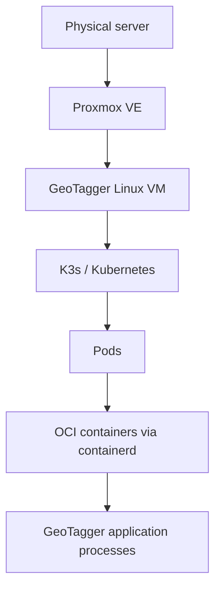

Kubernetes manages **application workloads**. Proxmox manages **virtual machines and physical resource allocation**.

---

# Runtime hierarchy

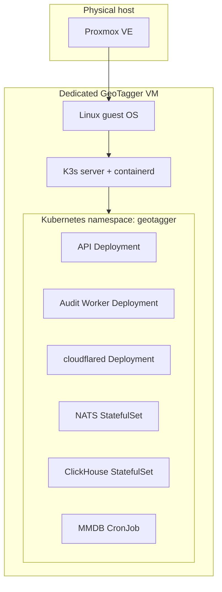

Everything application-specific is placed in the `geotagger` namespace.

---

# Resource map

| Kubernetes resource | Name | Purpose |
|---|---|---|
| Namespace | `geotagger` | Isolation boundary for project resources |
| Deployment | `geotagger-api` | Stateless lookup API |
| Service | `geotagger` | Stable internal endpoint for API Pods |
| HPA | `geotagger-api` | Scales API replica count from 1 to 8 |
| Deployment | `geotagger-audit-worker` | Consumes audit events and writes ClickHouse |
| StatefulSet | `nats` | Durable JetStream audit queue |
| Service | `nats` | Stable internal endpoint `nats:4222` |
| PVC | `data-nats-0` | Persistent JetStream state, initially 10 GiB |
| StatefulSet | `clickhouse` | Audit analytics/event store |
| Service | `clickhouse` | Stable internal endpoint `clickhouse:8123` |
| PVC | `data-clickhouse-0` | Persistent ClickHouse state, initially 50 GiB |
| Deployment | `cloudflared` | Outbound Cloudflare Tunnel connector |
| CronJob | `geotagger-mmdb-update` | Downloads/updates GeoLite2 Country database |
| Secret | `geotagger-secrets` | Runtime credentials/keys |
| ConfigMap | `clickhouse-init` | ClickHouse schema bootstrap SQL |
| NetworkPolicy | several | Restricts allowed ingress between Pods |

---

# Deployments

A Kubernetes **Deployment** manages replaceable/stateless Pods.

For GeoTagger the API is a Deployment because there is no important request state stored inside an API Pod. If an API Pod disappears, Kubernetes can simply create another one.

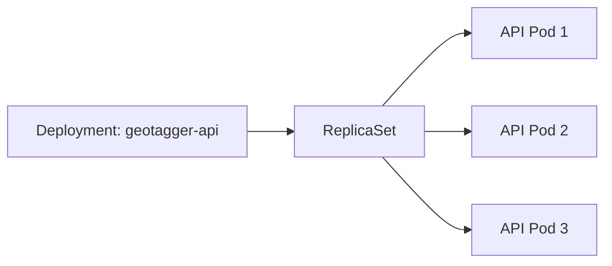

The desired number of Pods is declarative. Kubernetes continuously reconciles the actual state toward that desired state.

Example:

```text
desired replicas = 3
actual healthy Pods = 2

Kubernetes response:
create another Pod
```

If a Pod crashes:

```text
API Pod dies
   ↓
ReplicaSet notices desired count is not met
   ↓
new API Pod is scheduled
   ↓
readiness probe passes
   ↓
Service begins routing traffic to it
```

The audit worker and cloudflared are also Deployments because their running container instance can be recreated from configuration.

---

# StatefulSets

A **StatefulSet** is used when identity and persistent storage matter.

NATS and ClickHouse are stateful:

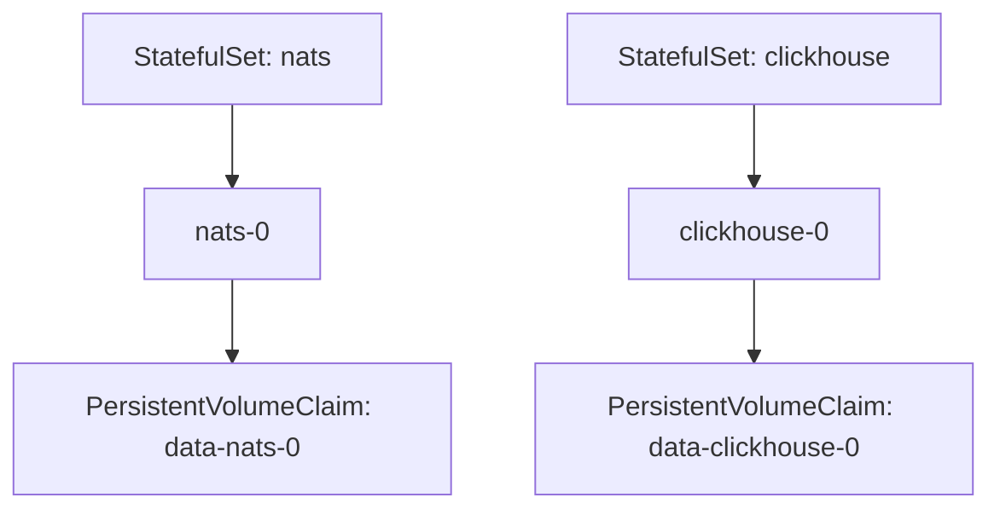

The Pod itself is replaceable, but its data volume survives Pod recreation.

Conceptually:

```text
nats-0 crashes
   ↓
Kubernetes creates replacement nats-0
   ↓
replacement mounts the same PVC
   ↓
JetStream files are still present
```

and similarly for ClickHouse.

The current architecture uses one NATS replica and one ClickHouse replica. That provides process restart/recovery but not replicated database/message-broker high availability.

---

# Services and internal DNS

Pod IP addresses are ephemeral. A replacement Pod can get a completely different IP.

Kubernetes **Services** provide stable names and virtual IPs so applications do not depend on Pod addresses.

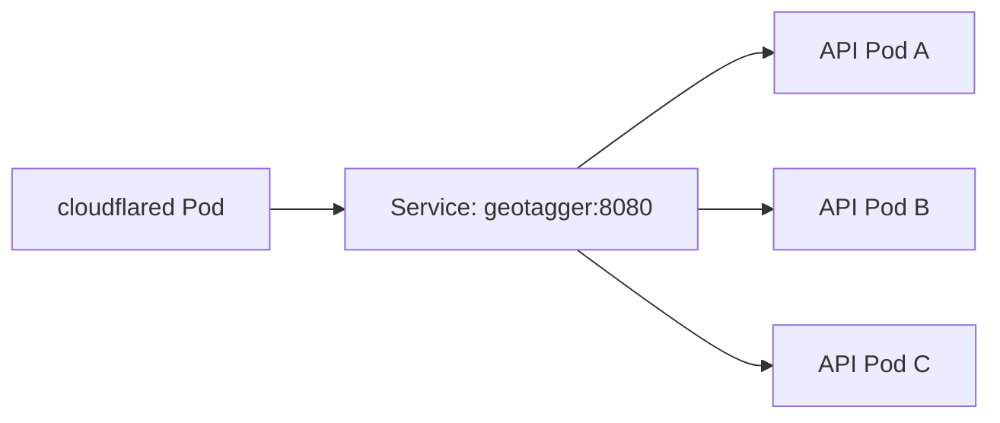

Internal names include:

```text
geotagger:8080
nats:4222
clickhouse:8123
```

The fully qualified API Service DNS name is:

```text
geotagger.geotagger.svc.cluster.local
```

Cloudflare Tunnel is configured to send traffic to the stable Service name rather than a Pod IP.

This is why API replicas can be created, removed, or replaced without changing DNS or Cloudflare configuration.

---

# Horizontal Pod Autoscaler

The GeoTagger API has a HorizontalPodAutoscaler (HPA):

```text
minimum replicas: 1
maximum replicas: 8
CPU target:       65%
```

The HPA reads resource metrics from Kubernetes Metrics Server and changes the Deployment's desired replica count.

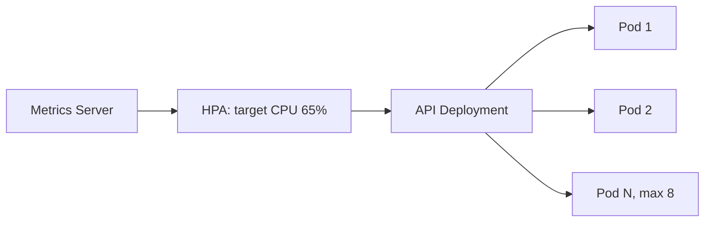

A simplified example:

```text
1 API Pod
average CPU = 90%
        ↓
HPA calculates additional replicas
        ↓
Deployment desired count increases
        ↓
Kubernetes creates more API Pods
        ↓
Service automatically includes ready Pods
```

When load falls, the HPA can scale back toward one replica. Scale-down has a stabilization window so a short dip does not immediately destroy replicas and cause oscillation.

## Important limitation

HPA creates **more Pods, not more hardware**.

All Pods currently share one 9-vCPU VM.

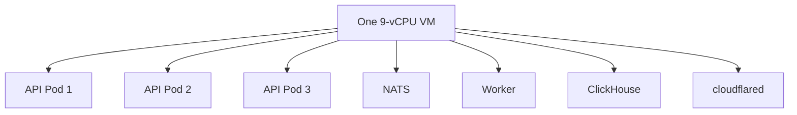

Autoscaling is useful while spare VM CPU exists. Once the VM itself is CPU saturated, more Pods cannot create capacity and can increase scheduler/contention overhead.

This distinction is important:

```text
Horizontal Pod Autoscaling = use available node capacity more effectively
Node/cluster autoscaling    = add actual machines/capacity
```

The current on-prem deployment has the first but not automatic node autoscaling.

---

# Health probes

Kubernetes has separate concepts for **liveness** and **readiness**.

## Liveness

Question:

> Is this container still functioning, or should Kubernetes restart it?

API:

```text
GET :9090/healthz
```

If the probe repeatedly fails, kubelet/containerd restarts the container.

## Readiness

Question:

> Is this Pod currently safe to receive new traffic?

API:

```text
GET :9090/readyz
```

If readiness fails, Kubernetes leaves the Pod running but removes it from Service endpoints.

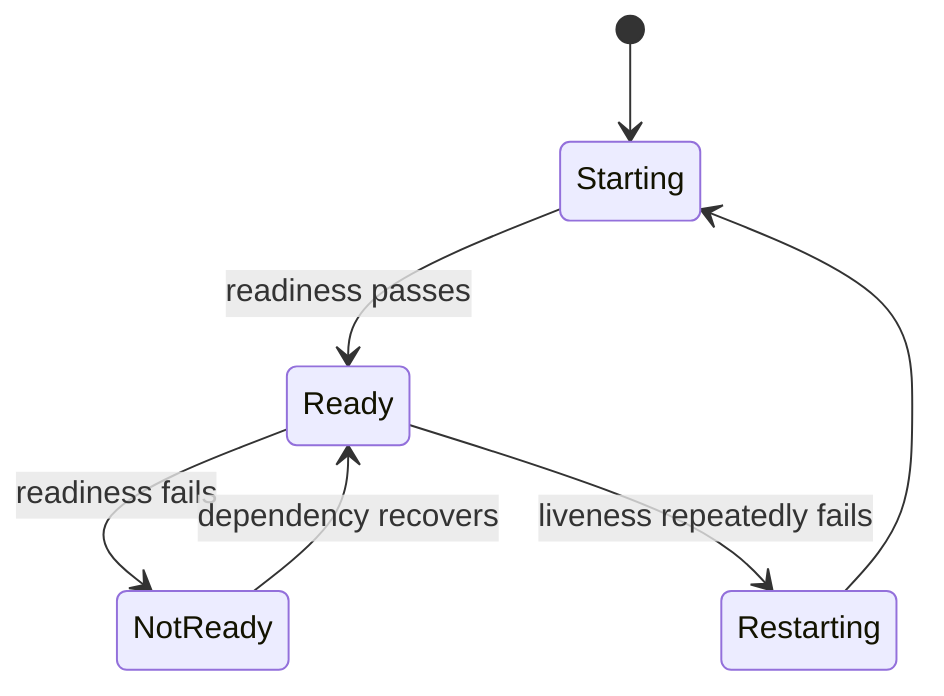

This allows dependency failures to stop traffic without necessarily killing the process.

NATS and ClickHouse also have probes so Kubernetes can distinguish healthy from unhealthy stateful Pods.

---

# MMDB initialization and updates

The API cannot serve useful lookups without the GeoLite2 Country MMDB.

The API Pod therefore includes the `wait-for-mmdb` init container.

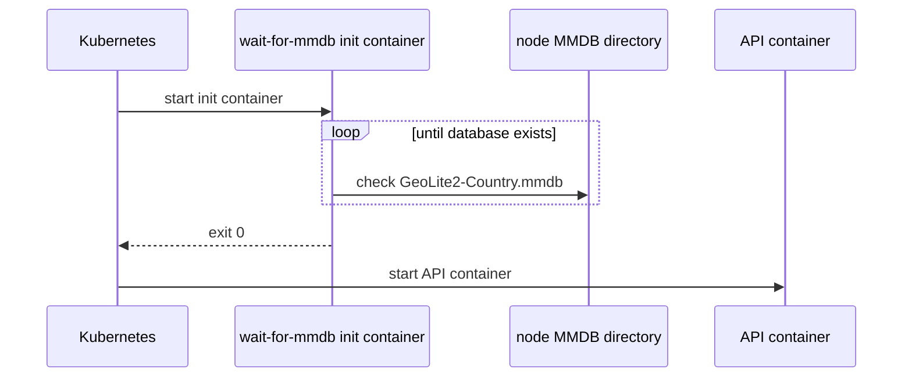

The database lives in the node-local directory:

```text
/var/lib/geotagger/mmdb
```

and is mounted read-only into API Pods.

A CronJob updates the database daily at:

```text
03:17
```

using:

```text
schedule: "17 3 * * *"
```

The CronJob uses `concurrencyPolicy: Forbid`, so Kubernetes does not start a second update while one is still running.

```mermaid
flowchart LR
    CRON[CronJob 03:17 daily] --> JOB[Updater Job]
    JOB --> MAX[MaxMind download]
    MAX --> TMP[temporary MMDB]
    TMP --> VALIDATE[validate + fsync]
    VALIDATE --> RENAME[atomic rename]
    RENAME --> FILE[/var/lib/geotagger/mmdb]
    FILE --> API[API Pods reopen changed DB]
```

---

# Security contexts

The application containers are explicitly run as non-root.

API and worker:

```text
UID 65532
GID 65532
```

NATS:

```text
UID 1000
GID 1000
```

The explicit numeric UID/GID is important because Kubernetes admission cannot always prove that an image's named/default user is non-root when only this is supplied:

```yaml
runAsNonRoot: true
```

The current manifests therefore use both:

```yaml
runAsNonRoot: true
runAsUser: 65532
runAsGroup: 65532
```

for the Go application containers.

Additional application-container controls include:

```text
allowPrivilegeEscalation: false
readOnlyRootFilesystem: true
capabilities: drop ALL
```

---

# NetworkPolicy

The namespace starts with default-deny ingress.

Then only the required flows are permitted.

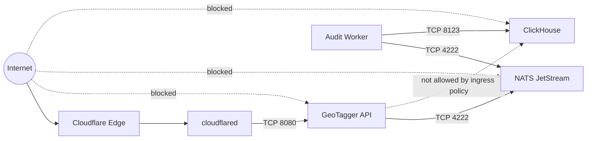

The current policies govern ingress. Production egress hardening is listed separately in the security audit because a strict egress policy must account for DNS, Cloudflare, and MaxMind download traffic.

---

# Secrets

Kubernetes Secrets supply sensitive runtime configuration rather than embedding credentials in manifests.

The project secret contains values such as:

```text
API_KEYS
AUDIT_HMAC_KEY
MAXMIND_LICENSE_KEY
CLICKHOUSE_PASSWORD
CLOUDFLARE_TUNNEL_TOKEN
```

The API, worker, updater, ClickHouse, and cloudflared Pods reference only the keys they require.

K3s is intended to run with Kubernetes Secrets encryption enabled at rest.

A Secret is not automatically a complete secret-management system: access to the Kubernetes API/node remains privileged and credential rotation still requires operational procedures.

---

# Persistent storage

Two Kubernetes PersistentVolumeClaims hold stateful service data.

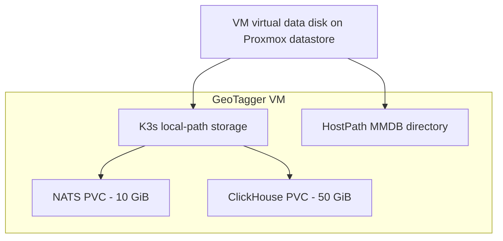

The recommended deployment config places K3s/local-path state on the VM's dedicated data disk under `/srv/geotagger-data`, rather than filling the small guest root filesystem.

PVC size is the Kubernetes reservation/request size, not a statement of long-term production capacity.

---

# Rolling application updates

Deployments can update API/worker/cloudflared Pods without manually stopping the entire namespace.

Conceptually:

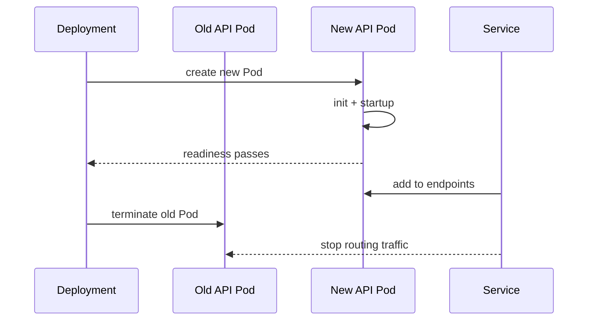

The stateful services require more caution because their persistent data and single-replica nature make upgrades operationally significant.

---

# What happens when something fails?

## API Pod crashes

```text
container exits
→ kubelet/containerd restarts it, or ReplicaSet replaces Pod
→ readiness must pass
→ Service routes traffic again
```

## One API Pod is unready

```text
Pod remains running
→ Service removes it from ready endpoints
→ other ready API Pods continue receiving requests
```

## Audit worker crashes

```text
worker restarts
→ JetStream retains unacknowledged audit events
→ worker resumes consumption
```

## ClickHouse is unavailable

```text
worker cannot persist batch
→ event remains unacknowledged / gets redelivered
→ JetStream backlog grows
→ API can continue while durable queue has capacity
```

## NATS is unavailable

```text
API cannot receive durable publish ACK
→ readiness/lookup path fails
→ service intentionally fails closed rather than returning unaudited success
```

## JetStream reaches configured capacity

```text
MaxBytes = 8 GiB
DiscardNew
→ new required audit publish is rejected
→ API returns service failure
```

Old unpersisted events are not expired by age because `MaxAge=0`.

## VM or physical host dies

Kubernetes cannot solve that in the current single-node design.

```text
physical host unavailable
→ GeoTagger VM unavailable
→ whole one-node K3s cluster unavailable
```

True infrastructure HA requires multiple independent Kubernetes nodes/failure domains and replicated state.

---

# Useful operational commands

## Overall state

```bash
kubectl -n geotagger get all
```

## Pods and where they run

```bash
kubectl -n geotagger get pods -o wide
```

## Live resource usage

```bash
kubectl top nodes
kubectl -n geotagger top pods
```

## HPA state

```bash
kubectl -n geotagger get hpa
kubectl -n geotagger describe hpa geotagger-api
```

This shows current CPU utilization, target utilization, and desired/current replica counts.

## API Pods

```bash
kubectl -n geotagger get pods -l app=geotagger-api
```

## Service endpoints

```bash
kubectl -n geotagger get svc geotagger
kubectl -n geotagger get endpoints geotagger
```

## API logs

```bash
kubectl -n geotagger logs deployment/geotagger-api --tail=200
```

For multiple replicas:

```bash
kubectl -n geotagger logs -l app=geotagger-api --tail=100 --prefix
```

## Worker logs

```bash
kubectl -n geotagger logs deployment/geotagger-audit-worker --tail=200
```

## NATS / ClickHouse logs

```bash
kubectl -n geotagger logs nats-0 --tail=200
kubectl -n geotagger logs clickhouse-0 --tail=200
```

## Persistent storage

```bash
kubectl -n geotagger get pvc
```

## Network policies

```bash
kubectl -n geotagger get networkpolicy
kubectl -n geotagger describe networkpolicy
```

## MMDB update jobs

```bash
kubectl -n geotagger get cronjob geotagger-mmdb-update
kubectl -n geotagger get jobs
```

Run one manual update from the CronJob template:

```bash
kubectl -n geotagger create job --from=cronjob/geotagger-mmdb-update geotagger-mmdb-update-manual
```

## Rollout state

```bash
kubectl -n geotagger rollout status deployment/geotagger-api
kubectl -n geotagger rollout status deployment/geotagger-audit-worker
```

---

# What Kubernetes does not do here

Kubernetes does **not** automatically provide:

- extra physical CPU beyond the VM;
- hardware high availability on a one-node cluster;
- backups;
- disaster recovery;
- perfect database replication;
- credential governance;
- regulatory compliance; or
- infinite autoscaling.

It provides orchestration and reconciliation. The underlying server, storage, network, backup strategy, and operations still determine the real availability envelope.

---

# Mental model

For this project, the easiest way to remember the resource model is:

```text
Proxmox VM
└── K3s cluster
    └── Namespace
        ├── Deployment = keep replaceable application Pods running
        ├── StatefulSet = keep stateful Pods + identity/storage running
        ├── Pod = scheduling/lifecycle wrapper around container(s)
        ├── Container = actual isolated application process
        ├── Service = stable internal network name/load balancer
        ├── HPA = change Deployment replica count from metrics
        ├── PVC = persistent disk state
        ├── CronJob = scheduled temporary Pod
        ├── Secret = sensitive runtime configuration
        └── NetworkPolicy = permitted Pod-to-Pod ingress paths
```

For GeoTagger specifically:

```text
Cloudflare sends requests to a Kubernetes Service.
The Service sends them to healthy API Pods.
The HPA changes how many API Pods exist.
The API uses a local MMDB and requires a durable NATS ACK.
The worker drains NATS into persistent ClickHouse storage.
Kubernetes keeps those declared components running and connected.
```
