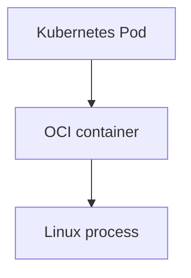
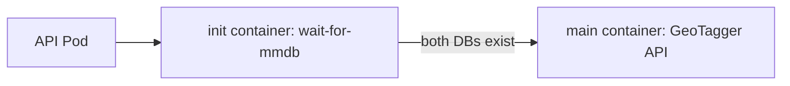
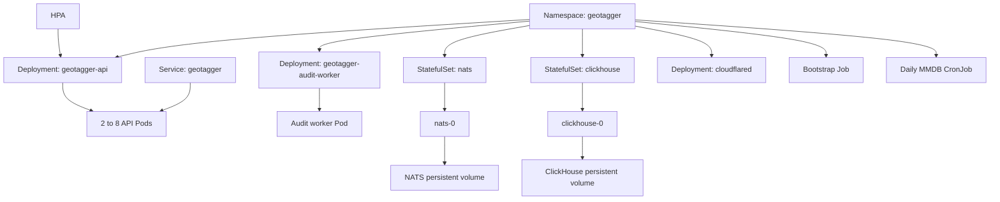
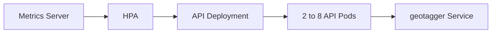
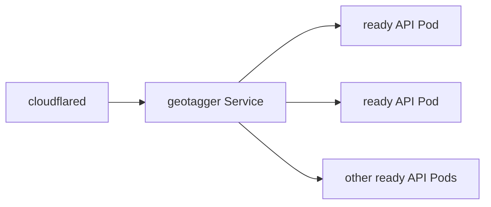
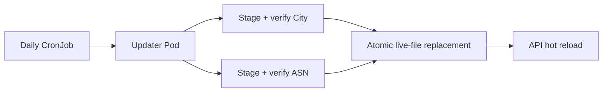
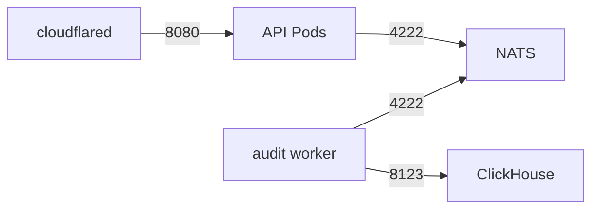
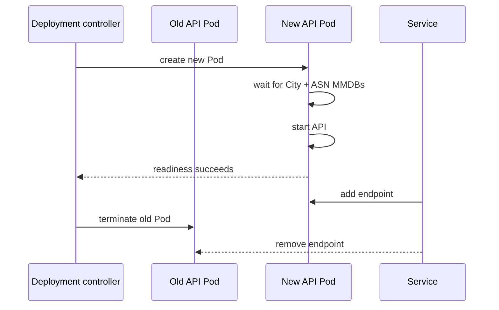
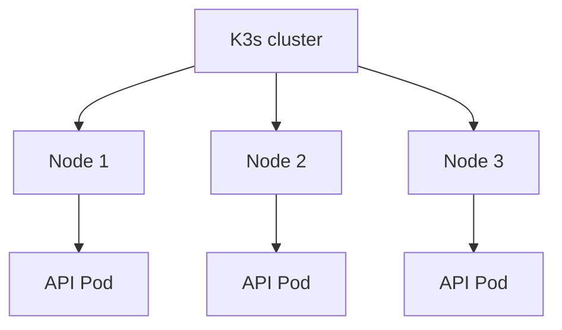

# GeoTagger on Kubernetes / K3s

## Pod versus container

A Kubernetes Pod is not a Docker container.

A **container** is an isolated process environment created from an OCI image. A **Pod** is the Kubernetes scheduling/lifecycle/networking unit that owns one or more containers. Containers in the same Pod share the Pod network namespace, IP address and selected volumes.

K3s uses **containerd** as the runtime. Docker is not required on the node to run GeoTagger workloads. Images built with Docker still work because they are OCI-compatible.



For GeoTagger, most Pods contain one long-running application container. The API Pod also has a short-lived init container.



The init container waits for:

```text
/data/GeoLite2-City.mmdb
/data/GeoLite2-ASN.mmdb
```

before the API process starts.

## Runtime stack

```text
Physical hardware
  -> Proxmox VE
    -> GeoTagger Linux VM
      -> K3s
        -> Kubernetes resources
          -> Pods
            -> containerd
              -> OCI containers
                -> Linux processes
```

Proxmox manages the VM. K3s/Kubernetes manages the application workloads inside the VM.

## Namespace

All application resources live in:

```text
namespace: geotagger
```

Useful command:

```bash
kubectl -n geotagger get all
```

## Resource map



## Deployment

A Deployment expresses desired stateless workload state.

For the API, Kubernetes is told:

```text
run at least 2 API Pods
allow the HPA to scale to 8
keep replacing failed Pods
roll out new image/config versions safely
```

The API has no request state that must survive a Pod replacement. Its required lookup data lives on the node-local MMDB volume and its audit dependency is NATS.

Inspect:

```bash
kubectl -n geotagger get deployment geotagger-api
kubectl -n geotagger get pods -l app=geotagger-api
kubectl -n geotagger describe deployment geotagger-api
```

## ReplicaSet

The Deployment controller creates ReplicaSets, which create Pods.

```text
Deployment
  -> ReplicaSet
    -> API Pod
    -> API Pod
    -> additional Pods when HPA scales
```

You generally operate the Deployment rather than manually managing ReplicaSets.

## Horizontal Pod Autoscaler

Current API HPA:

```text
minReplicas: 2
maxReplicas: 8
CPU request: 750m per Pod
CPU target: 65% of request
CPU limit: 2 cores per Pod
scale-down stabilization: 300 seconds
```

Kubernetes calculates HPA CPU utilization against the **CPU request**.

At the current values, the target is approximately:

```text
750m * 0.65 = 487.5m CPU per API Pod
```

As average API utilization rises, the HPA changes the desired replica count.



Inspect autoscaling:

```bash
kubectl -n geotagger get hpa
kubectl -n geotagger describe hpa geotagger-api
kubectl -n geotagger top pods
kubectl top nodes
```

### What autoscaling can and cannot do

All API replicas currently run on one 9-vCPU VM.

HPA can:

```text
use spare CPU by running more API processes
reduce per-Pod load
improve burst handling
keep two warm replicas
```

HPA cannot:

```text
create more physical CPU
survive failure of the one VM/host
turn one node into hardware HA
```

Once the VM is saturated, extra Pods may only increase scheduling contention.

## Service

Pod IP addresses are disposable. Kubernetes Services provide stable internal addressing.

Public API Service:

```text
geotagger:8080
geotagger.geotagger.svc.cluster.local:8080
```

Cloudflared sends traffic to the Service, not to a specific API Pod.



Internal stateful service names:

```text
nats:4222
clickhouse:8123
```

## Readiness and liveness probes

The API has an internal administrative listener on port 9090.

```text
GET /healthz
GET /readyz
GET /metrics
```

### Liveness

Liveness asks whether the process should be restarted.

Repeated failure causes Kubernetes to restart the container.

### Readiness

Readiness asks whether the Pod should receive new Service traffic.

If readiness fails, the Pod can remain running while being removed from Service endpoints.

For GeoTagger, readiness includes audit-transport health. A Pod that cannot communicate with the required NATS path should not continue receiving normal public traffic.

Inspect endpoints:

```bash
kubectl -n geotagger get endpoints geotagger
kubectl -n geotagger describe pod <api-pod>
```

## StatefulSet

NATS and ClickHouse are stateful services.

```text
StatefulSet/nats
  -> nats-0
  -> persistent volume

StatefulSet/clickhouse
  -> clickhouse-0
  -> persistent volume
```

A Pod may be recreated while its persistent volume survives.

This is different from the API Deployment, where no request-specific disk state needs to follow the Pod.

## PersistentVolumeClaim

PVCs provide durable storage claims for stateful workloads.

Inspect:

```bash
kubectl -n geotagger get pvc
kubectl -n geotagger describe pvc
```

Current state includes persistent storage for:

```text
NATS JetStream
ClickHouse
```

The City and ASN MMDB files are instead stored in a node-local host path:

```text
/var/lib/geotagger/mmdb
```

and mounted read-only by the API Pods.

## MMDB bootstrap Job

Before API rollout, `scripts/deploy-k3s.sh` runs:

```text
Job/geotagger-mmdb-bootstrap
```

The Job:

1. prepares ownership on the node-local MMDB directory;
2. downloads GeoLite2 City;
3. downloads GeoLite2 ASN;
4. fsyncs and verifies both staged databases;
5. replaces live files using atomic renames; and
6. exits successfully.

Only after the Job completes does the normal Kustomize deployment proceed.

This prevents new API Pods from starting with missing lookup data.

Inspect:

```bash
kubectl -n geotagger get jobs
kubectl -n geotagger logs job/geotagger-mmdb-bootstrap
```

## MMDB CronJob

Daily refresh:

```text
CronJob/geotagger-mmdb-update
schedule: 17 3 * * *
concurrencyPolicy: Forbid
```

The updater uses:

```text
MAXMIND_EDITIONS=GeoLite2-City,GeoLite2-ASN
MMDB_DIR=/data
```

and the existing `MAXMIND_LICENSE_KEY` secret.



All requested databases are staged and verified before live replacement begins. Each individual final rename is atomic.

Inspect:

```bash
kubectl -n geotagger get cronjob
kubectl -n geotagger get jobs --sort-by=.metadata.creationTimestamp
kubectl -n geotagger logs job/<update-job>
```

Manual refresh when needed:

```bash
kubectl -n geotagger create job --from=cronjob/geotagger-mmdb-update geotagger-mmdb-manual-$(date +%s)
```

## Hot reload

Each API process keeps two long-lived memory-mapped readers:

```text
GeoLite2-City.mmdb
GeoLite2-ASN.mmdb
```

Every configured reload interval, the API checks file modification times. Changed databases are opened and verified first, then swapped under a lock. Existing readers are closed only after the replacement is installed.

The API does not need to restart after a successful MMDB refresh.

Source metadata returned by `/v1/lookup` exposes the build/version of each database actually used.

## Secrets

The Kubernetes Secret contains runtime values such as:

```text
API_KEYS
AUDIT_HMAC_KEY
MAXMIND_LICENSE_KEY
CLICKHOUSE_PASSWORD
CLOUDFLARE_TUNNEL_TOKEN
```

Pods reference keys using `secretKeyRef`; plaintext values are not embedded in committed manifests.

Inspect metadata without printing secret values:

```bash
kubectl -n geotagger get secret geotagger-secrets
kubectl -n geotagger describe secret geotagger-secrets
```

Do not use `kubectl get secret ... -o yaml` casually on shared terminals/logged sessions.

K3s secrets encryption at rest should be enabled for the production cluster.

## NetworkPolicy

The namespace uses default-deny ingress and explicit allow rules.

Expected flows:

```text
cloudflared -> API        :8080
API         -> NATS       :4222
worker      -> NATS       :4222
worker      -> ClickHouse :8123
```



The current policy is ingress-focused. A future default-deny egress policy must preserve cluster DNS plus the outbound paths needed by cloudflared and the MaxMind updater.

## SecurityContext

API and worker:

```text
runAsNonRoot: true
runAsUser: 65532
runAsGroup: 65532
allowPrivilegeEscalation: false
readOnlyRootFilesystem: true
capabilities: drop ALL
```

NATS:

```text
runAsNonRoot: true
runAsUser: 1000
runAsGroup: 1000
```

The explicit numeric identities avoid the deployment bug where Kubernetes could not prove that an image's named/default user was non-root.

## Rolling updates

A Deployment update creates replacement Pods and waits for readiness before removing old replicas.



With a minimum of two API replicas, normal rolling replacement has more room to avoid a single-process cold-start window.

## Logs

API logs:

```bash
kubectl -n geotagger logs deployment/geotagger-api --tail=200
```

Follow:

```bash
kubectl -n geotagger logs deployment/geotagger-api -f
```

Worker:

```bash
kubectl -n geotagger logs deployment/geotagger-audit-worker --tail=200
```

NATS:

```bash
kubectl -n geotagger logs statefulset/nats --tail=200
```

ClickHouse:

```bash
kubectl -n geotagger logs statefulset/clickhouse --tail=200
```

## Port forwarding

Public API Service through an administrator-local port:

```bash
kubectl -n geotagger port-forward svc/geotagger 18080:8080
```

Internal admin listener:

```bash
kubectl -n geotagger port-forward deployment/geotagger-api 19090:9090
```

Then:

```bash
curl -fsS http://127.0.0.1:19090/readyz
curl -fsS http://127.0.0.1:19090/metrics
```

## Common status commands

```bash
kubectl -n geotagger get pods -o wide
kubectl -n geotagger get deployment,statefulset
kubectl -n geotagger get svc,endpoints
kubectl -n geotagger get hpa
kubectl -n geotagger get pvc
kubectl -n geotagger get cronjob,job
kubectl -n geotagger get networkpolicy
kubectl -n geotagger top pods
kubectl top nodes
```

## Failure examples

### API Pod dies

```text
Pod failure
-> ReplicaSet sees desired replicas are missing
-> replacement Pod created
-> init waits for City + ASN
-> API starts
-> readiness succeeds
-> Service routes traffic
```

### ClickHouse dies

```text
worker insert fails
-> messages are not successfully ACKed
-> JetStream retains/redelivers work
-> API can continue only while NATS still accepts required audit events
```

### NATS dies

```text
API cannot obtain required durable publish ACK
-> readiness can fail
-> normal audited success is not returned
```

### MMDB update fails

```text
download or verification fails
-> updater exits non-zero
-> existing live City/ASN files remain
-> API continues using current readers
```

### Entire VM dies

Kubernetes inside that VM cannot recover the service elsewhere because this is a one-node cluster. Proxmox/infrastructure recovery is required.

## Scaling beyond one node

A future multi-node design could schedule API replicas across separate hosts:



That would require redesigning node-local MMDB distribution and planning replicated/remote state for NATS and ClickHouse. Simply adding a node without solving those state/data-placement questions does not provide complete HA.
