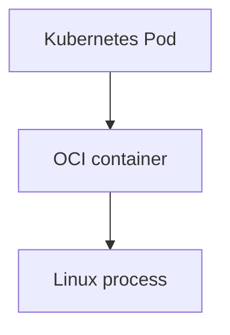
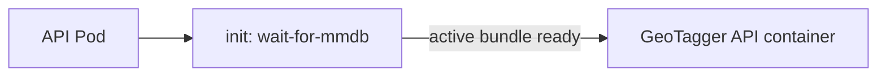
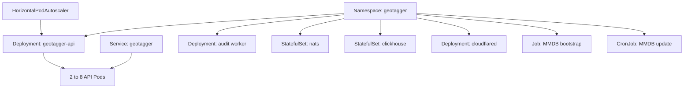
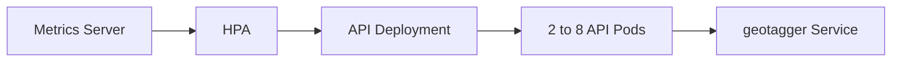
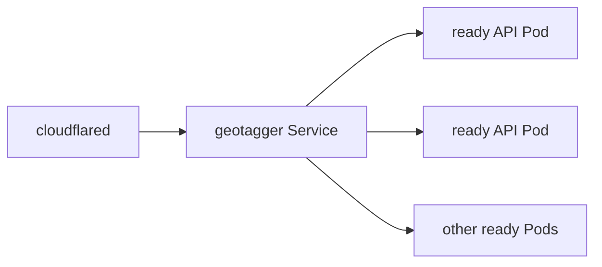
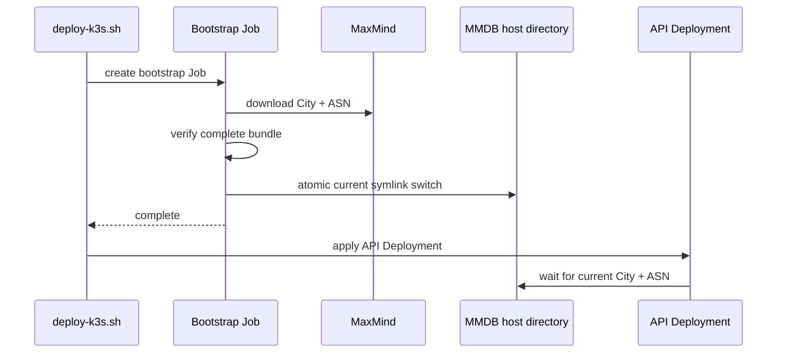
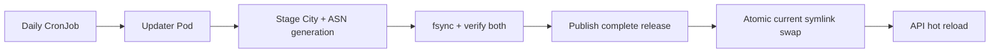
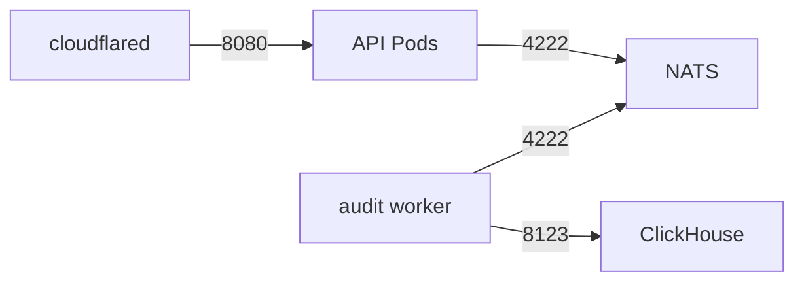
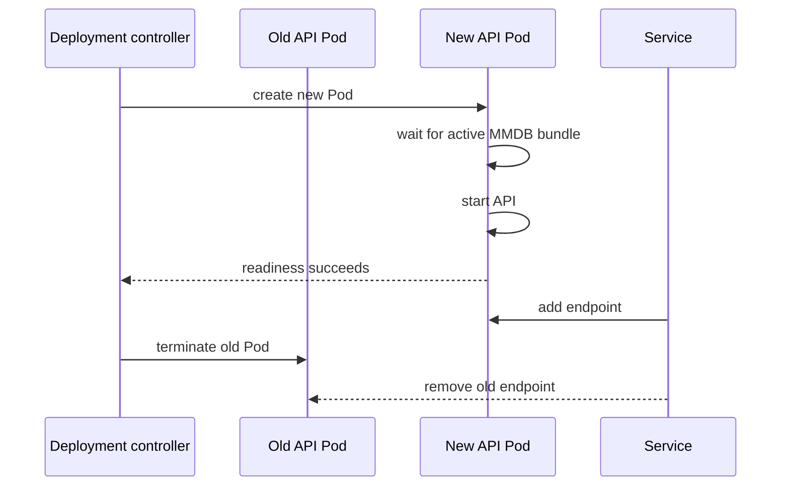
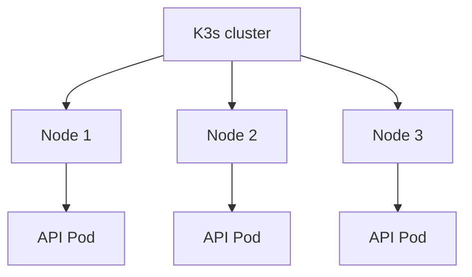

# GeoTagger on Kubernetes / K3s

## Pod versus container

A Kubernetes Pod is not a Docker container.

A **container** is an isolated process environment created from an OCI image. A **Pod** is the Kubernetes scheduling, lifecycle and networking unit that owns one or more containers. Containers in one Pod share its network namespace, IP address and selected volumes.

K3s uses **containerd** as the runtime. Docker is not required on the K3s node. Images built with Docker still work because they are OCI-compatible.



The API Pod contains a short-lived init container plus the long-running API container:



The init container waits for:

```text
/data/current/GeoLite2-City.mmdb
/data/current/GeoLite2-ASN.mmdb
```

## Runtime stack

```text
Physical hardware
  -> Proxmox VE
    -> GeoTagger Linux VM
      -> K3s
        -> Kubernetes resources
          -> Pods
            -> containerd
              -> OCI containers
                -> Linux processes
```

Proxmox manages the VM. K3s manages the application workloads inside the VM.

## Namespace and resource map

Everything runs in:

```text
namespace: geotagger
```



Useful overview:

```bash
kubectl -n geotagger get all
```

## API Deployment and ReplicaSets

A Deployment states the desired stateless workload:

```text
keep at least 2 API Pods
allow HPA scale-out to 8
replace failed Pods
perform rolling updates
```

The Deployment creates ReplicaSets, and ReplicaSets create Pods.

```text
Deployment
  -> ReplicaSet
    -> API Pod
    -> API Pod
    -> more API Pods when HPA scales
```

Inspect:

```bash
kubectl -n geotagger get deployment geotagger-api
kubectl -n geotagger get pods -l app=geotagger-api
kubectl -n geotagger describe deployment geotagger-api
```

## Horizontal Pod Autoscaler

Current values:

```text
minReplicas: 2
maxReplicas: 8
CPU request: 750m per Pod
CPU target: 65% of request
CPU limit: 2 cores per Pod
scale-down stabilization: 300 seconds
```

Kubernetes calculates HPA CPU utilization against the **request**, so the target is roughly:

```text
750m * 0.65 = 487.5m CPU per API Pod
```



Inspect:

```bash
kubectl -n geotagger get hpa
kubectl -n geotagger describe hpa geotagger-api
kubectl -n geotagger top pods
kubectl top nodes
```

All replicas still share one 9-vCPU VM. HPA can consume spare CPU; it cannot create new hardware capacity or survive loss of the VM/host.

## Kubernetes Services

Pod IPs are disposable. Services provide stable internal addressing.

```text
geotagger:8080
nats:4222
clickhouse:8123
```

Cloudflared connects to the API Service, not a specific Pod:



## Readiness and liveness

The API administrative listener is internal on port 9090:

```text
GET /healthz
GET /readyz
GET /metrics
```

**Liveness** decides whether Kubernetes should restart the container.

**Readiness** decides whether a running Pod should receive new Service traffic.

GeoTagger readiness includes audit-transport health, so an API Pod that cannot reach the required NATS path should not continue receiving ordinary lookup traffic.

Inspect:

```bash
kubectl -n geotagger get endpoints geotagger
kubectl -n geotagger describe pod <api-pod>
```

## StatefulSets and PVCs

NATS and ClickHouse are stateful:

```text
StatefulSet/nats
  -> nats-0
  -> persistent volume

StatefulSet/clickhouse
  -> clickhouse-0
  -> persistent volume
```

A stateful Pod can be recreated while its volume survives.

Inspect:

```bash
kubectl -n geotagger get statefulset
kubectl -n geotagger get pvc
kubectl -n geotagger describe pvc
```

The MMDB data uses a node-local host path rather than a PVC:

```text
/var/lib/geotagger/mmdb
```

The whole directory is mounted read-only at `/data` inside API Pods.

## Atomic MMDB bundle layout

City and ASN are activated as one generation:

```text
/var/lib/geotagger/mmdb/
├── current -> releases/release-<generation>/
└── releases/
    ├── release-<older>/
    ├── release-<previous>/
    └── release-<current>/
        ├── GeoLite2-City.mmdb
        └── GeoLite2-ASN.mmdb
```

API Pods read:

```text
/data/current/GeoLite2-City.mmdb
/data/current/GeoLite2-ASN.mmdb
```

The updater retains the three newest complete release directories.

## Bootstrap Job

Before the API rollout, `scripts/deploy-k3s.sh` creates:

```text
Job/geotagger-mmdb-bootstrap
```

The Job:

1. prepares ownership of the MMDB host directory;
2. creates a new staging release directory;
3. downloads GeoLite2 City;
4. downloads GeoLite2 ASN;
5. fsyncs and verifies both databases;
6. publishes the complete release directory;
7. atomically replaces the one `current` symlink; and
8. exits successfully.

Only after the bootstrap succeeds does the normal Kustomize rollout proceed.



Inspect:

```bash
kubectl -n geotagger get jobs
kubectl -n geotagger logs job/geotagger-mmdb-bootstrap
```

## MMDB CronJob

Daily refresh:

```text
CronJob/geotagger-mmdb-update
schedule: 17 3 * * *
concurrencyPolicy: Forbid
```

Environment:

```text
MAXMIND_EDITIONS=GeoLite2-City,GeoLite2-ASN
MMDB_DIR=/data
MAXMIND_LICENSE_KEY=<secretKeyRef>
```



This is bundle-atomic activation: readers see the old complete generation or the new complete generation. They do not observe a half-updated City/ASN pair.

Manual refresh:

```bash
kubectl -n geotagger create job \
  --from=cronjob/geotagger-mmdb-update \
  geotagger-mmdb-manual-$(date +%s)
```

Inspect active generation:

```bash
readlink -f /var/lib/geotagger/mmdb/current
ls -lh /var/lib/geotagger/mmdb/current/
ls -1 /var/lib/geotagger/mmdb/releases/
```

## API hot reload

Each API process maintains two long-lived memory-mapped readers. Every `MMDB_RELOAD_INTERVAL`, it stats the files reached through `current`.

After a bundle switch:

```text
current points to new release
-> file metadata changes
-> API opens and verifies changed reader(s)
-> swaps reader(s) under lock
-> closes old reader(s)
```

No Pod restart is required. Rich responses expose the City and ASN build metadata actually loaded by the process.

## Secrets

`geotagger-secrets` contains values such as:

```text
API_KEYS
AUDIT_HMAC_KEY
MAXMIND_LICENSE_KEY
CLICKHOUSE_PASSWORD
CLOUDFLARE_TUNNEL_TOKEN
```

Pods use `secretKeyRef`; plaintext production secrets are not committed in manifests.

Inspect metadata without dumping secret values:

```bash
kubectl -n geotagger get secret geotagger-secrets
kubectl -n geotagger describe secret geotagger-secrets
```

K3s secrets encryption at rest should be enabled in production.

## NetworkPolicy

The namespace has default-deny ingress plus explicit permitted flows:

```text
cloudflared -> API        :8080
API         -> NATS       :4222
worker      -> NATS       :4222
worker      -> ClickHouse :8123
```



A future default-deny egress policy must preserve cluster DNS, Cloudflare tunnel traffic and the MaxMind updater's HTTPS access.

## SecurityContext

API and worker:

```text
runAsNonRoot: true
runAsUser: 65532
runAsGroup: 65532
allowPrivilegeEscalation: false
readOnlyRootFilesystem: true
capabilities: drop ALL
```

NATS:

```text
runAsNonRoot: true
runAsUser: 1000
runAsGroup: 1000
```

The explicit numeric identities prevent the Kubernetes admission failure previously seen when `runAsNonRoot: true` was set without a verifiable numeric runtime UID.

## Rolling API updates



With a minimum of two API replicas, normal rollouts have more room to avoid a single-process cold-start window.

## Logs

```bash
kubectl -n geotagger logs deployment/geotagger-api --tail=200
kubectl -n geotagger logs deployment/geotagger-audit-worker --tail=200
kubectl -n geotagger logs statefulset/nats --tail=200
kubectl -n geotagger logs statefulset/clickhouse --tail=200
```

Follow API logs:

```bash
kubectl -n geotagger logs deployment/geotagger-api -f
```

## Port forwarding

API Service:

```bash
kubectl -n geotagger port-forward svc/geotagger 18080:8080
```

Admin listener:

```bash
kubectl -n geotagger port-forward deployment/geotagger-api 19090:9090
curl -fsS http://127.0.0.1:19090/readyz
curl -fsS http://127.0.0.1:19090/metrics
```

## Common status commands

```bash
kubectl -n geotagger get pods -o wide
kubectl -n geotagger get deployment,statefulset
kubectl -n geotagger get svc,endpoints
kubectl -n geotagger get hpa
kubectl -n geotagger get pvc
kubectl -n geotagger get cronjob,job
kubectl -n geotagger get networkpolicy
kubectl -n geotagger top pods
kubectl top nodes
```

## Failure examples

### API Pod dies

```text
Pod failure
-> ReplicaSet notices desired replicas missing
-> replacement Pod created
-> init waits for current bundle
-> API starts
-> readiness passes
-> Service routes traffic
```

### MMDB update fails before activation

```text
download / fsync / Verify fails
-> updater exits non-zero
-> current symlink remains unchanged
-> API continues on old complete City+ASN generation
```

### MMDB updater dies after activation

The `current` rename is the commit point. Once it succeeds, it already references a complete verified release directory. A crash after that point leaves the new complete generation active.

### ClickHouse dies

```text
worker insert fails
-> messages are not ACKed
-> JetStream retains/redelivers work
```

### NATS dies

```text
API cannot obtain durable audit publish ACK
-> readiness/normal lookup path fails closed
```

### Entire VM dies

This is a one-node cluster. Kubernetes cannot reschedule the workloads elsewhere; Proxmox/infrastructure recovery is required.

## Scaling beyond one node

A future multi-node design could place API Pods on separate hosts:



That would require a deliberate strategy for distributing the MMDB bundle to each node plus replicated/remote state for NATS and ClickHouse. Merely adding worker nodes does not make the current stateful design highly available.
