# GeoTagger on Kubernetes / K3s

## Pod versus container

A Kubernetes Pod is not a Docker container.

A **container** is an isolated process environment created from an OCI image. A **Pod** is the Kubernetes scheduling and lifecycle unit that owns one or more containers. Containers in the same Pod share the Pod network namespace, IP address and selected volumes.

K3s uses **containerd** as the runtime. Docker is not required on the K3s node to run GeoTagger workloads. Images built with Docker still work because containerd understands OCI-compatible images.

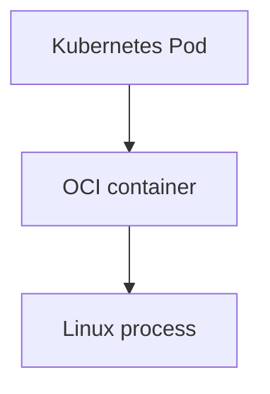

Most GeoTagger Pods contain one long-running container:

```text
geotagger-api-xxxxx
└── api

geotagger-audit-worker-xxxxx
└── worker

nats-0
└── nats

clickhouse-0
└── clickhouse
```

The API Pod also has an init container named `wait-for-mmdb`. It runs before the main API container and blocks startup until the GeoLite2 Country database exists.

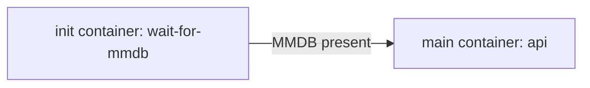

## Runtime hierarchy

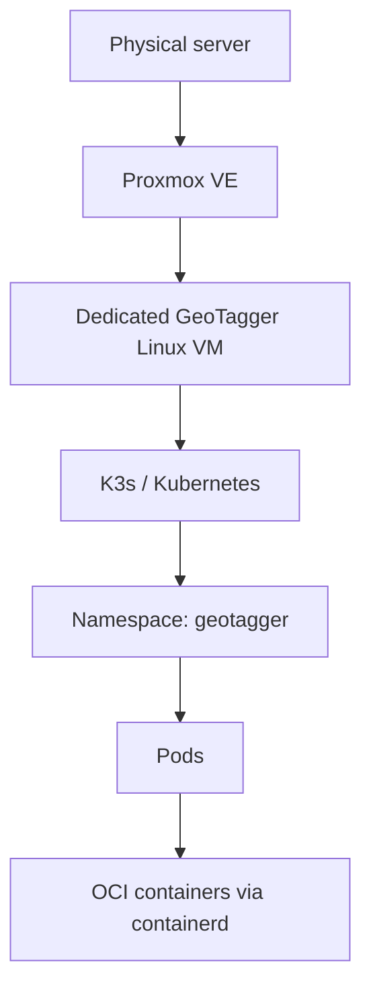

Proxmox owns virtual-machine and hardware resource allocation. Kubernetes owns application scheduling, service discovery, health, rollout and workload reconciliation inside the VM.

## Why K3s is used

GeoTagger could run with Docker Compose, but the deployed design needs several orchestration features:

- restart and reconciliation of failed workloads;
- readiness-aware service routing;
- horizontal API scaling;
- persistent volumes for NATS and ClickHouse;
- scheduled MMDB updates;
- Kubernetes Secret references;
- NetworkPolicy isolation;
- rolling Deployment updates; and
- a migration path to multiple nodes later.

K3s provides those features with less control-plane overhead than a conventional multi-package Kubernetes installation.

## Resource map

| Resource | Name | Role |
|---|---|---|
| Namespace | `geotagger` | Scope for project resources |
| Deployment | `geotagger-api` | Stateless lookup API |
| Service | `geotagger` | Stable API endpoint on port 8080 |
| HPA | `geotagger-api` | Scales API replicas from 1 to 8 |
| Deployment | `geotagger-audit-worker` | Persists audit events to ClickHouse |
| StatefulSet | `nats` | JetStream durable queue |
| Service | `nats` | Internal NATS endpoint on port 4222 |
| PVC | `data-nats-0` | Persistent NATS state, initially 10 GiB |
| StatefulSet | `clickhouse` | Audit/event store |
| Service | `clickhouse` | Internal ClickHouse endpoint on port 8123 |
| PVC | `data-clickhouse-0` | Persistent ClickHouse state, initially 50 GiB |
| Deployment | `cloudflared` | Outbound Cloudflare Tunnel connector |
| CronJob | `geotagger-mmdb-update` | Daily GeoLite2 refresh |
| Secret | `geotagger-secrets` | Runtime secrets and credential material |
| ConfigMap | `clickhouse-init` | ClickHouse bootstrap SQL |
| NetworkPolicy | several | Allowed ingress between workloads |

## Deployments and ReplicaSets

A Deployment manages replaceable Pods. The API is stateless with respect to individual requests, so any healthy API replica can handle a request.

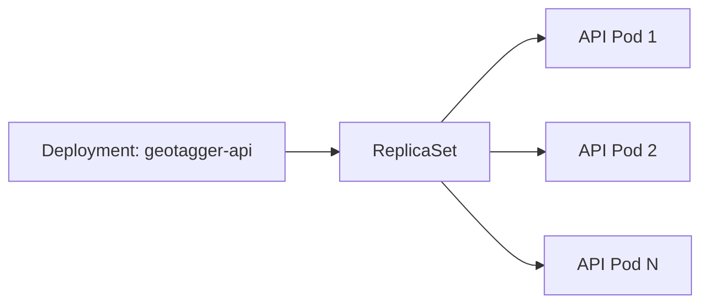

Kubernetes continuously reconciles desired state with actual state. If the Deployment wants three replicas and only two healthy Pods exist, the ReplicaSet creates another Pod.

The audit worker and cloudflared are also Deployments because their container instances can be recreated from declarative configuration.

## StatefulSets and persistent storage

NATS and ClickHouse keep persistent state and therefore use StatefulSets.

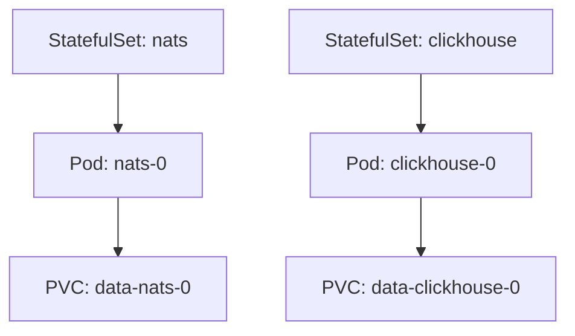

A stateful Pod can be recreated while its PVC remains attached to the replacement Pod. This protects process restarts; it is not replicated high availability. The current deployment has one NATS replica and one ClickHouse replica.

## Services and DNS

Pod IP addresses are disposable. Services provide stable names and select ready Pods by label.

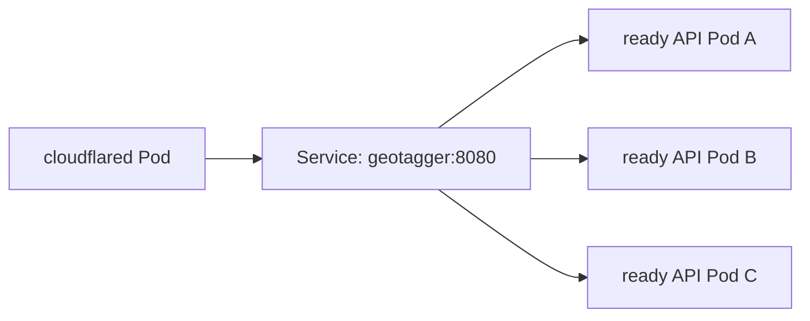

Internal service names include:

```text
geotagger:8080
nats:4222
clickhouse:8123
```

The API Service also has the fully qualified DNS name:

```text
geotagger.geotagger.svc.cluster.local
```

Cloudflare Tunnel targets the Service name, not an individual Pod IP. Replica replacement therefore requires no Cloudflare configuration change.

## Horizontal Pod Autoscaler

The API HPA is configured for:

```text
minimum replicas: 1
maximum replicas: 8
CPU target:       65%
```

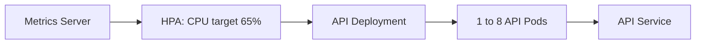

When average API CPU rises above the target, the HPA can increase the Deployment replica count. When load falls, it can reduce replicas. Scale-down has a five-minute stabilization window to reduce oscillation.

### Capacity boundary

HPA adds Pods, not hardware.

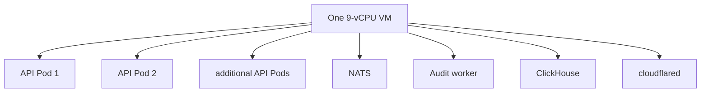

Autoscaling helps while the VM has unused CPU. Once the VM is saturated, additional Pods compete for the same cores and do not increase physical capacity.

## Liveness and readiness

The API exposes internal administrative endpoints on port 9090:

```text
/healthz
/readyz
/metrics
```

The public Service exposes only port 8080.

- **Liveness** answers whether the container should continue running. Repeated failure causes a restart.
- **Readiness** answers whether the Pod should receive new Service traffic. A Pod can remain running while being removed from Service endpoints.

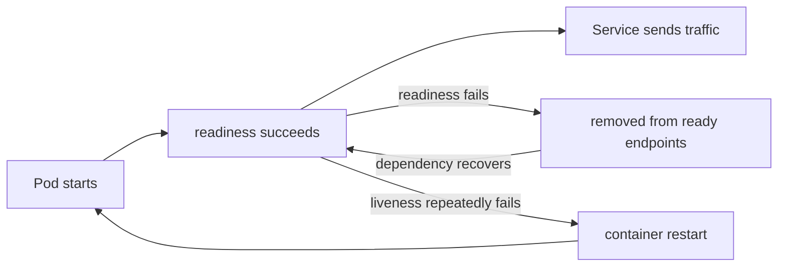

## MMDB initialization and daily update

The API cannot become ready without the GeoLite2 Country MMDB.

Startup sequence:

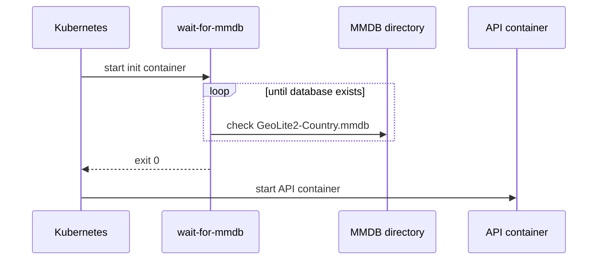

The active database is stored under:

```text
/var/lib/geotagger/mmdb
```

The CronJob schedule is:

```text
17 3 * * *
```

which is 03:17 daily. `concurrencyPolicy: Forbid` prevents a second scheduled update from starting while the previous run is still active.

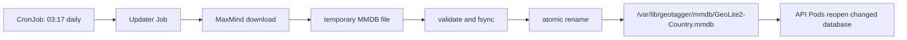

The file-path node is quoted intentionally. Unquoted Mermaid labels beginning with `/` can be parsed as shape syntax by GitHub's Mermaid renderer.

## Security contexts

The API and worker run with numeric UID/GID `65532:65532`. NATS runs with `1000:1000`.

Application container controls include:

```text
runAsNonRoot: true
allowPrivilegeEscalation: false
readOnlyRootFilesystem: true
capabilities: drop ALL
```

The explicit numeric IDs prevent Kubernetes admission from having to infer whether a named image user is non-root.

## NetworkPolicy

The base namespace policy denies ingress by default and permits only the required application paths.

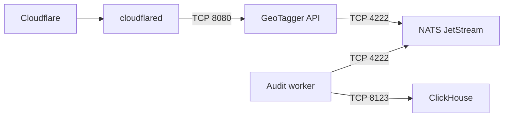

The current base policies govern ingress. Egress restrictions require care because cloudflared must reach Cloudflare, the updater must reach MaxMind, and workloads need DNS. See `HIPAA_READINESS.md` and `SECURITY_AUDIT.md` before enabling a stricter egress policy.

## Secrets

Sensitive values are referenced from `geotagger-secrets` rather than embedded in workload manifests:

```text
API_KEYS
AUDIT_HMAC_KEY
MAXMIND_LICENSE_KEY
CLICKHOUSE_PASSWORD
CLOUDFLARE_TUNNEL_TOKEN
```

Kubernetes Secret objects are not a full secret-management program. Cluster administrators can be highly privileged. Production operation still requires controlled administrator access, credential rotation, protected recovery copies and verification that K3s secrets encryption is enabled.

## Storage layout

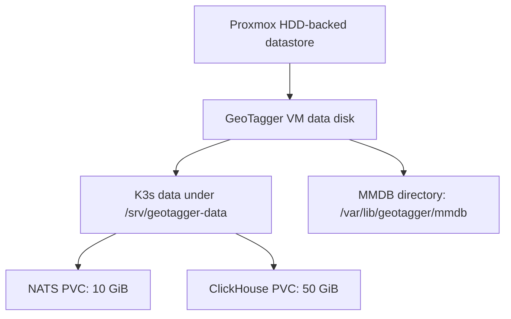

PVC requests are initial allocations, not long-term capacity guarantees.

## Rolling updates

Stateless Deployments can be replaced gradually.

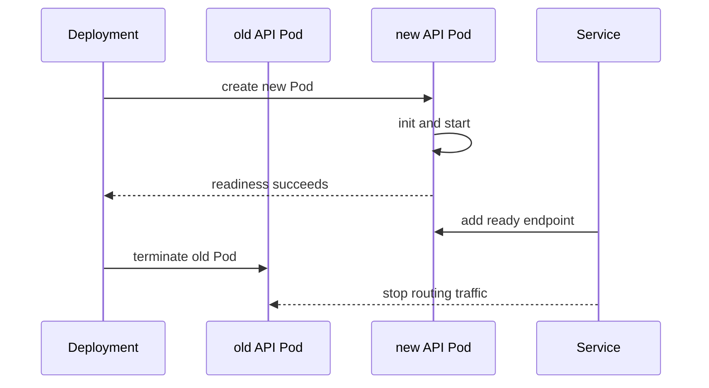

Single-replica StatefulSet upgrades require more caution because NATS and ClickHouse carry persistent state.

## Failure behavior

| Failure | Kubernetes/system behavior |
|---|---|
| API container exits | kubelet/containerd restarts it; ReplicaSet restores desired Pod count |
| API readiness fails | Pod remains running but is removed from Service endpoints |
| worker exits | Deployment restarts/replaces it; JetStream retains unacknowledged events |
| ClickHouse unavailable | worker cannot ACK persisted work; backlog remains in JetStream |
| NATS unavailable | API cannot receive durable audit ACK and normal audited success fails closed |
| JetStream full | `DiscardNew` rejects new required audit events; API returns service failure |
| VM/host unavailable | entire one-node cluster is unavailable; Kubernetes cannot reschedule onto another node |

## Operational commands

```bash
# Overall workload state
kubectl -n geotagger get all

# Pods and node placement
kubectl -n geotagger get pods -o wide

# Live CPU/RAM
kubectl top nodes
kubectl -n geotagger top pods

# HPA
kubectl -n geotagger get hpa
kubectl -n geotagger describe hpa geotagger-api

# API service and ready endpoints
kubectl -n geotagger get svc geotagger
kubectl -n geotagger get endpoints geotagger

# Logs
kubectl -n geotagger logs deployment/geotagger-api --tail=200
kubectl -n geotagger logs deployment/geotagger-audit-worker --tail=200
kubectl -n geotagger logs nats-0 --tail=200
kubectl -n geotagger logs clickhouse-0 --tail=200

# Storage and policies
kubectl -n geotagger get pvc
kubectl -n geotagger get networkpolicy

# MMDB schedule/jobs
kubectl -n geotagger get cronjob geotagger-mmdb-update
kubectl -n geotagger get jobs

# Rollouts
kubectl -n geotagger rollout status deployment/geotagger-api
kubectl -n geotagger rollout status deployment/geotagger-audit-worker
```

Manual MMDB update from the CronJob template:

```bash
kubectl -n geotagger create job \
  --from=cronjob/geotagger-mmdb-update \
  geotagger-mmdb-update-manual
```

## What Kubernetes does not provide here

The current one-node cluster does not automatically provide:

- more CPU/RAM than the VM owns;
- hardware high availability;
- independent backups;
- disaster recovery;
- replicated NATS/ClickHouse state;
- credential governance; or
- regulatory compliance.

Those controls are separate operational responsibilities. See `BACKUP_RECOVERY.md`, `INCIDENT_RESPONSE.md`, `SECURITY_AUDIT.md`, and `HIPAA_READINESS.md`.
