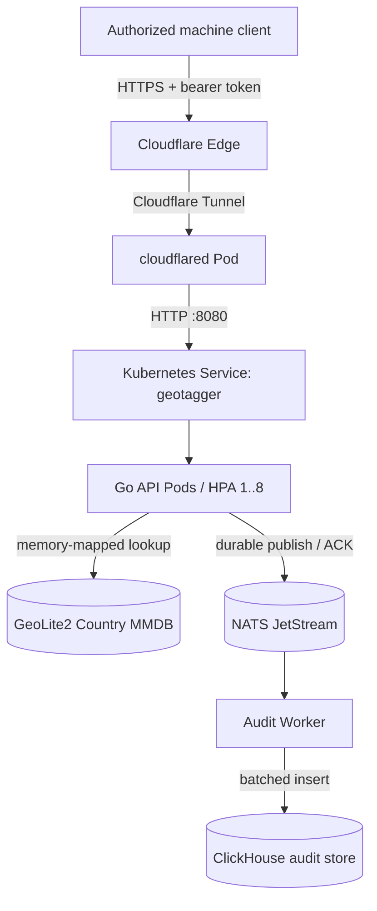
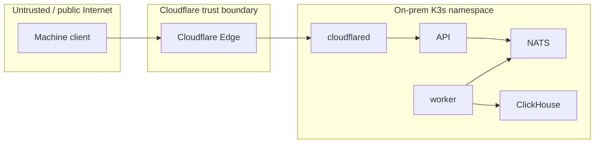
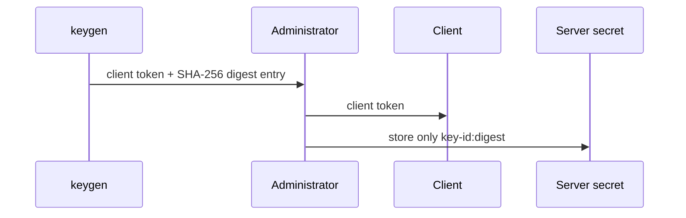
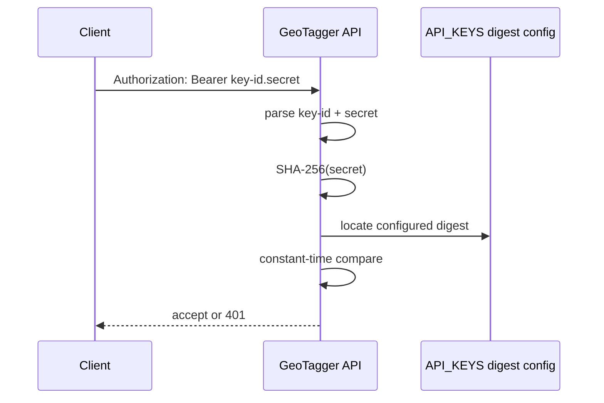
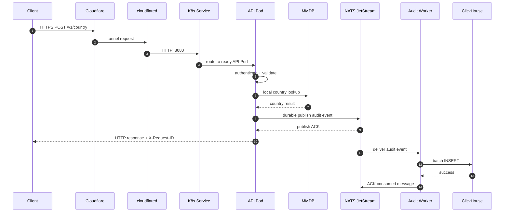
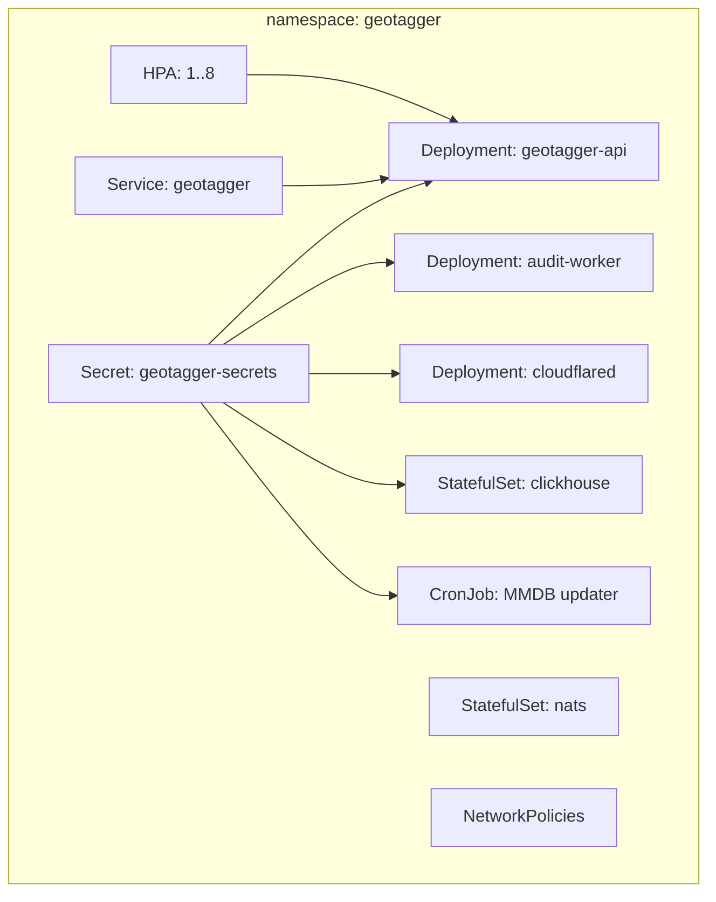
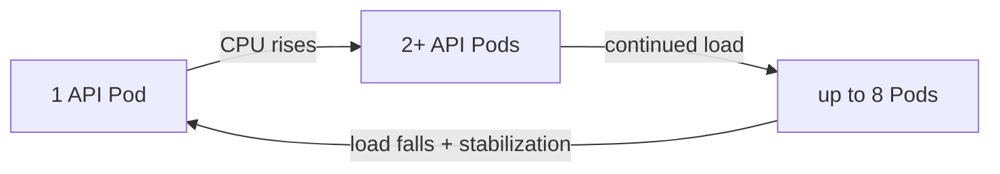
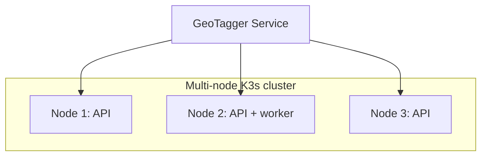

# GeoTagger Project Overview

## Executive summary

GeoTagger is a self-hosted, authenticated IP-to-country lookup service designed for on-premises deployment. It resolves public IPv4 and IPv6 addresses against a local MaxMind GeoLite2 Country database and records a privacy-preserving, durable audit event for each request.

The public service is currently available at:

```text
https://geo.itsjosiahdavis.dev
```

At first glance the application appears simple:

```text
IP address in → country out
```

The project deliberately adds production-oriented infrastructure around that small lookup operation:

- machine-to-machine authentication;
- request validation and private-address rejection;
- local/offline GeoIP resolution;
- request correlation IDs;
- HMAC-based audit privacy;
- durable fail-closed audit publication;
- asynchronous audit persistence;
- Kubernetes health/restart behavior;
- API horizontal autoscaling;
- internal network isolation;
- encrypted runtime secrets;
- persistent NATS/ClickHouse state;
- scheduled MMDB updates;
- Cloudflare Tunnel ingress; and
- end-to-end observability and load testing.

The result is intentionally more than a single HTTP handler. It is a compact reference architecture for a secure, auditable on-premises machine API.

---

# Problem statement

Applications sometimes need a coarse location signal derived from an IP address, for example:

- country-level routing;
- geographic analytics;
- operational logging;
- fraud/risk context;
- country-specific behavior; or
- a reusable internal service used by multiple applications.

Calling a third-party GeoIP API for every request has several disadvantages:

- another network dependency in the hot path;
- recurring API cost/quotas;
- external data exposure;
- additional latency;
- reduced control over availability;
- more vendor coupling; and
- weaker ability to define custom audit/privacy policy.

GeoTagger solves that by keeping the database and request processing local.

---

# Design goals

## 1. Local lookup path

A successful lookup should not require an outbound call to MaxMind or another GeoIP provider.

The active GeoLite2 Country MMDB is stored locally and memory-mapped by the Go API.

## 2. Small synchronous path

The request handler should do only the work necessary to safely answer:

```text
authenticate
→ validate JSON/IP
→ local MMDB lookup
→ durable audit publish
→ return JSON
```

ClickHouse persistence is deliberately asynchronous and outside the response path.

## 3. Durable auditing

A normal successful result should not be returned if the required audit event cannot be accepted by the durable queue.

The API therefore waits for a NATS JetStream publish acknowledgement before returning the result.

## 4. Privacy by default

The raw target IP should not need to be retained in the audit store.

Default mode stores an HMAC-SHA256 representation of the queried IP instead.

## 5. Machine-oriented security

The API is intended for service-to-service use rather than end-user browser login.

Each caller receives its own bearer credential:

```text
key-id.secret
```

Only the secret digest is configured server-side.

## 6. Self-healing deployment

A crashed API/worker/container should be restarted or replaced automatically.

K3s/Kubernetes supplies reconciliation, readiness/liveness probes, rolling Deployment semantics, and Services.

## 7. Measurable scalability

The API should be able to consume spare CPU across the VM by scaling from one to multiple API Pods.

The current HPA range is 1-8 replicas at a 65% CPU target.

## 8. Explicit failure behavior

The architecture should favor predictable, documented failure modes over silent data loss.

Examples:

- missing MMDB → API not ready;
- NATS unavailable → lookup cannot complete normally;
- JetStream full → reject new required audit events;
- ClickHouse unavailable → durable backlog accumulates;
- worker unavailable → durable backlog accumulates;
- Cloudflare connector unavailable → public endpoint unavailable while origin remains private.

---

# Non-goals

The current project is not intended to provide:

- precise GPS/geographic coordinates;
- city/street-level authoritative geolocation;
- identity verification;
- VPN/proxy/fraud classification;
- ASN/ISP intelligence beyond the current country database;
- distributed multi-region high availability;
- autonomous hardware/node autoscaling;
- a public unauthenticated GeoIP service; or
- compliance certification by itself.

It provides country lookup plus a hardened service/audit architecture.

---

# External API contract

Primary endpoint:

```http
POST /v1/country
Authorization: Bearer <key-id.secret>
Content-Type: application/json
```

Body:

```json
{"ip":"8.8.8.8"}
```

Success:

```json
{"country":"United States"}
```

Every response includes an `X-Request-ID` correlation identifier.

Example verified production request:

```text
request_id: c75bb0a033c44dd87a9969df059dd6b4
country:    United States
status:     200
```

The matching audit row was independently confirmed in ClickHouse.

See `API.md` for the full contract.

---

# End-to-end architecture



The important architectural separation is:

```text
lookup result path:
client → API → local MMDB → durable NATS ACK → client

audit persistence path:
NATS → worker → ClickHouse
```

ClickHouse is not required to answer an individual lookup synchronously.

---

# Component inventory

## Go API

Responsibilities:

- parse/validate HTTP requests;
- authenticate bearer credentials;
- reject unsupported/private targets;
- resolve country from local MMDB;
- generate request IDs;
- encode audit records;
- HMAC/raw/omit IP according to policy;
- publish audit event durably to NATS;
- return JSON response;
- expose health/readiness/Prometheus metrics.

The API is stateless with respect to user requests and is therefore horizontally replicable.

## GeoLite2 Country MMDB

Responsibilities:

- local IP-to-country data source;
- no request-time external network call;
- periodically refreshed by the updater;
- atomically replaced so readers do not observe a partially written database.

## NATS JetStream

Responsibilities:

- durable buffer between API and audit database;
- acknowledge audit acceptance before API success response;
- retain unacknowledged audit work across worker/ClickHouse outages;
- enforce a bounded storage ceiling.

Important stream safety properties:

```text
retention: WorkQueue
MaxAge:    0
MaxBytes:  8 GiB
Discard:   DiscardNew
```

`MaxAge=0` means required unpersisted audit work is not deleted simply because it became old.

## Audit worker

Responsibilities:

- consume JetStream audit events;
- batch events;
- insert batches into ClickHouse;
- ACK NATS only after the persistence step succeeds;
- retry through at-least-once delivery semantics.

## ClickHouse

Responsibilities:

- long-term audit/event storage;
- efficient append/analytical querying;
- 30-day event TTL;
- retain request/caller/outcome/lookup metadata.

Current table:

```text
geotagger.audit_events
```

Key data includes:

```text
timestamp
request_id
caller_id
ip_value
ip_mode
country_code
country
outcome
status_code
lookup_latency_us
mmdb_version
```

## cloudflared

Responsibilities:

- establish outbound connections to Cloudflare;
- provide the only intended public ingress path;
- forward public requests to the internal Kubernetes Service.

No inbound WAN port-forward rule is required for the origin.

## MMDB updater

Responsibilities:

- download GeoLite2 Country using the MaxMind license key;
- extract the database;
- validate/write/fsync;
- atomically replace the active database.

The Kubernetes CronJob runs daily at 03:17.

---

# Trust boundaries



Key security assumptions:

- clients may be hostile;
- bearer tokens are secrets;
- Cloudflare/public traffic is not trusted simply because it passed the edge;
- application authentication is still required;
- NATS/ClickHouse are internal-only;
- only the worker should reach ClickHouse HTTP ingress under current NetworkPolicy;
- the Kubernetes/node administrative plane is highly privileged;
- access to Proxmox/K3s/root credentials is outside the application security boundary.

---

# Authentication model

A credential has two logical pieces:

```text
azure-prod.<secret>
```

The identifier is not secret. The secret is random key material.

Server configuration contains the digest, not the plaintext secret.



At request time:



Each integration should have its own key ID so one caller can be revoked without replacing every client's credential.

---

# Public IP policy

By default GeoTagger accepts public/global addresses and rejects local/private targets.

Examples rejected by design:

```text
10.0.0.0/8
172.16.0.0/12
192.168.0.0/16
127.0.0.0/8
link-local addresses
IPv6 local/link-local equivalents
```

A request for `10.0.0.1` with valid authentication was verified to return:

```http
HTTP/2 422
```

```json
{"error":"IP address is not a permitted public address"}
```

This prevents the API from pretending that a private RFC1918 LAN address has meaningful Internet-country geolocation.

---

# Privacy model

The default configuration is:

```text
AUDIT_IP_MODE=hmac
```

Instead of storing:

```text
8.8.8.8
```

ClickHouse stores a keyed digest such as:

```text
5a3ec8b2...<64 hex characters>
```

Properties:

- the raw IP is not retained;
- the same IP under the same HMAC key can be correlated;
- an attacker who only obtains ClickHouse rows cannot simply recompute the value without the HMAC key;
- rotating the HMAC key changes future correlation identity.

Alternative modes exist for explicit requirements:

```text
hmac  recommended default
raw   retain raw target address
omit  do not retain target representation
```

---

# Request lifecycle



The HTTP response happens after the durable NATS ACK but before the asynchronous ClickHouse write is required to finish.

---

# Why the audit queue exists

A direct design could be:

```text
API → ClickHouse → response
```

but that would make every lookup wait on ClickHouse and tightly couple API availability/latency to the analytical store.

GeoTagger instead uses:

```text
API → durable queue ACK → response
                 ↓
              worker → ClickHouse
```

This gives several advantages:

- temporary ClickHouse outage does not immediately destroy API availability;
- bursts can be buffered;
- ClickHouse inserts can be batched efficiently;
- audit persistence can recover after worker/database downtime;
- the synchronous dependency is a small message broker rather than the full database insert path.

The trade-off is extra operational complexity and at-least-once delivery semantics.

---

# Delivery semantics

The worker uses at-least-once processing.

Normal flow:

```text
receive NATS event
→ insert ClickHouse row
→ ACK NATS event
```

Crash edge case:

```text
insert ClickHouse row succeeds
→ worker crashes before ACK
→ NATS redelivers event
→ duplicate ClickHouse row is possible
```

This means audit analysis should use `request_id` when deduplication matters.

The architecture intentionally prefers a possible duplicate over silent event loss.

---

# Kubernetes model

The application is deployed into one K3s namespace.



See `KUBERNETES.md` for the detailed Kubernetes explanation.

---

# Autoscaling behavior

The API Deployment can scale from one to eight Pods.



Autoscaling is useful because one Go process does not need to monopolize all VM CPU and multiple replicas can exploit spare cores.

However:

```text
more Pods ≠ more physical CPU
```

All replicas currently share one 9-vCPU VM. Once the VM is CPU saturated, Kubernetes cannot manufacture additional capacity.

---

# Observed performance

Initial end-to-end production-path load testing produced approximately:

| Offered tier | Achieved throughput | p95 | p99 | HDD utilization |
|---:|---:|---:|---:|---:|
| 100 RPS | ~100 req/s | 190 ms | 203 ms | <1% |
| 1,000 RPS | ~668 req/s | 2.08 s | 3.81 s | <1% |
| 5,000 RPS | ~1,373 req/s | 14.3 s | 20.3 s | <3% |
| 10,000 RPS | ~322-643 req/s | 6.2-8.2 s | much higher | <1% |

The important interpretation is not that the API handler is inherently limited to one of these exact numbers.

The test generator ran on the same 9-vCPU VM as:

- K3s;
- API replicas;
- NATS;
- ClickHouse;
- worker;
- cloudflared; and
- the load generator itself.

Traffic also left the VM through the public Cloudflare path and came back.

Observed bottleneck:

```text
CPU contention / saturation
```

not HDD throughput.

The lookup itself was observed at:

```text
56 microseconds
```

for the verified `8.8.8.8` audit row, showing that local MMDB resolution is tiny compared with full end-to-end request latency under load.

Current operational estimate for the tested setup is roughly 500-1,000 RPS before tail latency becomes unattractive, but a clean ceiling requires an external load generator.

See `PERFORMANCE.md` for full interpretation.

---

# Why this architecture is intentionally "overbuilt"

If the only requirement were a hobby lookup endpoint, the whole system could be:

```text
one Go process + one MMDB file
```

or perhaps:

```text
Docker Compose
├── API
├── NATS
├── worker
├── ClickHouse
└── cloudflared
```

GeoTagger deliberately uses K3s and a durable pipeline because the project is also demonstrating operational qualities that matter in real internal services:

```text
self-healing
health gating
autoscaling
stable service discovery
network segmentation
persistent state
secret injection
rolling deployment
durable asynchronous work
scheduled data maintenance
observability
failure recovery
```

That makes it somewhat overengineered for the business function but appropriately engineered as a production-pattern/reference implementation.

---

# Failure-mode matrix

| Failure | Request effect | Data effect | Recovery behavior |
|---|---|---|---|
| API container crash | affected connection fails; other replicas may continue | none | Kubernetes restarts/replaces Pod |
| API readiness fails | Pod stops receiving new traffic | none | re-added after readiness recovers |
| MMDB missing | API not ready | no invalid lookup served | updater/admin restores file |
| NATS unavailable | normal successful lookups fail closed | audit not silently skipped | resume after NATS recovery |
| Worker unavailable | API may continue while queue has capacity | JetStream backlog grows | worker restarts and drains backlog |
| ClickHouse unavailable | API may continue while queue has capacity | durable backlog grows | worker retries after recovery |
| JetStream 8-GiB limit reached | new required audit publishes rejected | old queued events preserved | restore consumer/DB capacity |
| cloudflared unavailable | public endpoint unavailable | internal cluster remains intact | Deployment restarts connector |
| entire VM unavailable | service unavailable | state depends on VM/disk integrity | Proxmox/VM recovery required |
| physical host unavailable | entire service unavailable | local state inaccessible | host/infrastructure recovery required |

---

# Storage model

```mermaid
flowchart TB
    HOST[Proxmox HDD-backed datastore]
    VDISK[GeoTagger VM data disk]
    K3S[K3s data/local-path]
    NPV[NATS PVC 10 GiB]
    CPV[ClickHouse PVC 50 GiB]
    MMD[/var/lib/geotagger/mmdb]

    HOST --> VDISK
    VDISK --> K3S
    K3S --> NPV
    K3S --> CPV
    VDISK --> MMD
```

Important distinction:

- API Pods are disposable;
- NATS/ClickHouse Pods are replaceable but their PVC data must persist;
- MMDB is node-local shared data used by API Pods;
- the VM/data disk remains a single physical failure domain in the current architecture.

---

# Observability

The API exposes internal administrative endpoints:

```text
/healthz
/readyz
/metrics
```

on port 9090.

The public Kubernetes Service exposes only port 8080.

Operational signals to monitor:

## Request/API

- RPS;
- status distribution;
- p50/p95/p99 latency;
- auth failure rate;
- request body/validation errors;
- readiness/liveness failures;
- API replica count;
- per-Pod CPU/RAM.

## NATS

- stream bytes/messages;
- consumer pending count;
- redelivery count;
- publish failures/timeouts;
- storage utilization vs 8-GiB ceiling.

## Worker

- consumed events/s;
- batch size;
- ClickHouse insert failures;
- redelivery behavior;
- processing lag.

## ClickHouse

- insert throughput;
- query/insert errors;
- disk usage;
- merge/TTL behavior;
- storage growth per day.

## Node/VM

- CPU saturation;
- RAM pressure;
- disk `await`/queue/utilization;
- filesystem utilization;
- network RTT/throughput.

---

# Deployment security posture

Implemented controls include:

- no direct public origin port required;
- machine bearer authentication;
- secret digests rather than plaintext client credentials;
- default HMAC audit mode;
- private/local address rejection;
- request-body limits;
- unknown JSON field rejection;
- default-deny namespace ingress;
- explicit Pod-to-Pod ingress rules;
- non-root numeric UIDs;
- dropped capabilities;
- read-only root filesystem for Go application containers;
- K3s Secrets encryption configuration;
- internal-only NATS/ClickHouse Services; and
- separate admin listener from public Service.

Remaining security work is documented in `SECURITY_AUDIT.md`, especially:

- egress NetworkPolicy;
- formal token lifecycle/rotation;
- fully immutable image pinning;
- stronger ClickHouse SQL least privilege;
- backup/recovery procedures; and
- regulatory/organizational controls if regulated data enters the system.

---

# Data retention

ClickHouse rows have a 30-day TTL:

```sql
TTL timestamp + INTERVAL 30 DAY DELETE
```

This is merge-driven. The row becoming 30 days old does not imply deletion at the exact same second.

JetStream is not a second 30-day audit archive. It is the durable transport/buffer for work not yet successfully persisted to ClickHouse.

Its configured `MaxAge=0` means unpersisted queued events do not expire solely due to age.

---

# Software delivery

Application images:

```text
ghcr.io/jstarzz/geotagger-api
ghcr.io/jstarzz/geotagger-worker
ghcr.io/jstarzz/geotagger-updater
```

CI validates:

- Go module consistency;
- unit/integration/race tests;
- `go vet`;
- reachable vulnerability scanning;
- Kustomize rendering;
- pinned ClickHouse runtime compatibility;
- application container builds; and
- NATS-to-ClickHouse integration behavior.

Current production guidance is to move deployments toward immutable image SHAs/digests rather than relying indefinitely on mutable `latest` tags.

---

# Scaling roadmap

## Current

```text
one physical host
→ one Proxmox VM
→ one K3s node
→ 1-8 API Pods
→ one NATS
→ one worker
→ one ClickHouse
```

## Next practical step

Before adding infrastructure complexity:

1. run the load generator from another machine;
2. measure internal Service path separately from public Cloudflare path;
3. establish latency/RPS SLOs;
4. find the actual CPU saturation point;
5. decide whether more VM CPU or newer hardware is enough.

## Future multi-node form



A real HA architecture would also need replicated state/storage for NATS and ClickHouse, multiple failure domains, backup/restore validation, power/network redundancy, and an appropriate scheduler/storage design.

Simply adding more API nodes does not automatically make the stateful pipeline HA.

---

# Operational definition of success

A deployment should not be considered healthy merely because containers are `Running`.

A meaningful end-to-end validation is:

```text
1. public hostname resolves
2. Cloudflare Tunnel is connected
3. valid bearer token authenticates
4. public IP resolves to expected country
5. X-Request-ID is returned
6. request receives durable JetStream ACK
7. audit worker consumes event
8. matching request ID appears in ClickHouse
9. stored IP representation matches configured privacy mode
10. invalid/private target and invalid-auth paths behave correctly
```

This validation was completed on the deployed service.

---

# Related documentation

- `API.md` — client integration contract
- `ARCHITECTURE.md` — deep architecture diagrams and data flows
- `KUBERNETES.md` — K3s/Kubernetes resource model and operations
- `PERFORMANCE.md` — load-test results and capacity interpretation
- `SECURITY_AUDIT.md` — security findings and hardening roadmap
