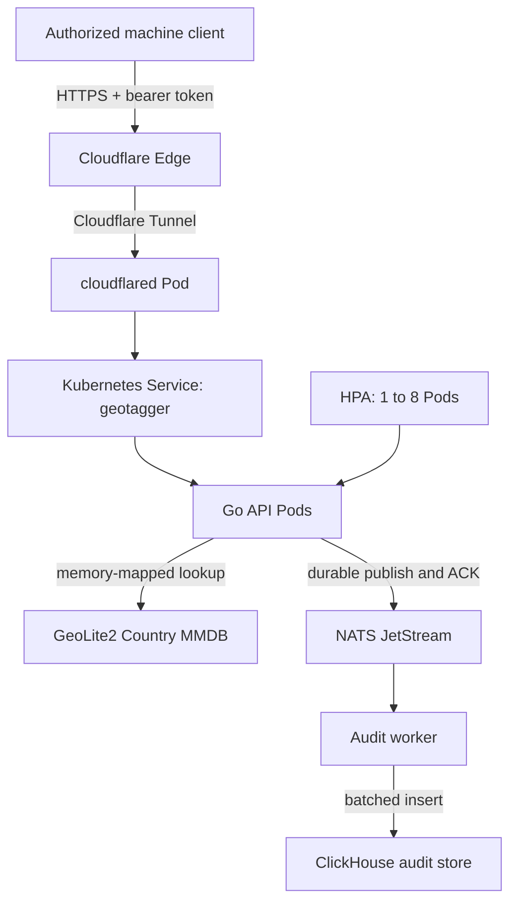
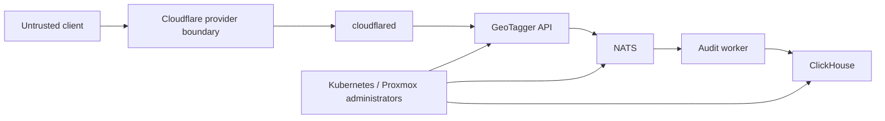
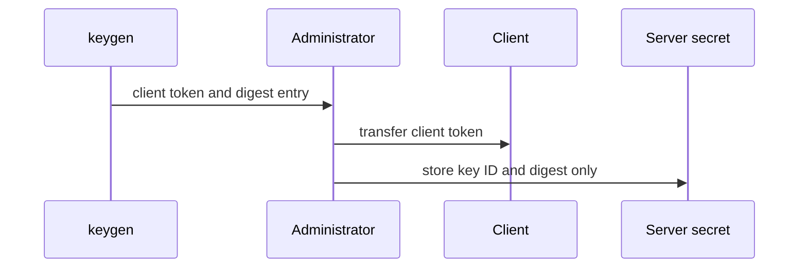
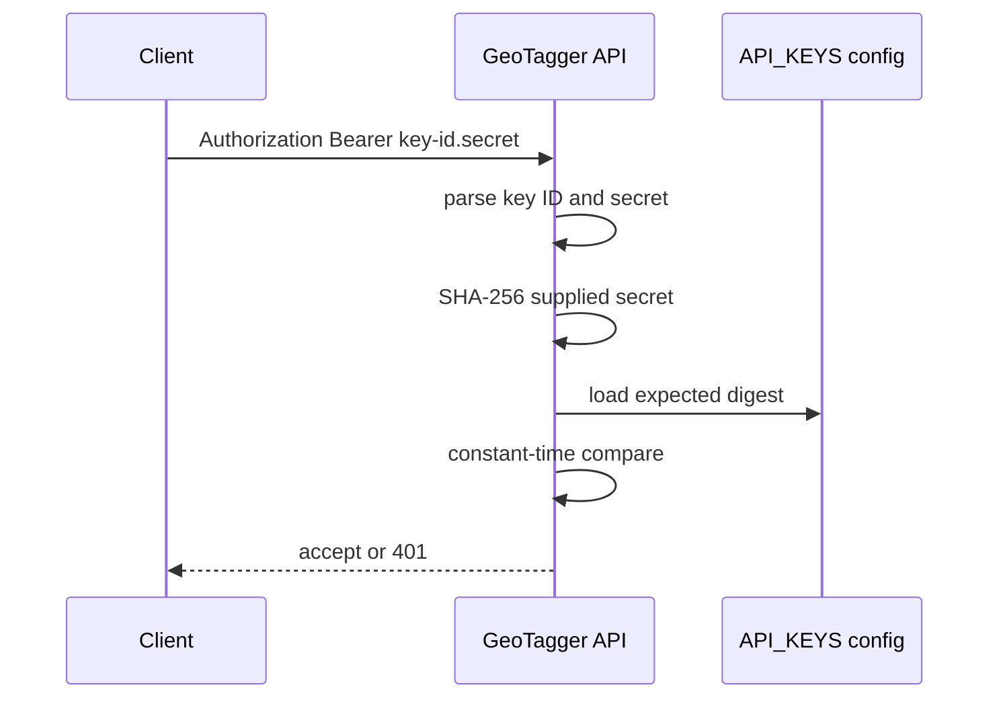
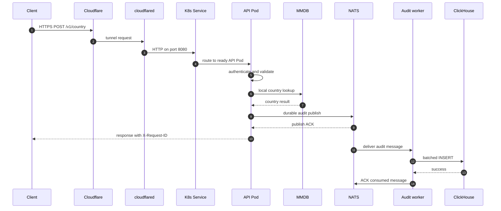
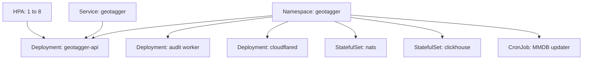
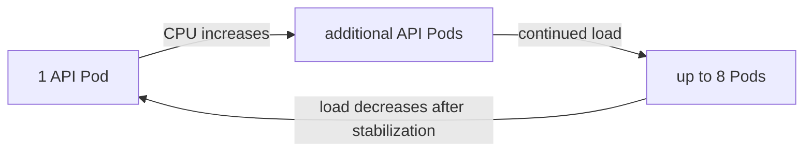
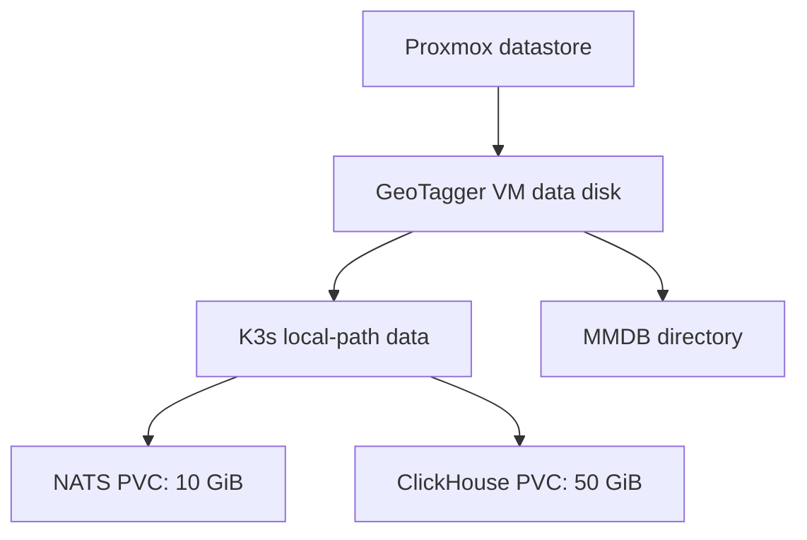
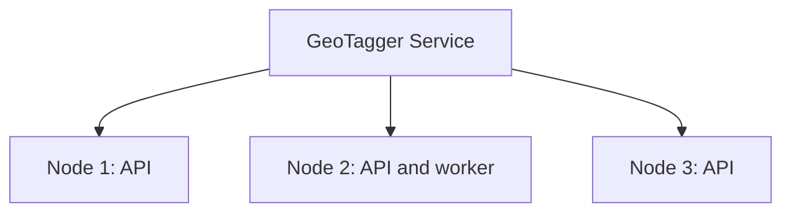

# GeoTagger Project Overview

## Executive summary

GeoTagger is a self-hosted, authenticated IP-to-country service for on-premises deployment. It resolves public IPv4 and IPv6 addresses against a local MaxMind GeoLite2 Country database and records a durable audit event for each request.

Public endpoint:

```text
https://geo.itsjosiahdavis.dev
```

The business function is small:

```text
public IP address -> country
```

The surrounding design addresses operational requirements that a bare lookup handler would not cover:

- machine-to-machine authentication;
- request validation and private-address rejection;
- local GeoIP resolution with no request-time third-party lookup;
- request correlation IDs;
- HMAC-based audit privacy;
- durable fail-closed audit acceptance;
- asynchronous ClickHouse persistence;
- Kubernetes health/restart behavior;
- API autoscaling;
- persistent NATS and ClickHouse state;
- internal network isolation;
- secret injection;
- scheduled MMDB refresh;
- Cloudflare Tunnel ingress; and
- measured end-to-end validation.

GeoTagger should therefore be treated as a small service with a production-oriented control plane, not as a single endpoint script.

## Problem statement

Applications may need country-level context from a public IP address for routing, analytics, operational logging, risk context or shared internal services.

Calling a third-party GeoIP API for every lookup adds:

- request-time network dependency;
- external data disclosure;
- latency;
- API quotas or recurring cost;
- vendor availability dependency; and
- less control over retention and audit policy.

GeoTagger keeps the active database and request processing local.

## Design goals

### Local lookup

Successful lookups must not depend on an outbound MaxMind/API call. The GeoLite2 Country MMDB is stored locally and memory-mapped by the Go API.

### Small synchronous path

```text
authenticate
-> validate JSON and IP
-> local MMDB lookup
-> durable audit publish
-> return JSON
```

ClickHouse writes occur asynchronously after durable queue acceptance.

### Durable auditing

A normal result is not returned if the required audit event cannot be accepted by JetStream.

### Privacy by default

`AUDIT_IP_MODE=hmac` is the default. The audit store receives an HMAC-SHA256 representation of the queried IP instead of the raw address.

### Machine-oriented authentication

Each integration receives a bearer credential in the form:

```text
key-id.secret
```

Only the SHA-256 digest of the secret is configured server-side.

### Automatic workload recovery

K3s handles Deployment reconciliation, probes, Services, rolling updates and stateful volume attachment.

### Measurable scaling

The API HPA can scale from one to eight Pods with a 65% CPU target. This uses spare capacity inside the current VM; it does not add hardware.

### Defined failure behavior

| Condition | Expected behavior |
|---|---|
| MMDB missing | API does not become ready |
| NATS unavailable | audited lookup path fails closed |
| JetStream full | new required audit events are rejected |
| worker unavailable | JetStream backlog grows |
| ClickHouse unavailable | backlog remains durable until recovery |
| cloudflared unavailable | public endpoint unavailable; internal cluster remains private |
| VM/host unavailable | entire one-node cluster unavailable |

## Non-goals

GeoTagger does not currently provide:

- precise GPS coordinates;
- authoritative city/street geolocation;
- identity verification;
- VPN/proxy/fraud scoring;
- ASN/ISP intelligence beyond the configured MMDB;
- multi-region HA;
- automatic node/hardware autoscaling;
- a public unauthenticated lookup service; or
- regulatory compliance by itself.

## API contract

```http
POST /v1/country
Authorization: Bearer <key-id.secret>
Content-Type: application/json
```

```json
{"ip":"8.8.8.8"}
```

Success:

```json
{"country":"United States"}
```

Every response includes `X-Request-ID`. See `API.md` for status/error semantics and integration guidance.

## End-to-end architecture



Synchronous path:

```text
client -> Cloudflare -> API -> local MMDB -> JetStream ACK -> client
```

Asynchronous persistence path:

```text
JetStream -> audit worker -> ClickHouse
```

## Component responsibilities

### Go API

- authenticate bearer credentials;
- bound and parse requests;
- validate the target IP;
- reject non-permitted private/local targets;
- resolve country from the local MMDB;
- generate request IDs;
- apply audit IP policy;
- publish audit events durably to NATS;
- return the HTTP result; and
- expose internal health/readiness/metrics endpoints.

### GeoLite2 Country MMDB

- provides local IP-to-country data;
- avoids request-time third-party calls;
- is refreshed on a schedule; and
- is atomically replaced to avoid partial-file reads.

### NATS JetStream

- provides the durable boundary between API response and audit persistence;
- retains unacknowledged work during worker/ClickHouse outages; and
- enforces a bounded queue size.

Production stream settings:

```text
Retention: WorkQueue
MaxAge:    0
MaxBytes:  8 GiB
Discard:   DiscardNew
```

### Audit worker

- consumes JetStream messages;
- batches events;
- inserts into ClickHouse; and
- ACKs NATS only after successful persistence.

Delivery is at-least-once. Duplicate ClickHouse rows are possible if a worker crashes after insert and before ACK.

### ClickHouse

- stores audit events;
- supports append-heavy analytical access; and
- applies a 30-day TTL to the current audit table.

Table:

```text
geotagger.audit_events
```

### cloudflared

- creates outbound Cloudflare Tunnel connections; and
- forwards public traffic to the internal API Service.

No inbound WAN port-forward is required.

### MMDB updater

- downloads GeoLite2 Country;
- validates and fsyncs the replacement file; and
- atomically renames it into the active path.

The CronJob runs at 03:17 daily.

## Trust boundaries



Assumptions:

- client requests are untrusted until application authentication succeeds;
- Cloudflare does not replace application authentication;
- NATS and ClickHouse remain internal-only;
- Kubernetes/Proxmox administrator access is highly privileged; and
- production credential/recovery processes exist outside the application code.

## Authentication flow

Credential issuance:



Request verification:



Each integration should have its own key ID so one caller can be revoked without rotating unrelated callers.

## Public-IP policy

The default policy rejects private, loopback and link-local targets.

Examples:

```text
10.0.0.0/8
172.16.0.0/12
192.168.0.0/16
127.0.0.0/8
link-local IPv4/IPv6
```

A validated request for `10.0.0.1` returned HTTP 422:

```json
{"error":"IP address is not a permitted public address"}
```

## Privacy model

Default:

```text
AUDIT_IP_MODE=hmac
```

The HMAC value remains sensitive because it is stable/correlatable under the same key. The HMAC key must be protected separately from the audit dataset.

Supported modes:

```text
hmac  default; stable keyed representation
raw   stores raw queried address; requires explicit justification
omit  stores no target representation
```

See `DATA_CLASSIFICATION.md` before enabling raw retention.

## Request lifecycle



## Delivery semantics

Normal worker flow:

```text
receive NATS event
-> insert ClickHouse row
-> ACK NATS event
```

Crash window:

```text
insert succeeds
-> worker crashes before ACK
-> NATS redelivers
-> duplicate row may be inserted
```

Use `request_id` when deduplication matters.

## Kubernetes model



See `KUBERNETES.md` for lifecycle, probes, PVCs, Services and operating commands.

## Autoscaling



All replicas currently share one 9-vCPU VM. HPA improves use of spare node capacity; it is not hardware autoscaling.

## Observed performance

Initial public-path tests:

| Target tier | Achieved throughput | p95 | p99 | HDD utilization |
|---:|---:|---:|---:|---:|
| 100 RPS | ~100 req/s | 190 ms | 203 ms | <1% |
| 1,000 RPS | ~668 req/s | 2.08 s | 3.81 s | <1% |
| 5,000 RPS | ~1,373 req/s | 14.3 s | 20.3 s | <3% |
| 10,000 RPS | ~322-643 req/s | 6.2-8.2 s | much higher | <1% |

The load generator ran on the same 9-vCPU VM as K3s, API replicas, NATS, ClickHouse, worker and cloudflared, while traffic traversed the public Cloudflare path. CPU contention appeared before disk saturation.

A verified request recorded a 56-microsecond MMDB lookup. That figure describes the local lookup, not end-to-end request latency.

For the tested topology, approximately 500-1,000 RPS is a reasonable operational range before tail latency becomes poor. A clean ceiling requires an external load generator. See `PERFORMANCE.md`.

## Storage model



The current VM/data disk is a single infrastructure failure domain. Backups must live independently of it. See `BACKUP_RECOVERY.md`.

## Observability

Monitor at least:

**API:** RPS, status distribution, p50/p95/p99, authentication failures, readiness/liveness, replicas, CPU and RAM.

**NATS:** stream bytes/messages, pending count, redeliveries, publish failures/timeouts and capacity utilization.

**Worker:** events/s, batch size, ClickHouse failures and processing lag.

**ClickHouse:** insert errors/throughput, disk growth, merge/TTL behavior and query health.

**VM/node:** CPU saturation, RAM pressure, disk latency/utilization, filesystem usage and network RTT.

## Security posture

Implemented controls include:

- Cloudflare Tunnel instead of direct inbound origin exposure;
- per-caller bearer authentication;
- secret digests instead of plaintext caller secrets server-side;
- HMAC audit mode by default;
- private/local address rejection;
- bounded strict JSON parsing;
- default-deny namespace ingress;
- internal-only NATS/ClickHouse Services;
- non-root numeric UIDs for API/worker/NATS;
- dropped capabilities and read-only root filesystems for application containers; and
- K3s Secrets encryption configuration.

Open controls and compliance requirements are tracked in `SECURITY_AUDIT.md` and `HIPAA_READINESS.md`.

## Data retention

ClickHouse currently applies:

```sql
TTL timestamp + INTERVAL 30 DAY DELETE
```

This is an application default. It is not a universal HIPAA or legal retention requirement. Regulated deployments must approve retention based on the actual data classification and policy requirements.

JetStream is a transport buffer for not-yet-persisted work, not a second 30-day archive.

## Software delivery

Application images:

```text
ghcr.io/jstarzz/geotagger-api
ghcr.io/jstarzz/geotagger-worker
ghcr.io/jstarzz/geotagger-updater
```

CI checks include Go tests/race detection, vetting, vulnerability scanning, Kustomize rendering, ClickHouse compatibility, image builds and NATS-to-ClickHouse integration.

Production deployments should use approved immutable image references rather than relying indefinitely on mutable `latest` tags.

## Scaling roadmap

Current:

```text
1 physical host
-> 1 Proxmox VM
-> 1 K3s node
-> 1 to 8 API Pods
-> 1 NATS
-> 1 worker
-> 1 ClickHouse
```

Before adding nodes:

1. run load generation from a separate machine;
2. measure internal Service path separately from public Cloudflare path;
3. define latency/RPS SLOs;
4. identify the true CPU ceiling; and
5. determine whether more/newer CPU is sufficient.

Potential multi-node API layout:



Stateful HA would still require replicated NATS, ClickHouse/storage design and independent failure domains.

## Operational acceptance

A healthy deployment must pass more than `kubectl get pods`.

```text
[ ] public DNS resolves
[ ] Cloudflare Tunnel connected
[ ] valid caller authenticates
[ ] public IP returns expected country
[ ] X-Request-ID returned
[ ] JetStream accepts audit event durably
[ ] worker consumes event
[ ] matching request ID appears in ClickHouse
[ ] stored target representation matches configured privacy mode
[ ] invalid token returns 401
[ ] private target returns 422
[ ] backup/recovery status is current
[ ] security/compliance gate matches the environment's data classification
```
