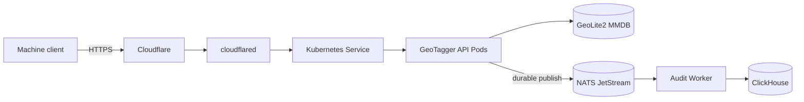

# GeoTagger Documentation

GeoTagger now has a full technical handoff set covering the product, API, Kubernetes deployment, architecture, performance, and security posture.

## Start here

- [Project Overview](PROJECT_OVERVIEW.md) — detailed description of what GeoTagger is, why it exists, design goals, component responsibilities, request/audit lifecycle, trust boundaries, failure behavior, scaling model, and operational definition of success.
- [Production Architecture](ARCHITECTURE.md) — detailed Mermaid diagrams for physical deployment, Cloudflare ingress, Kubernetes topology, request sequence, audit persistence, MMDB refresh, storage, network isolation, scaling, security zones, and failure/recovery paths.
- [Kubernetes / K3s Guide](KUBERNETES.md) — explains Pods vs containers, containerd, Deployments, StatefulSets, Services, HPA, PVCs, probes, NetworkPolicy, Secrets, CronJobs, rolling updates, and day-to-day `kubectl` operations specifically for GeoTagger.

## Integration and operations

- [API Guide](API.md) — authentication, request/response contract, errors, retry behavior, IPv4/IPv6, audit correlation, and integration examples.
- [Performance and Capacity](PERFORMANCE.md) — measured deployment load-test results, CPU bottleneck analysis, current operational estimate, benchmark limitations, and a clean external-generator re-test plan.
- [Internal Security Audit](SECURITY_AUDIT.md) — implemented controls, findings, residual risks, hardening recommendations, and release checklist.

## Architecture at a glance

The current deployment is a single-node K3s architecture inside a dedicated Proxmox VM. Kubernetes provides application reconciliation, readiness-aware routing, autoscaling from 1-8 API Pods, scheduled MMDB updates, internal service discovery, persistent state, and network-policy controls. It does **not** turn the one physical server into hardware high availability.

These documents describe the deployed architecture and measured prototype behavior. They do not by themselves establish regulatory compliance, clinical suitability, or hardware high availability.
