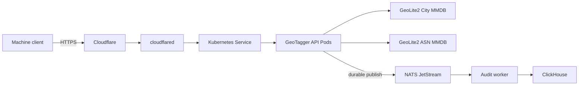
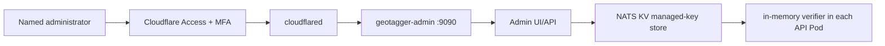

# GeoTagger Documentation

This directory is the technical and operational handoff for the deployed GeoTagger service.

## Core system documentation

- [Client Quickstart](CLIENT_QUICKSTART.md) — Yaak and cURL setup, authentication header, test addresses and end-to-end audit verification.
- [`openapi.yaml`](../openapi.yaml) — machine-readable OpenAPI 3.1 contract suitable for importing into Yaak, Postman and other API clients.
- [City + ASN Upgrade Runbook](UPGRADE_CITY_ASN.md) — production migration, verification, rollback and post-upgrade benchmark procedure for an existing country-only deployment.
- [Admin Control Plane](ADMIN_CONTROL_PLANE.md) — implemented human-admin architecture, Cloudflare Access origin validation, managed API-key lifecycle, one-time token handling and failure semantics.
- [Cloudflare Admin Setup](CLOUDFLARE_ADMIN_SETUP.md) — exact Access application, MFA, AUD/team-domain, Tunnel route, Kubernetes-secret and acceptance-test rollout sequence for `admin.geo.itsjosiahdavis.dev`.
- [Project Overview](PROJECT_OVERVIEW.md) — purpose, design goals, component responsibilities, trust boundaries, request lifecycle, scaling and operational acceptance.
- [Production Architecture](ARCHITECTURE.md) — physical placement, Cloudflare ingress, Kubernetes topology, synchronous lookup, durable audit pipeline, storage, networking, scaling and failure recovery.
- [Kubernetes / K3s Guide](KUBERNETES.md) — Pods versus containers, containerd, Deployments, StatefulSets, Services, HPA, PVCs, probes, CronJobs, NetworkPolicy, Secrets and operating commands.
- [API Guide](API.md) — full City/ASN intelligence API, `/v1/me`, backward-compatible country lookup, authentication, response fields, errors, IPv4/IPv6 and audit correlation.
- [Performance and Capacity](PERFORMANCE.md) — measured public-path load test, bottleneck analysis and benchmark limitations.
- [Performance Tuning Guide](PERFORMANCE_TUNING.md) — HPA tuning, Redis/cache decision, latency metrics, load-test methodology and prioritized scaling options.
- [Project Changelog](../CHANGELOG.md) — notable repository, deployment-hardening, API and documentation changes.

## Current lookup data path



The public API supports:

```text
POST /v1/lookup       full City + ASN intelligence
GET  /v1/lookup?ip=  full lookup using a query parameter
GET  /v1/me           full lookup for the observed caller IP
POST /v1/country      backward-compatible country-only response
```

The City and ASN databases are downloaded locally with the existing MaxMind license key, verified before activation, memory-mapped by API Pods and hot-reloaded after scheduled refreshes. Normal lookups still do not call a third-party geolocation API.

## Admin/key-management path

The human admin surface is separate from the public machine API:



The dashboard manages only JetStream-KV-backed credentials. Existing static `API_KEYS` credentials remain compatibility/break-glass credentials and are intentionally not displayed in the web UI. Managed-key create/rotate operations return plaintext secrets exactly once; GeoTagger stores only SHA-256 digests.

The admin hostname must be protected by Cloudflare Access, and GeoTagger independently validates the Access JWT at the origin. The public machine API hostname must remain free of interactive Access login requirements.

The deployed cluster is a single K3s node inside a dedicated Proxmox VM. Kubernetes provides workload reconciliation, readiness-aware routing, API autoscaling, scheduled MMDB updates, internal service discovery, persistent volumes and network policy. It does not provide hardware high availability for the single VM/host.

## Security, privacy and compliance operations

- [Internal Security Audit](SECURITY_AUDIT.md) — current controls, findings, risk priorities and release checklist.
- [HIPAA Readiness and Control Matrix](HIPAA_READINESS.md) — engineering mapping to HIPAA safeguards, production gate and vendor/BAA/risk-analysis requirements before ePHI use.
- [MFA and Identity Policy](MFA_AND_IDENTITY.md) — explains why machine API calls do not use interactive MFA, where privileged human MFA is required, and stronger machine-identity options.
- [Data Classification and Handling](DATA_CLASSIFICATION.md) — classification of request, audit and credential data; minimum-necessary and retention rules.
- [Backup and Recovery Runbook](BACKUP_RECOVERY.md) — backup scope, independent failure-domain requirement, restore procedure and recovery evidence.
- [Security Incident Response Runbook](INCIDENT_RESPONSE.md) — containment, evidence preservation, credential rotation, recovery and post-incident review.

## Location-data interpretation

City, region and coordinate values are IP-geolocation estimates. They are not GPS readings and must not be presented as exact device location. Consumers should use the returned `accuracy_radius_km` and treat missing fields as unavailable rather than inferring values.

The richer response data is returned to the authenticated caller, while the existing durable audit record remains minimized: HMAC-derived IP representation, caller/request IDs, country-level result, outcome/status, lookup latency and database-version metadata.

## Compliance status

The repository contains technical safeguards and readiness documentation; it does **not** certify the deployment as HIPAA compliant. Before ePHI use, the operator/regulated entity must complete the applicable risk analysis, risk management, business associate agreements, policies, access controls, contingency planning, incident procedures, documentation and periodic evaluations described in `HIPAA_READINESS.md`.
