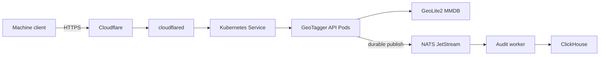

# GeoTagger Documentation

This directory is the technical and operational handoff for the deployed GeoTagger service.

## Core system documentation

- [Project Overview](PROJECT_OVERVIEW.md) — purpose, design goals, component responsibilities, trust boundaries, request lifecycle, scaling and operational acceptance.
- [Production Architecture](ARCHITECTURE.md) — physical placement, Cloudflare ingress, Kubernetes topology, synchronous lookup, durable audit pipeline, storage, networking, scaling and failure recovery.
- [Kubernetes / K3s Guide](KUBERNETES.md) — Pods versus containers, containerd, Deployments, StatefulSets, Services, HPA, PVCs, probes, CronJobs, NetworkPolicy, Secrets and operating commands.
- [API Guide](API.md) — authentication, request/response contract, errors, retry behavior, IPv4/IPv6 and audit correlation.
- [Performance and Capacity](PERFORMANCE.md) — measured public-path load test, bottleneck analysis and benchmark limitations.
- [Performance Tuning Guide](PERFORMANCE_TUNING.md) — HPA tuning, Redis/cache decision, new latency metrics, load-test methodology and prioritized scaling options.
- [Project Changelog](../CHANGELOG.md) — notable repository, deployment-hardening and documentation changes.

## Security, privacy and compliance operations

- [Internal Security Audit](SECURITY_AUDIT.md) — current controls, findings, risk priorities and release checklist.
- [HIPAA Readiness and Control Matrix](HIPAA_READINESS.md) — engineering mapping to HIPAA safeguards, production gate and vendor/BAA/risk-analysis requirements before ePHI use.
- [MFA and Identity Policy](MFA_AND_IDENTITY.md) — explains why machine API calls do not use interactive MFA, where privileged human MFA is required, and stronger machine-identity options.
- [Data Classification and Handling](DATA_CLASSIFICATION.md) — classification of request, audit and credential data; minimum-necessary and retention rules.
- [Backup and Recovery Runbook](BACKUP_RECOVERY.md) — backup scope, independent failure-domain requirement, restore procedure and recovery evidence.
- [Security Incident Response Runbook](INCIDENT_RESPONSE.md) — containment, evidence preservation, credential rotation, recovery and post-incident review.

## Architecture at a glance

The deployed cluster is a single K3s node inside a dedicated Proxmox VM. Kubernetes provides workload reconciliation, readiness-aware routing, API autoscaling, scheduled MMDB updates, internal service discovery, persistent volumes and network policy. It does not provide hardware high availability for the single VM/host.

## Compliance status

The repository contains technical safeguards and readiness documentation; it does **not** certify the deployment as HIPAA compliant. Before ePHI use, the operator/regulated entity must complete the applicable risk analysis, risk management, business associate agreements, policies, access controls, contingency planning, incident procedures, documentation and periodic evaluations described in `HIPAA_READINESS.md`.
